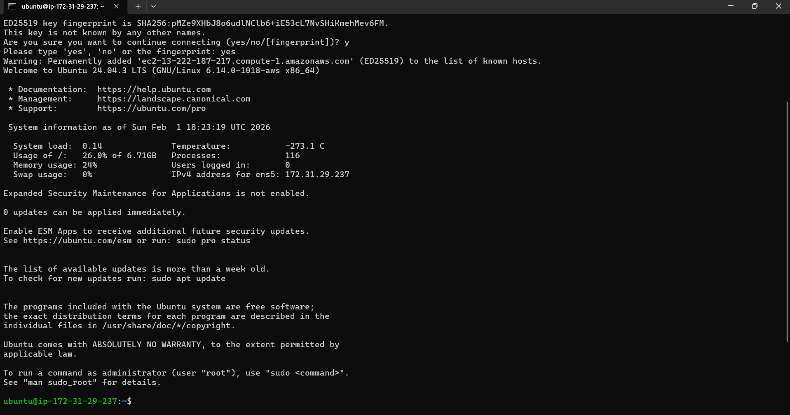
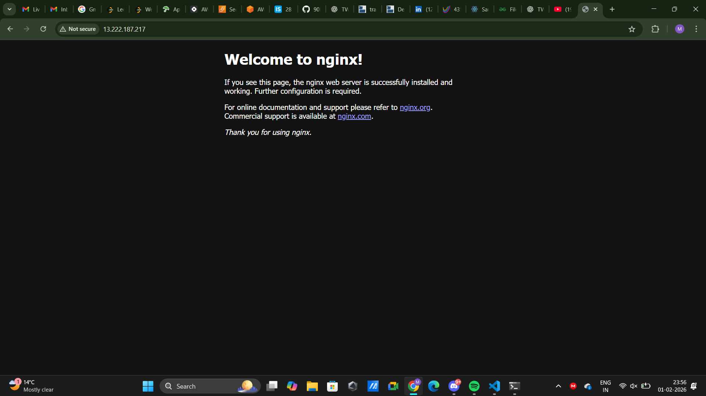

1) Connect via SSH

2) Install Nginx

3) Extract and save logs to a file

152.58.119.1 - - [01/Feb/2026:18:26:35 +0000] "GET / HTTP/1.1" 200 409 "-" "Mozilla/5.0 (Windows NT 10.0; Win64; x64) AppleWebKit/537.36 (KHTML, like Gecko) Chrome/144.0.0.0 Safari/537.36"
152.58.119.1 - - [01/Feb/2026:18:26:36 +0000] "GET /favicon.ico HTTP/1.1" 404 196 "http://13.222.187.217/" "Mozilla/5.0 (Windows NT 10.0; Win64; x64) AppleWebKit/537.36 (KHTML, like Gecko) Chrome/144.0.0.0 Safari/537.36"
