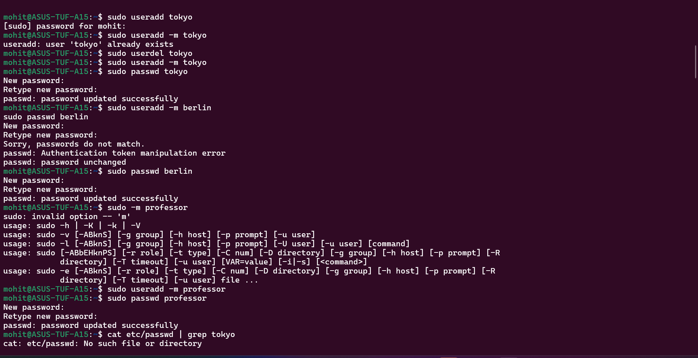
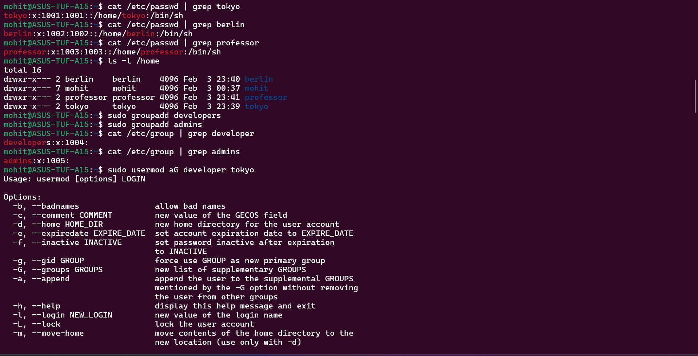
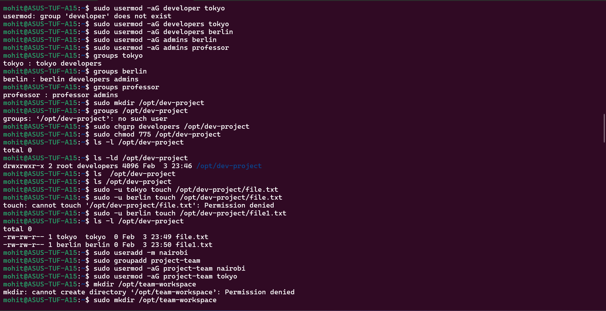
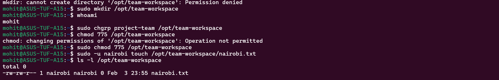

List of commands I used in this day 09:-

useradd

passwd

groupadd

usermod

groups

chgrp

chmod

mkdir

ls

cat

touch

Task 1, Task 2, Task 3, Task 4 and Task 5 screenshots are attached below:- 

