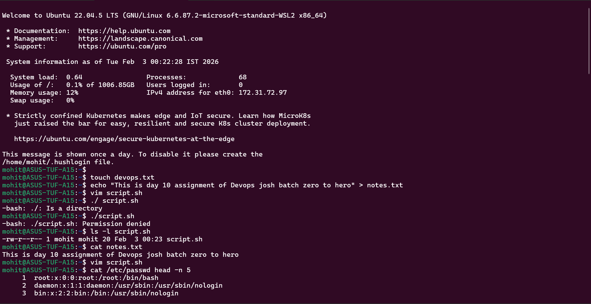
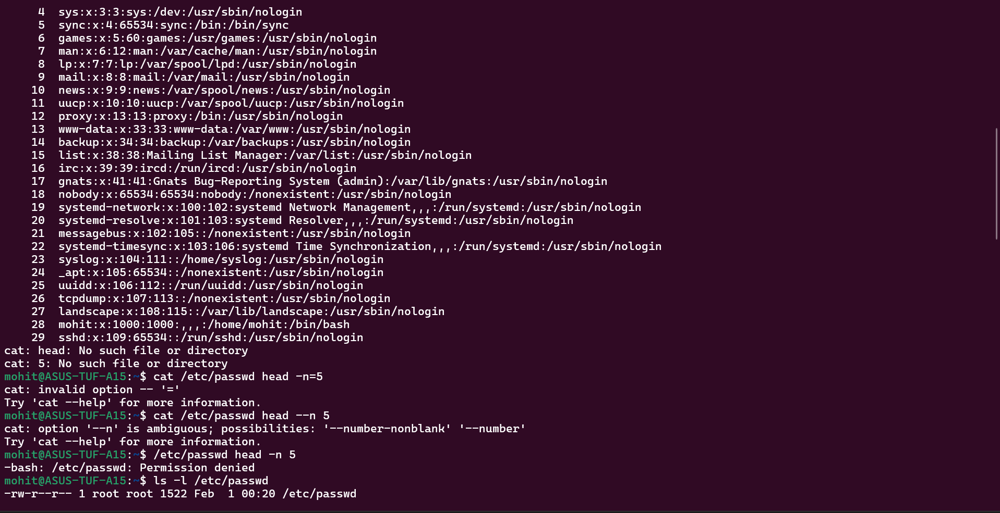
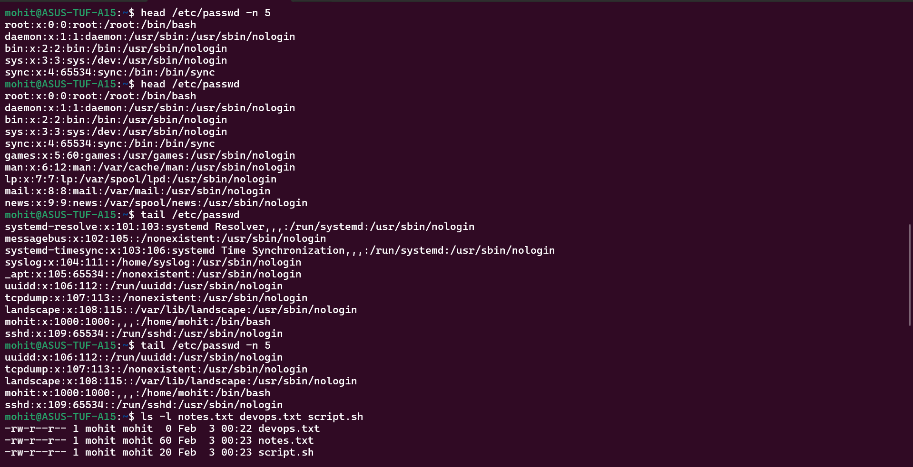
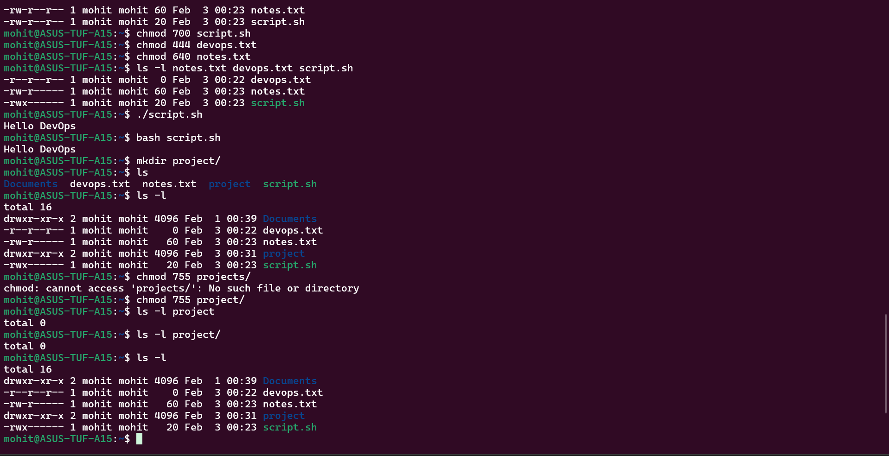
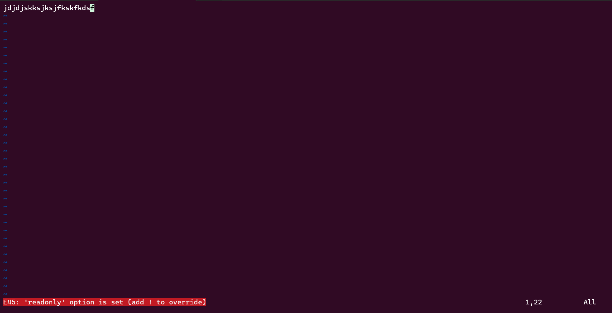

Task 1, Task 2, Task 3, Task 4 and Task 5 screenshots are below and the answer for Task 3 question is The user can read and write the file but groups and others can only read the file.

Task 5 question answer is when I try to write in a read only file it gives me an error saying read only mode but it also gave me an option to override the mode using "!" this symbol after :wq in vim editor. Last screenshot is of Task 5 question.

Another question answer for Task 5 is when I try to execute a file without execute permissions, it gives me an error saying, "Permission Denied". The error is pasted below:- 

mohit@ASUS-TUF-A15:~$ ./script.sh
-bash: ./script.sh: Permission denied

