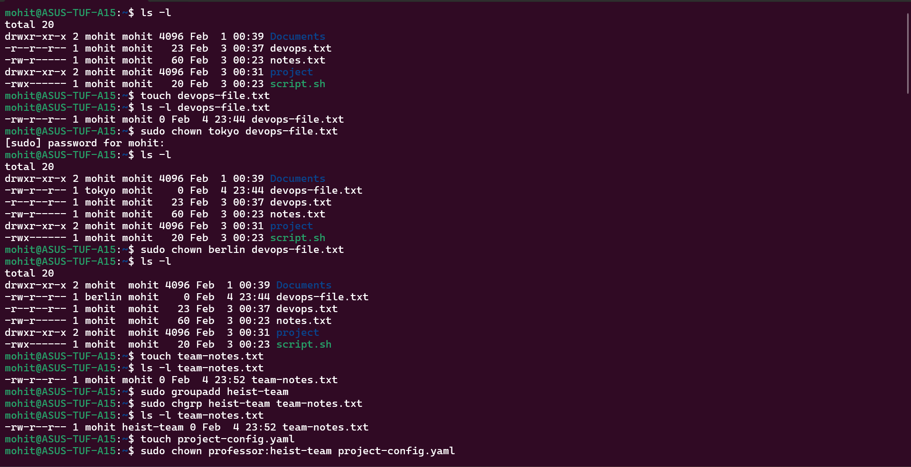
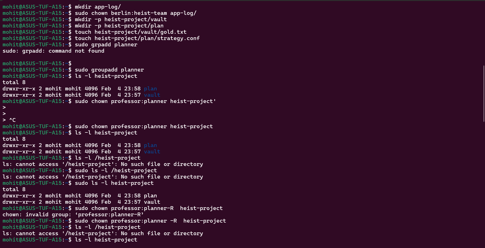
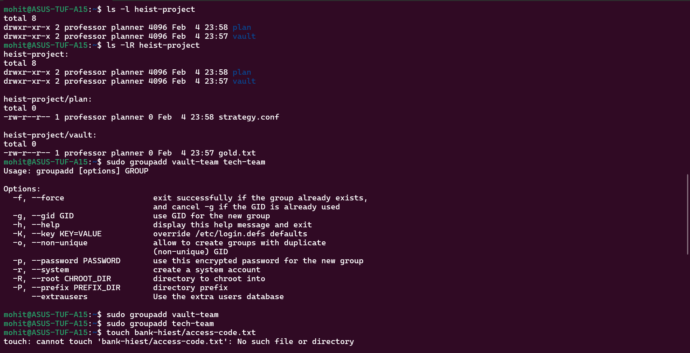
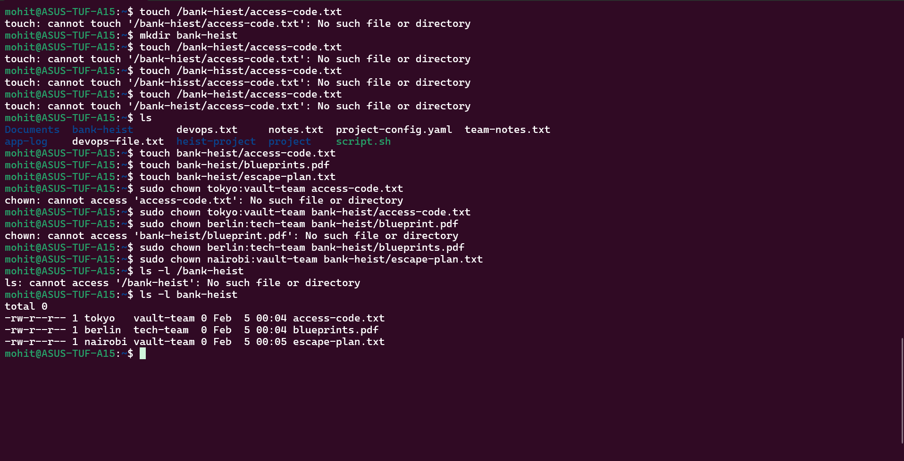

Task 1, Task 2, Task 3, Task 4, Task 5 and Task 6 screenshots are attached below and the answer to the Task 1 question is:- 

Owner is a specific user who owns/control the file. Owner's permissions apply only to that user.
Group is a collection of users who share permissions on file. Group's permissions apply to all the users in that group.

Commands I used today:- 
ls -l

touch

mkdir

chown

chgrp

groupadd

useradd

-R recursive flag

