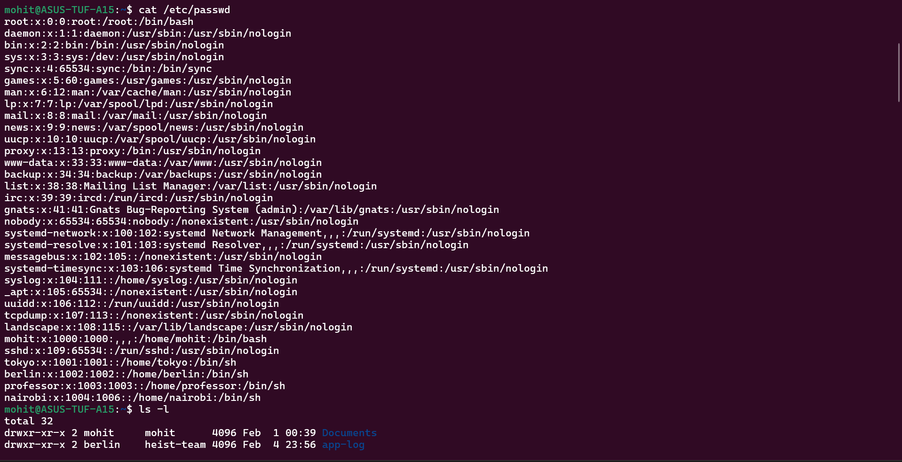
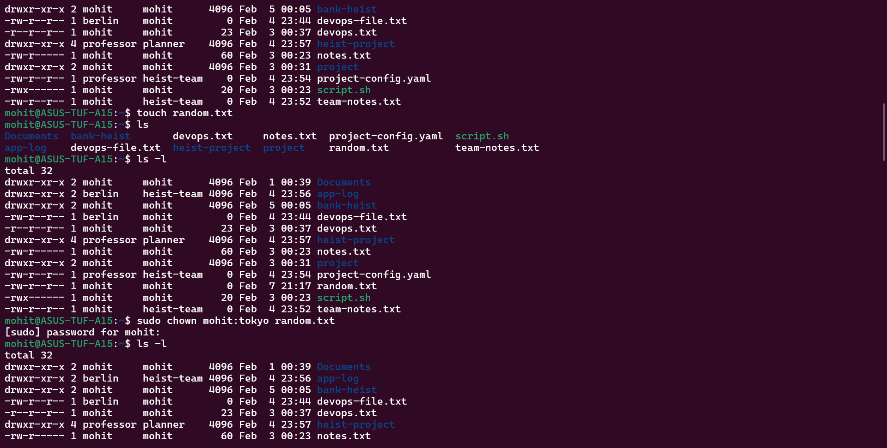
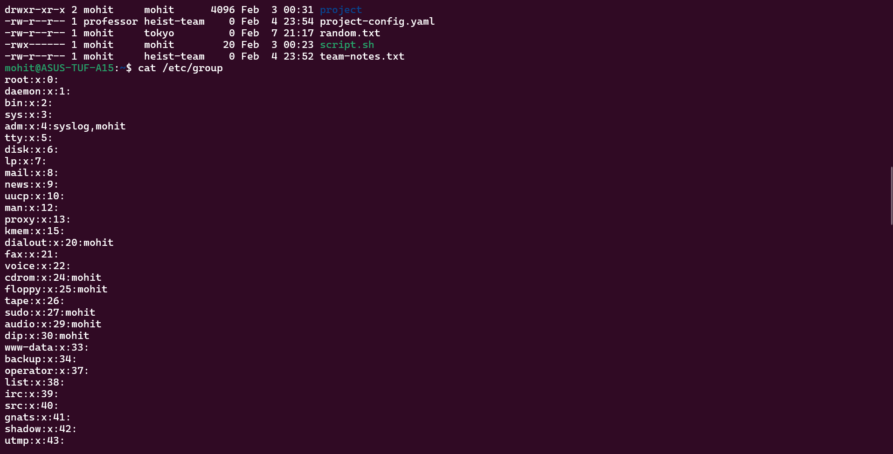
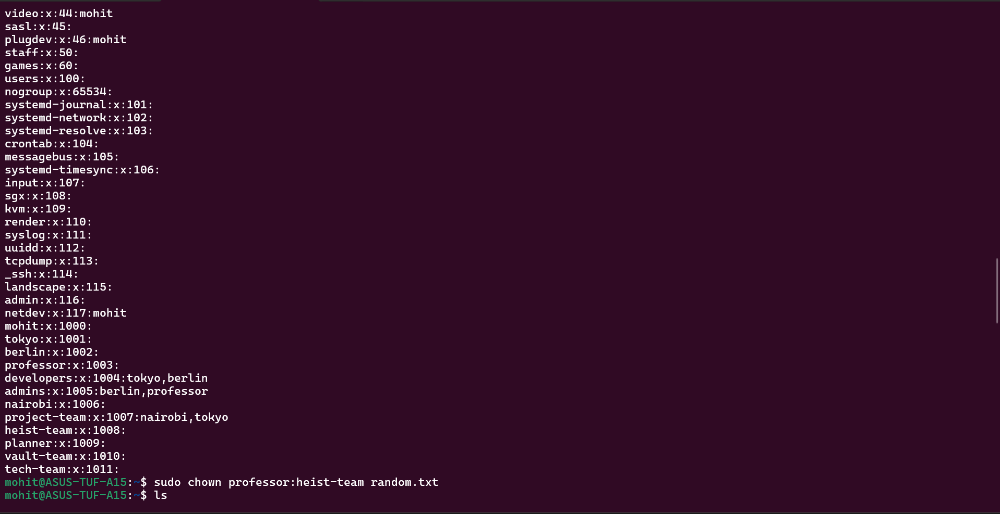
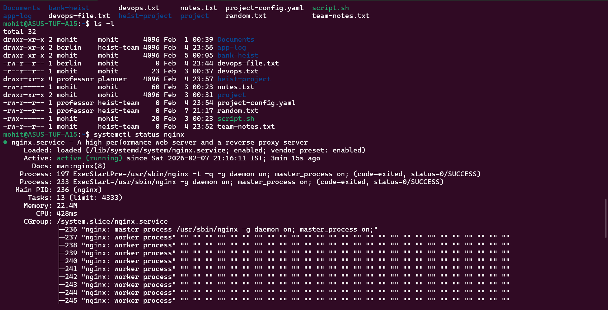
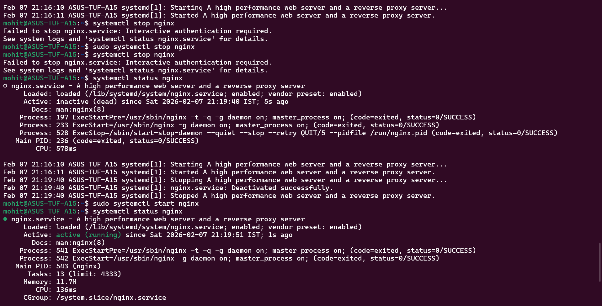
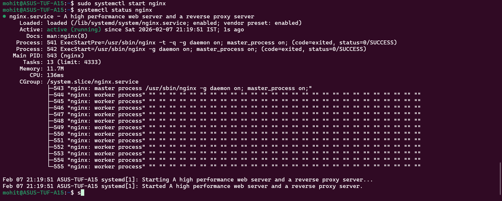

1) The three commands that saves me the most time are:- 
a) top - to check which process is taking the maximum CPU and disrupting the system.
b) systemctl - to check what is the status of the service and to start or stop a service.
   systemctl status <service_name>, systemctl start <service_name>, systemctl stop <service_name>
c) journalctl - to check the logs of the service and determine what is the problem.
   journalctl -u <service_name> -n <no_of_lines_of_log_you_want_to_print>

2) I will check the status of the service using systemctl status <service_name>.
   I will check the logs of the service using journalctl command, journalctl -u <service_name> -n <no_of_lines_of_log_you_want_to_print>.

3) I will change the ownership and permissions using chmod command for changing permissions and chown for changing ownership.

4) I will want to learn about networking, more things about linux for the next 3 days.

