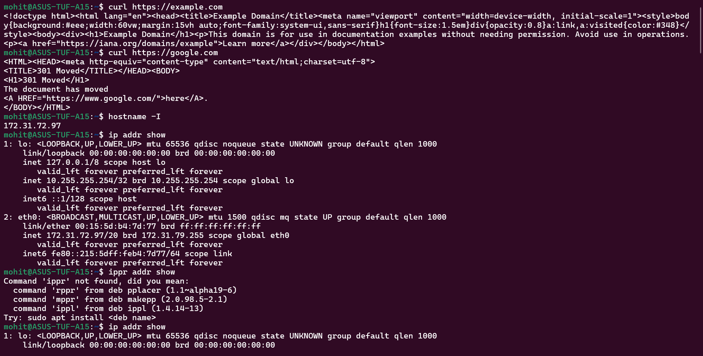
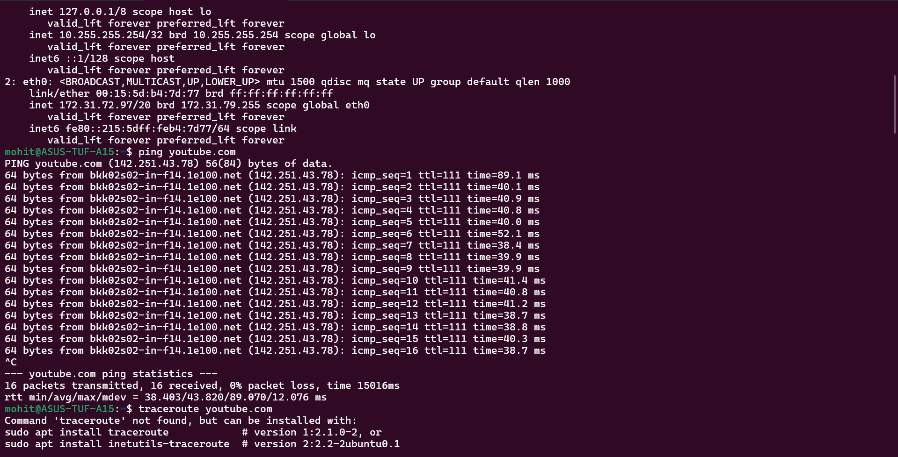
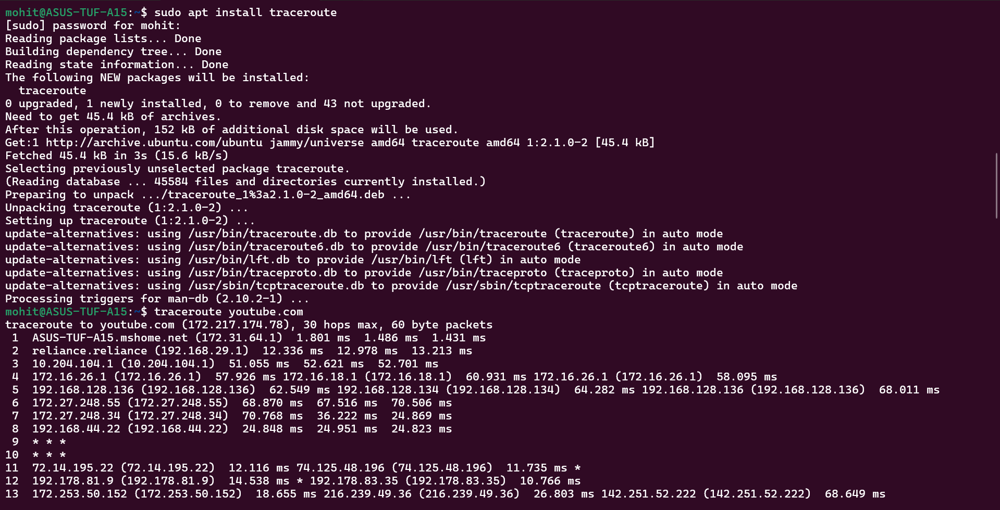
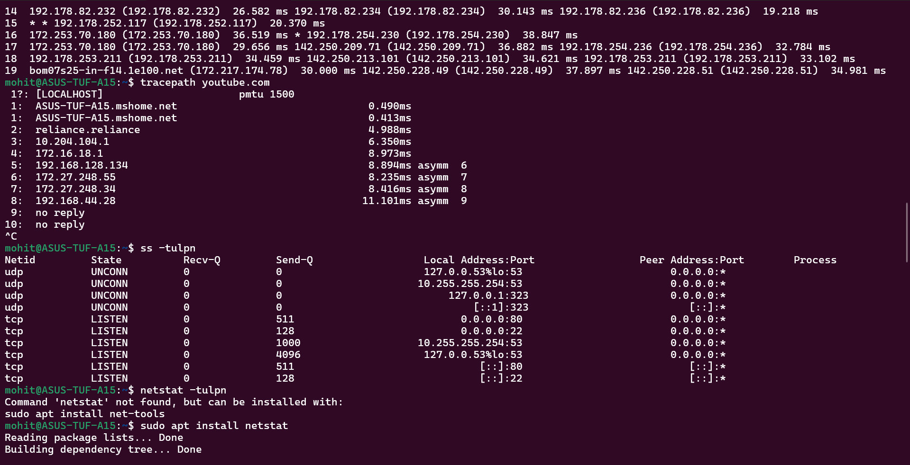
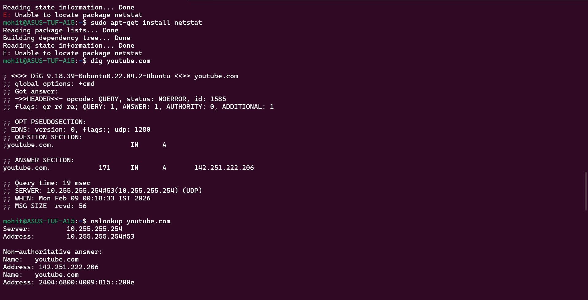
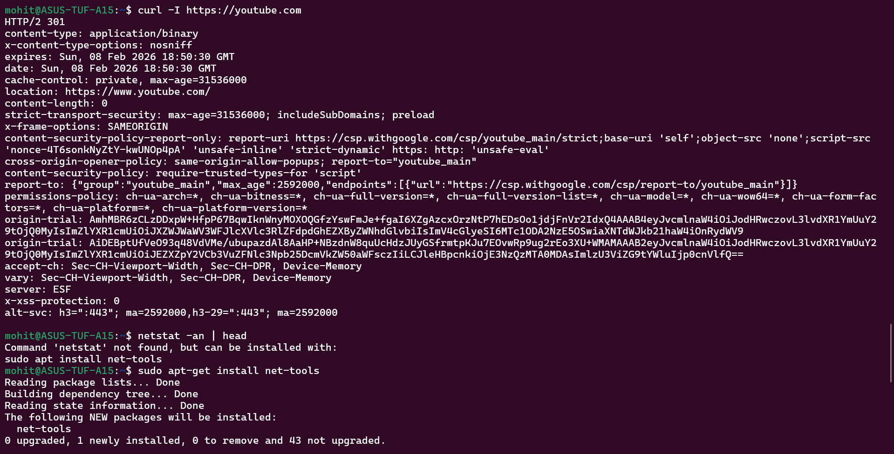
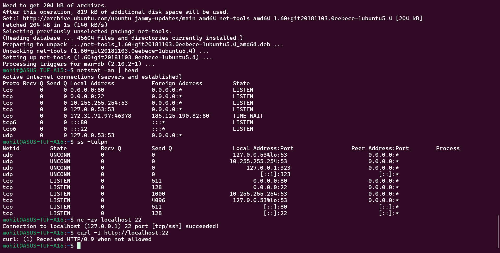

1) About OSI Model:- 
   L1 is Physical layer which includes physical cables, routers, signals etc.
   L2 is Data Link Layer which includes MAC(Media Access Control) addresses and ensures node to node data transfer.
   L3 is Network Layer which includes IP routing and determines the best physical path for the data to reach its destination and also assigns unique IP addresses.
   L4 is Transport Layer which includes TCP/UDP ports and it breaks data into smalled units or packets called segments and reassembles them at the receiving end and used TCP for reliability and UDP for speed.
   L5 is Session Layer for Session Control. It manages the connections between computers by establishing, maintaining and terminating the connections(sessions) between applications.
   L6 is Presentation Layer which is used for encryption used for security purposes, data translator so that each application can understand the data and data compression for reducing bandwidth and making communication seemless and efficient.
   L7 is Application Layer which is just HTTP/HTTPS, DNS that acts as an interface between end-user software application and network.

2) About TCP/IP Model:- 
   Link is Ethernet, Wifi, Internet, etc.
   Internet is network, i.e, IP.
   Transport is TCP and UDP. TCP for reliability and UDP for speed.
   Application is HTTP/HTTPS, DNS which is just the interface connecting users and the network.

3) Where things sit:-
   IP - Network/Internet Layer
   TCP/UDP - Transport Layer
   HTTP/HTTPS - Application Layer
   DNS - Application Layer

4) Hands-on checklist :- 
   Identity - 172.31.72.97
   Reachability - 0 packet loss and latency = 38.403/43.820/89.070/12.076 ms
   Path - 19 paths
   Ports - tcp           LISTEN         0              128                           0.0.0.0:22                        0.0.0.0:*
   Name Resolution - 142.251.222.206
   HTTP Check - HTTP/2 301
   Connection Snapshot - 6 listen State 

5) Mini Task: Port Probe & Interpret
   tcp           LISTEN         0              128                           0.0.0.0:22                        0.0.0.0:*
   
   mohit@ASUS-TUF-A15:~$ nc -zv localhost 22
   Connection to localhost (127.0.0.1) 22 port [tcp/ssh] succeeded!
   mohit@ASUS-TUF-A15:~$ curl -I http://localhost:22
   curl: (1) Received HTTP/0.9 when not allowed

   It is reachable 

6) Reflection
   ping, nslookup and curl
   Application Layer. I will check logs using journalctl and status using systemctl if http 500 error comes.
   I will Check listening port and ping the site and use nslookup to find if the dns is foundable or not. 

Screenshots of commands are attached below:- 

