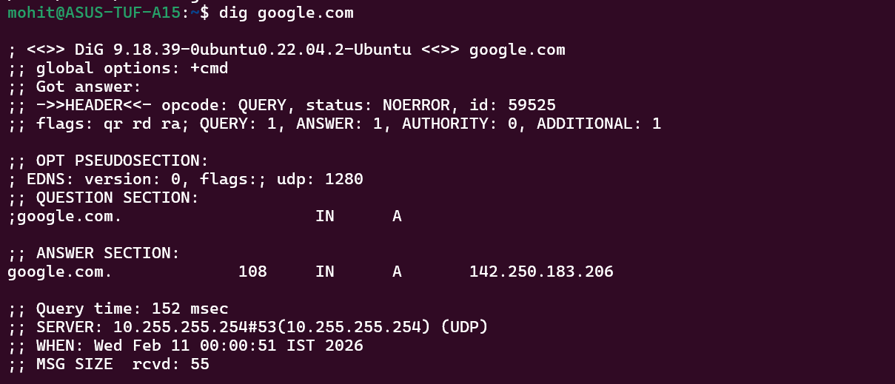
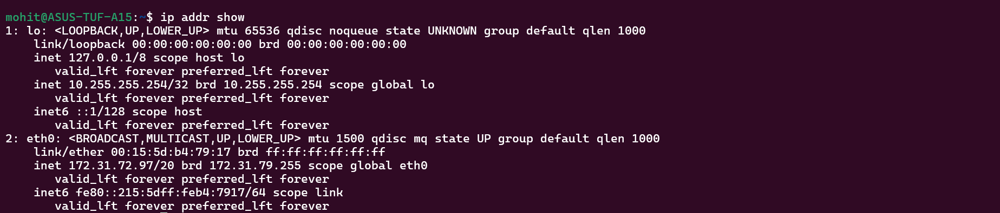
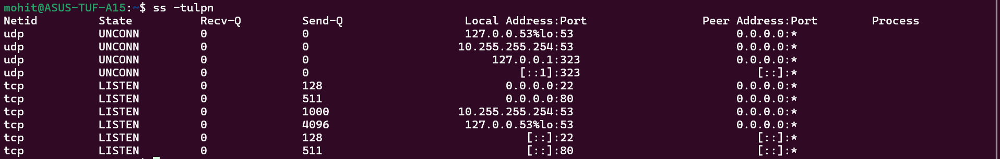

1) a) System checks local cache or /etc/hosts. If not found, it queries a DNS resolver. The resolver asks root -> TLD(.com) -> authoritative name server. DNS returns an IP Address(A record). Browser connects to that IP using TCP.

   b) A - maps domain name to IPv4 address
   AAAA - maps domain to IPv6 address
   CNAME - alias for another domain name
   MX - Mail server record
   NS - name server responsible for the domain

   c) 

2) IPv4 is a 32 bit number address and is written in dotted decimal format. Eg- 192.168.1.10. It is divided into network + host portions

Public ip is globally routable on internet. Eg - 8.8.8.8 and Private IP is used inside internal networks and it is not directly accessible from internet. Eg- 192.168.1.5

Private IP ranges - 10.0.0.0 - 10.255.255.255, 172.16.0.0 - 172.31.255.255, 192.168.0.0 - 192.168.255.255

3) /24 bits are network portion. Remaining 8 bits are host portion.

Usable host is 2**host_bits - 2 

We use subnet because it reduces broadcast traffic, it has better network configuration, it improves security isolation and also efficient IP allocation.

4) It is an endpoint where communication happens for certain app.
Without ports, multiple applications won't work on the same machine.
| Port  | Service |
| ----- | ------- |
| 22    | SSH     |
| 80    | HTTP    |
| 443   | HTTPS   |
| 53    | DNS     |
| 3306  | MySQL   |
| 6379  | Redis   |
| 27017 | MongoDB |

5) It includes DNS resolution, TCP connection to port 8080, http request, IP routing and as we are using port 8080 we need to enable 8080 port inside firewall rule so we are using firewall also.

Use ping, check 3306 port is open or not, check if mysql is running or not, check firewall if the port number is allowed or not.