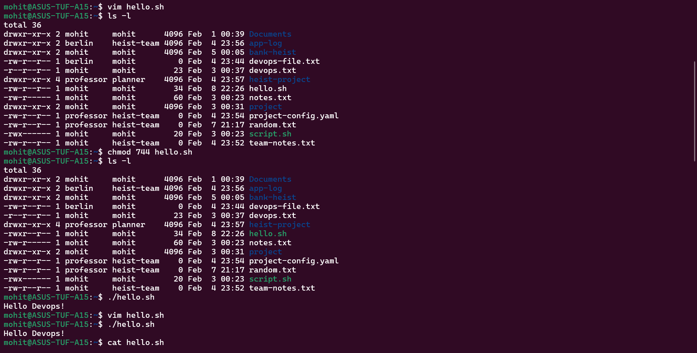
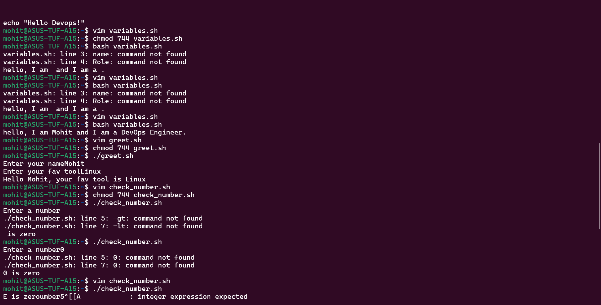
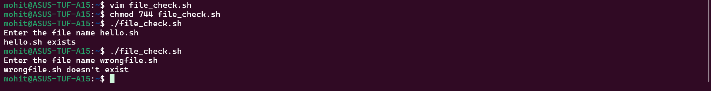
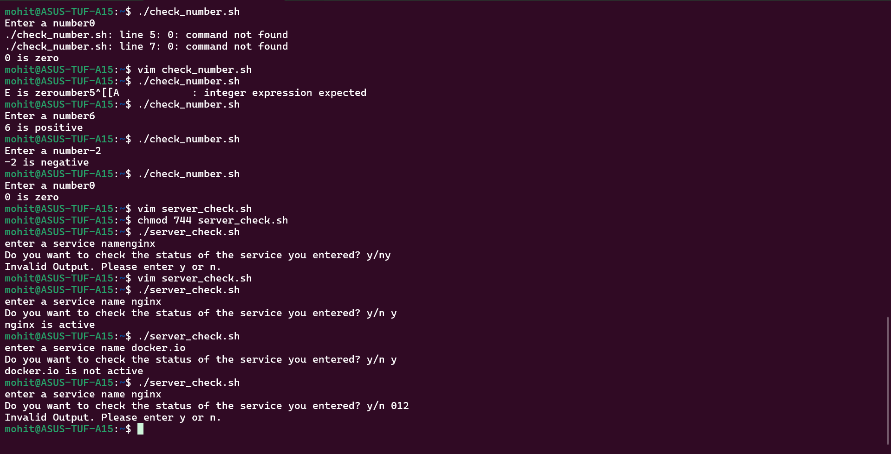
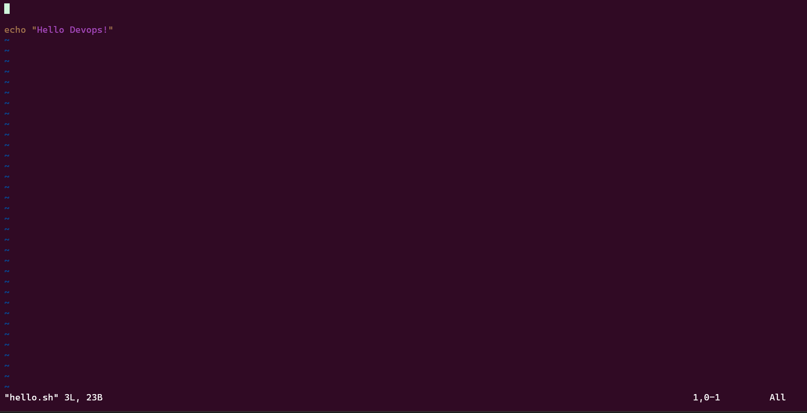
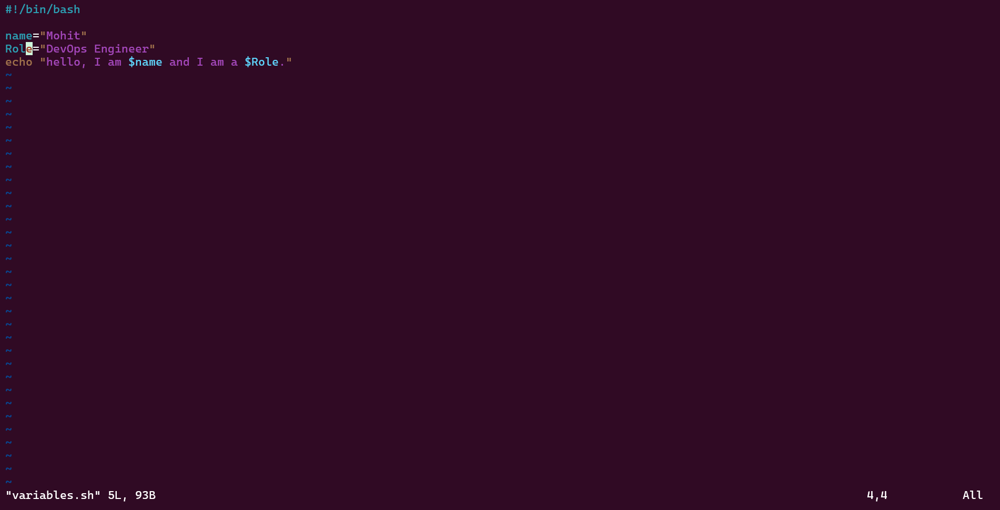
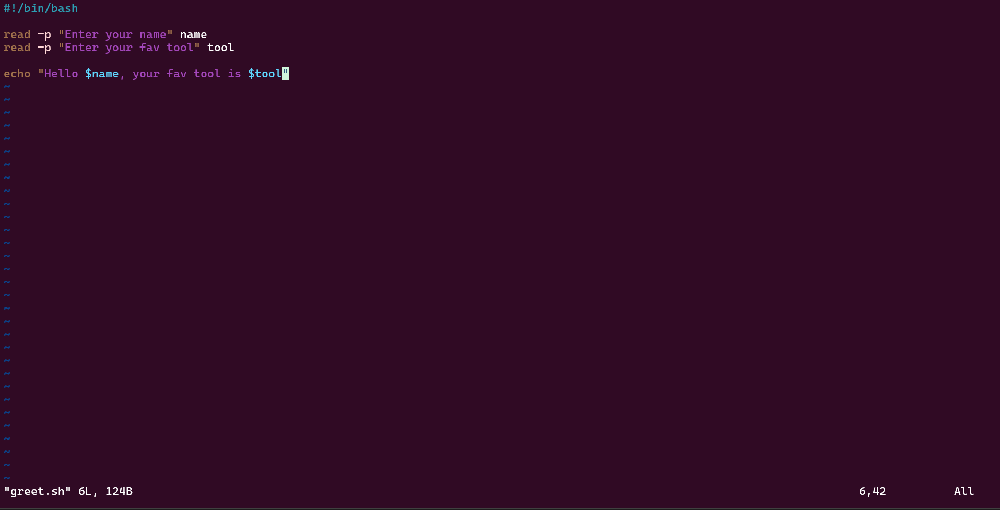
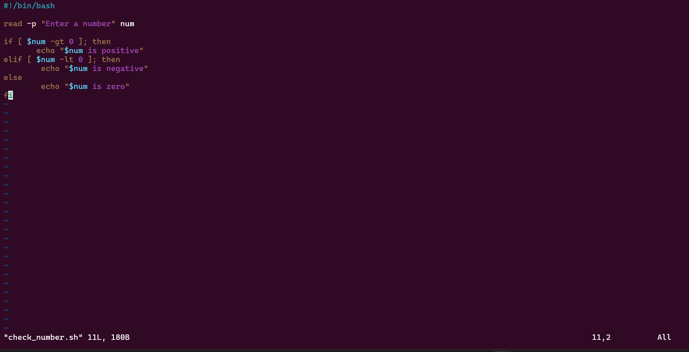
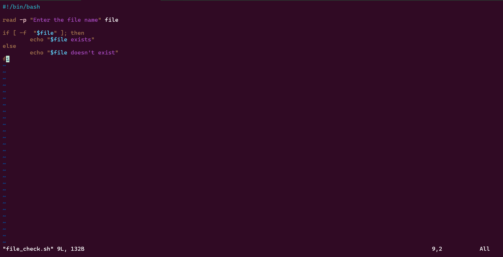
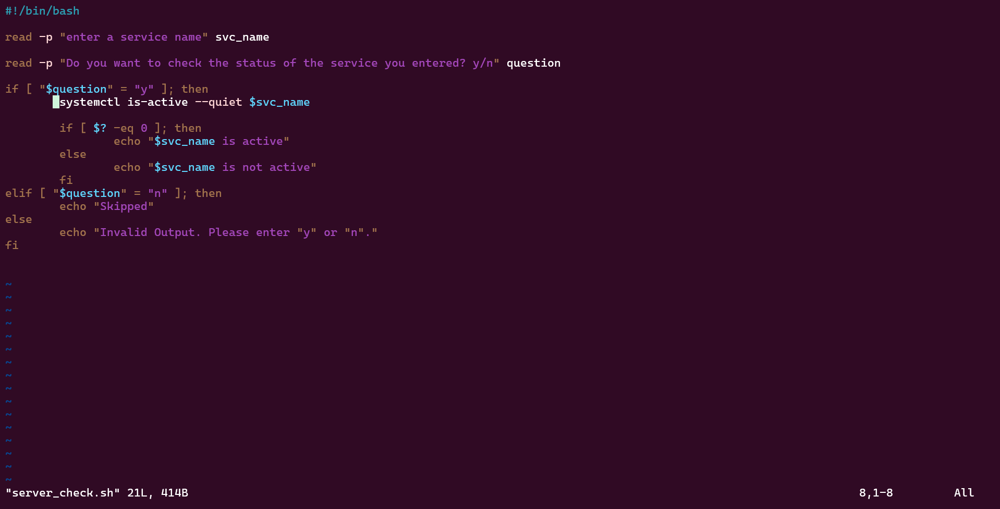

Task 1, Task 2, Task 3, Task 4, Task 5 and Task 6 screenshots are attached below:-

All the scripts that I created, screenshots are below:- 

I also learned a new thing that $? stores the exit status of the last command. 0 is success and non-zero is failure.

I learned a lot about shell scripting and how if-else syntax is a little bit different than actual coding languages and also spaces after square brackets matter a lot in shell scripting.

I can use it to automate, check the status and lot more in my daily use. 

It is just like a programming language. The only difference it is a group of commands used in a single script/file to get the desired output easily.