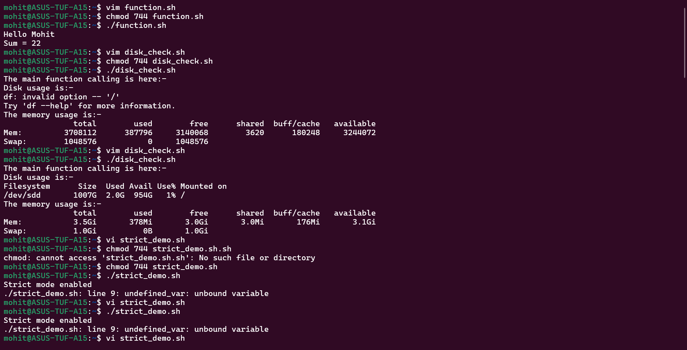
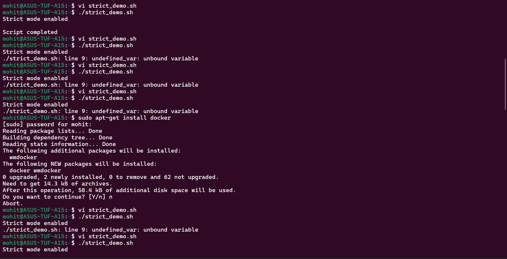
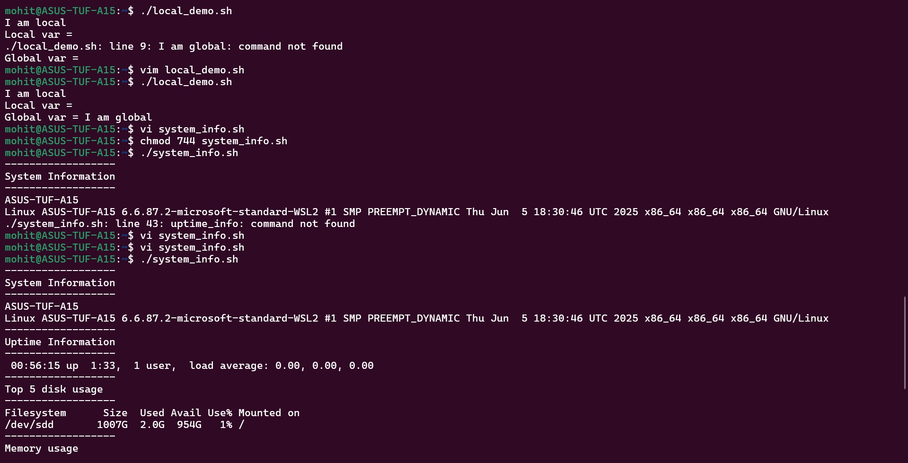
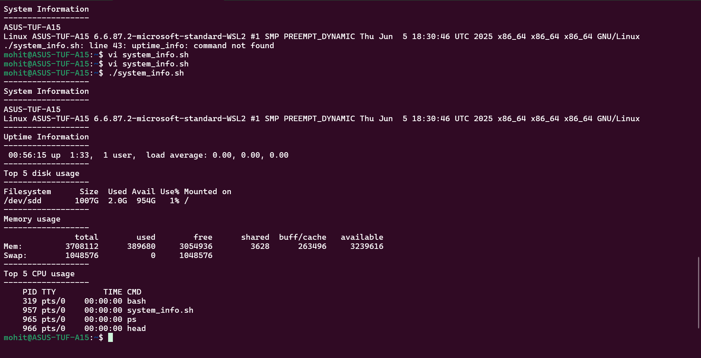
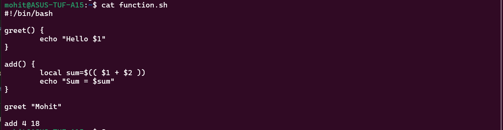
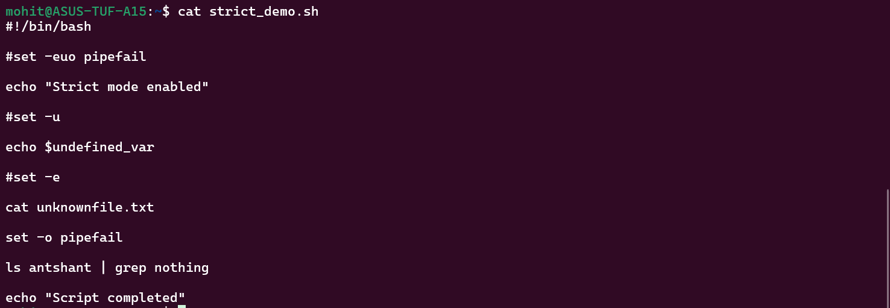
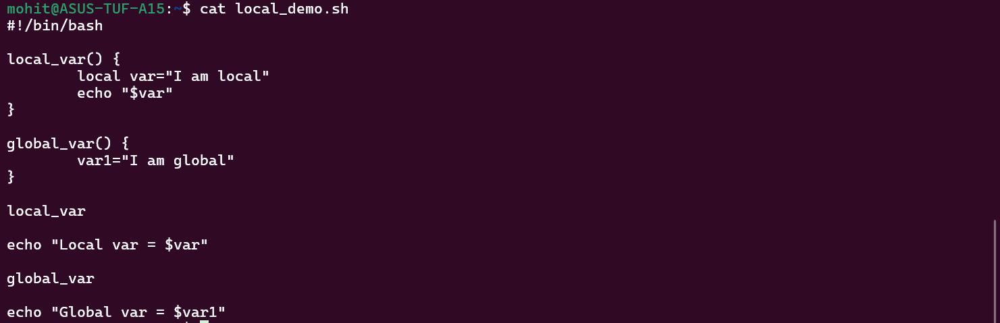
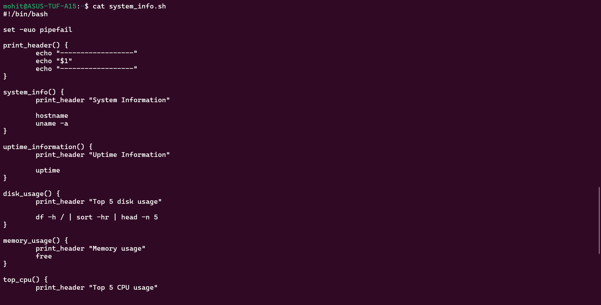

The screenshots of Task 1, 2, 3, 4 and 5 and the answers of the questions are attached below :- 

Task 1:- 

Screenshots of my scripts are attached below:-

The answers of the questions asked in these tasks are - 

**Document:** What does each flag do?
- `set -e` → It exits immediately if any command fails.
- `set -u` → It treats undefined variables as errors.
- `set -o pipefail` → If any command inside the pipeline fails then the entire pipeline fails.