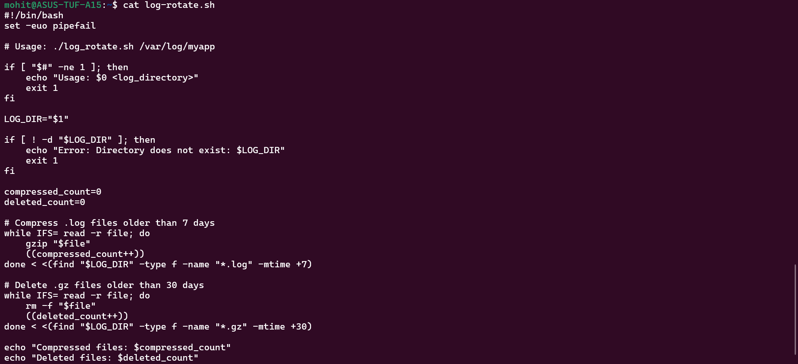
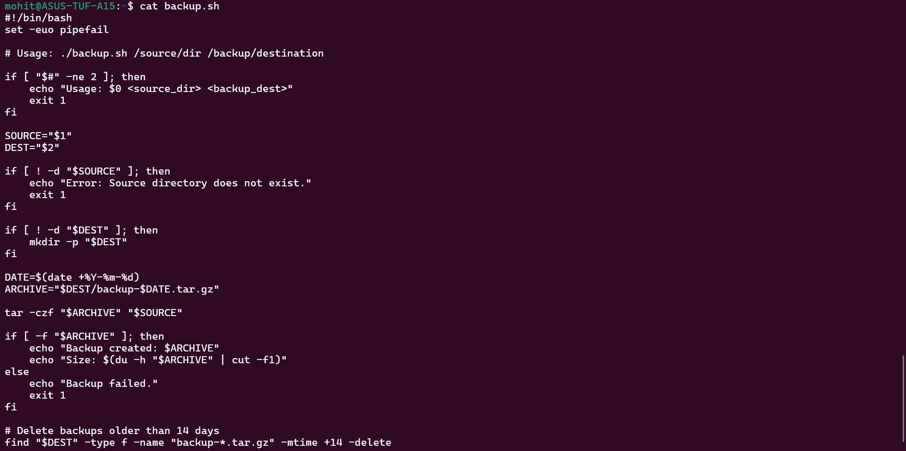
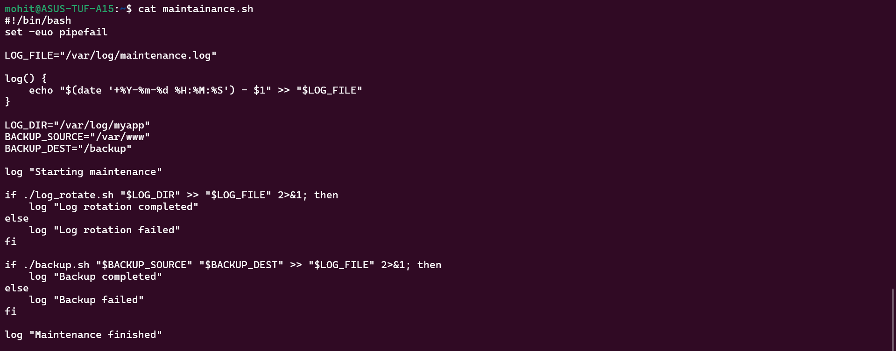

Scripts created:- 

1) log-rotate.sh

crontab command:- 
0 2 * * * /home/mohit/log_rotate.sh /var/log/myapp

2) backup.sh

crontab command:-
0 3 * * 0 /home/mohit/backup.sh /var/www /backup

3) maintainance.sh

crontab command:-
0 1 * * * /full/path/maintenance.sh

