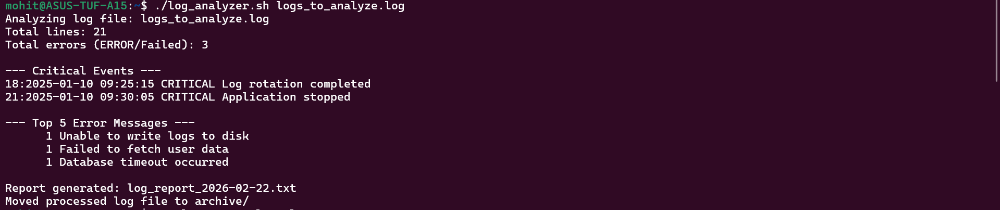

# Day 20 – Log Analyzer Solution

## Approach

1. Validated input arguments.
2. Checked file existence.
3. Counted errors using grep.
4. Extracted CRITICAL events with line numbers.
5. Parsed top 5 ERROR messages using:
   - grep
   - sed
   - sort
   - uniq
6. Generated structured report file.
7. Archived processed log file.

---

## Commands Used

- grep
- sed
- wc
- sort
- uniq
- head
- date
- mv
- mkdir

---

## Sample Output

[Paste console output here]

---

## What I Learned

1. Log parsing requires careful pattern filtering.
2. Pipes (`|`) allow powerful data transformation.
3. `set -euo pipefail` makes scripts production-safe.
4. Always validate input before processing.
5. Structured reports are essential for daily operations.

Screenshot of my script and the output:-
