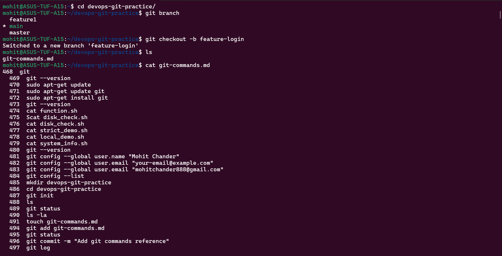
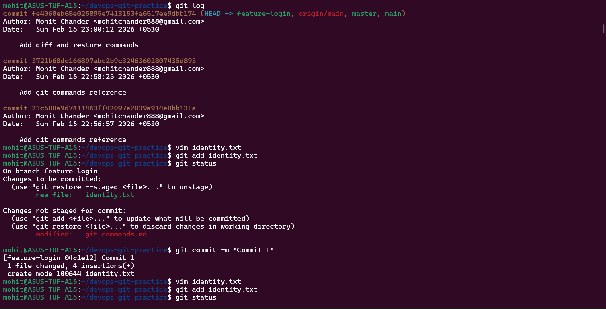
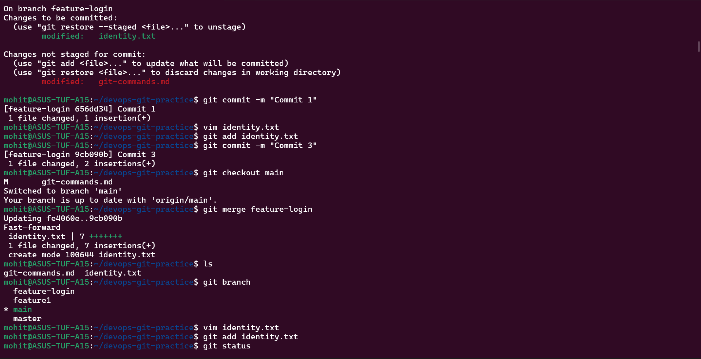
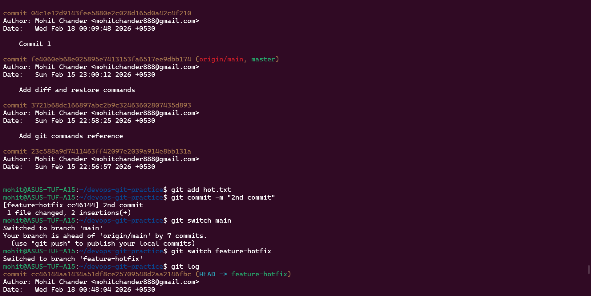
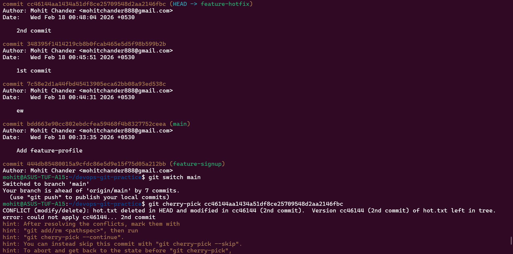

The solution of Task 1, 2, 3, 4 and 5 are given below with answers and screenshots :-

Task 1:-

What is a fast-forward merge?
When main has not diverged, Git just moves the branch pointer forward — no new merge commit is created.

When does Git create a merge commit?

When both branches have new commits (diverged history).

What is a merge conflict?

When Git cannot automatically combine changes due to overlapping edits.

Task 2 :-

What does rebase actually do?

It rewrites your commits as if they were created from the latest main.

Why never rebase pushed commits?

Because rebase rewrites commit history.
If others pulled your commits, rewriting causes conflicts.

When use rebase vs merge?

Rebase:

Clean local feature history

Before pushing

Merge:

Shared branches

Public history

Team collaboration

Task 3 :-

What does squash merging do?

Combines all feature commits into one single commit.

When use squash?

Clean feature history

Many small commits

Before merging PR

Trade-off

Pros:

Clean history

Cons:

Lose detailed commit breakdown

Task 4:- 

Difference: pop vs apply

apply → It keeps stash
pop → It applies and removes stash

Real-world use case

Urgent bug fix

Switching branches quickly

Temporary unfinished work

What does cherry-pick do?

Applies a specific commit from another branch onto current branch.

When use cherry-pick?

Urgent hotfix

Selectively move one commit

Backport fixes

What can go wrong?

Conflict during cherry-pick

Duplicate commits

Hard-to-follow history

Screenshots :- 

