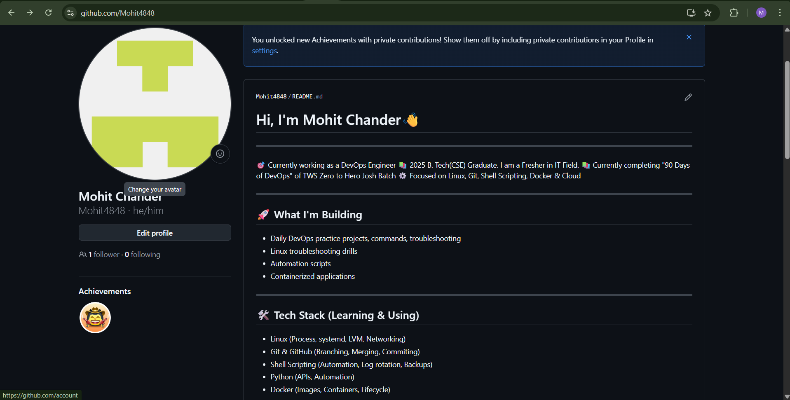
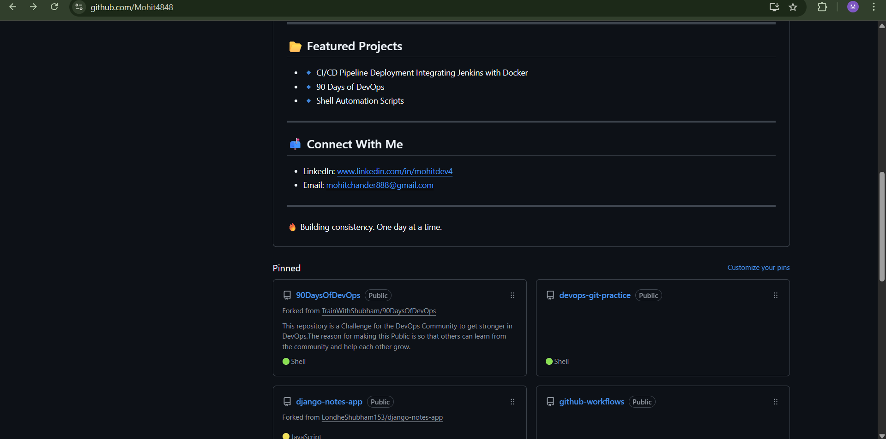
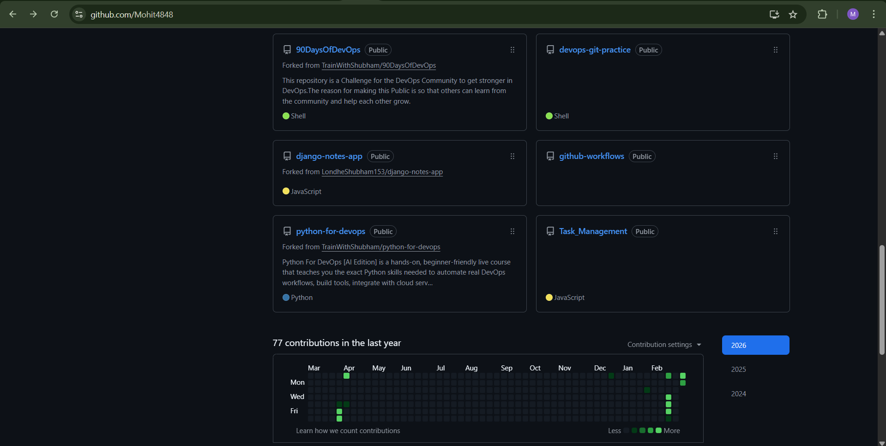

This is my github profile after doing changes. I forgot to take the screenshot before doing changes but that profile was nothing special. Everything was missing, majorly my introduction. But now it is all sorted. 

The only thing I am missing is adding a README.md file for my personal projects. I will do it soon and update the assignment with it.