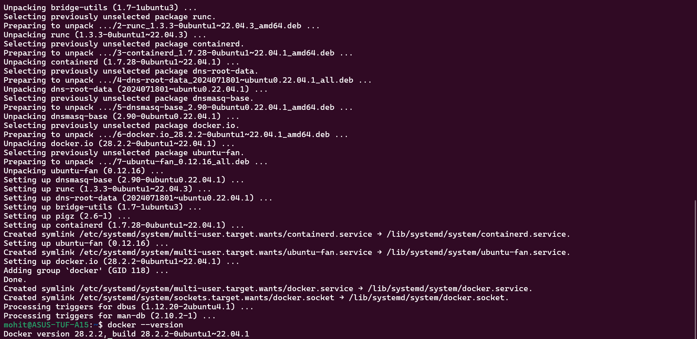
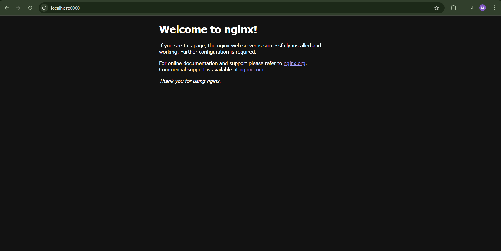
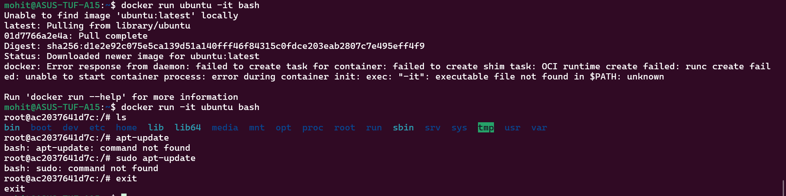
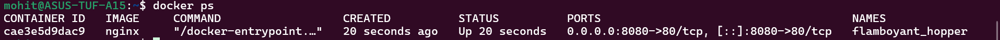
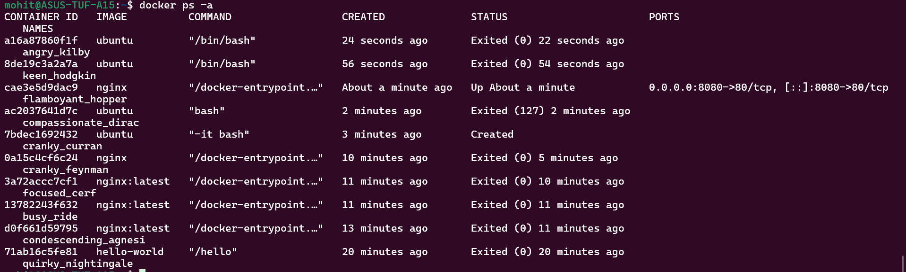
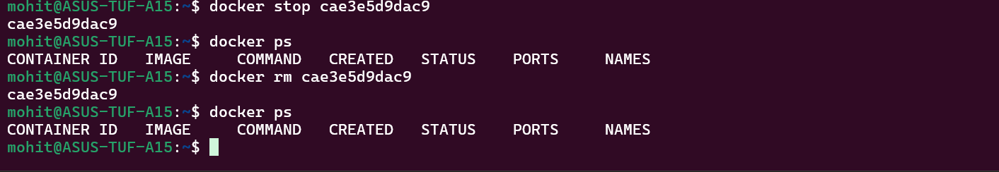
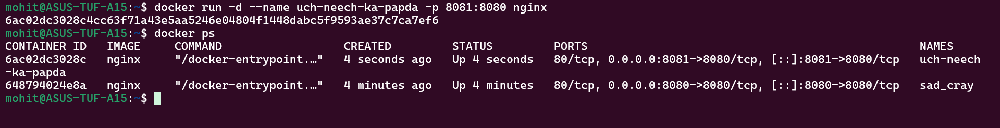
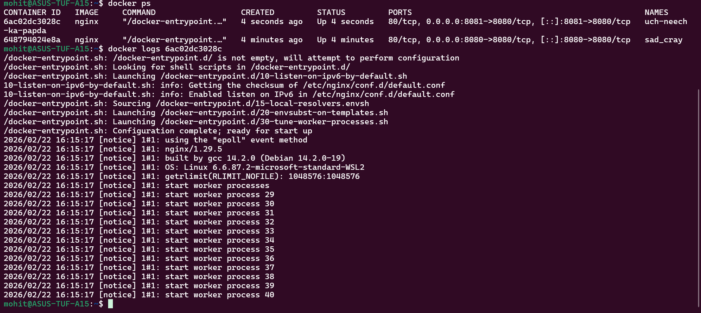
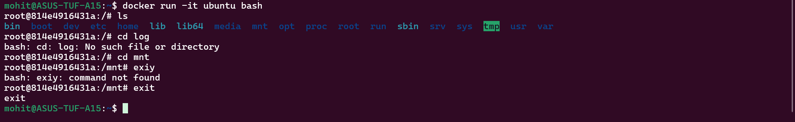

Task 1:-
What is a Container?
A container is a lightweight, isolated environment that runs an application with all its dependencies.
It packages:
Application code
Runtime
Libraries
System tools

Containers solve:
“It works on my machine” problem.

Why Do We Need Containers?
Consistent environments across dev/test/prod
Faster deployments
Lightweight compared to VMs
Easy scaling
Microservices-friendly

Containers vs Virtual Machines
Feature	                      Containers	                 Virtual Machines
OS	                          Share host kernel	             Full guest OS
Boot Time	                  Seconds	                     Minutes
Size	                      MBs	                         GBs
Performance	                  Near-native	                 Slight overhead
Isolation	                  Process-level	                 Full hardware-level

Containers use OS-level virtualization.
VMs use hardware virtualization.

Docker Architecture
Docker has 4 main components:
Docker Client:-
CLI (docker run)
Sends commands

Docker Daemon (dockerd):-
Runs in background
Builds and manages containers

Docker Images:-
Read-only templates
Used to create containers

Docker Registry (Docker Hub):-
Stores images
Public/private repos

Docker Architecture in Simple Words

When you use command like:-

docker run <any_service>

The flow of the docker is:-
Client → Daemon → Pull image from Registry → Create container → Run that container

Task 2:-

When I run the "hello-world" container:-
 1. The Docker client contacted the Docker daemon.
 2. The Docker daemon pulled the "hello-world" image from the Docker Hub.
    (amd64)
 3. The Docker daemon created a new container from that image which runs the
    executable that produces the output you are currently reading.
 4. The Docker daemon streamed that output to the Docker client, which sent it
    to your terminal.

Task 3:-

Task 4:-

1) It runs in background in detached mode where the service/container keeps running and logs doesn't get showed up in terminal. Basically terminal doesn't get attached and the service keeps running without having terminal attached.

2) and 3) 

4) 

5) 