Task 1:- 

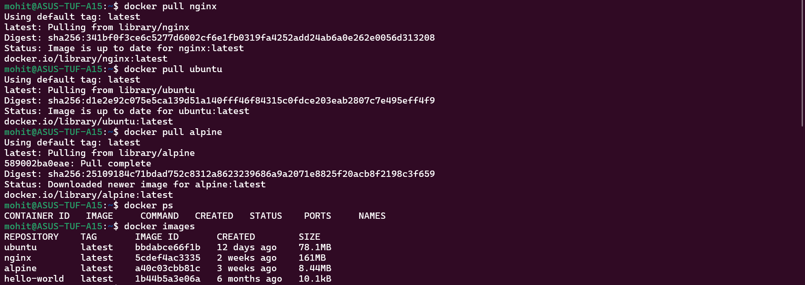
Why Is Alpine So Small?
Alpine uses musl libc instead of glibc
Minimal packages
Designed for containers
No unnecessary system tools

Ubuntu:
Full Linux distribution
Larger base libraries
👉 Smaller image = faster pull = faster deployment.

I can see Environment variables:-
Entrypoint
Default command
Exposed ports
Image ID
Creation date

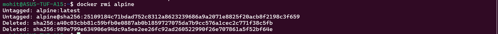

Task 2:-

I saw images, creation date, created by, size and comments.

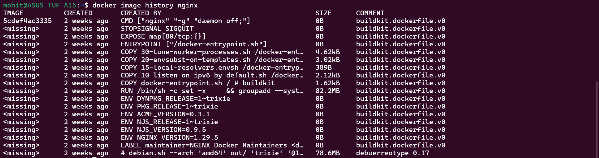

What Are Layers?
Each instruction in a Dockerfile creates a layer.

Why Use Layers?
Efficient caching
Faster rebuilds
Shared layers between images
Less disk usage
If two images share same base image, Docker stores it only once.

Some layers show 0B because they are metadata layers like ENTRYPOINT, CMD, EXPOSE, etc.

Task 3:-
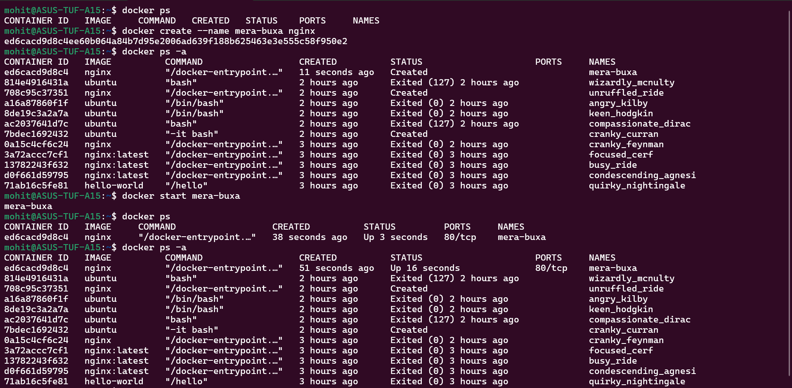

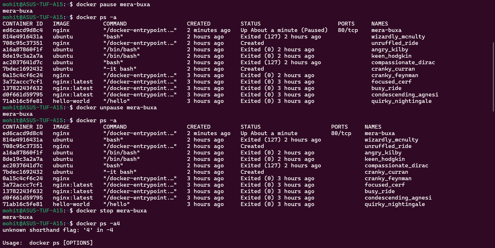

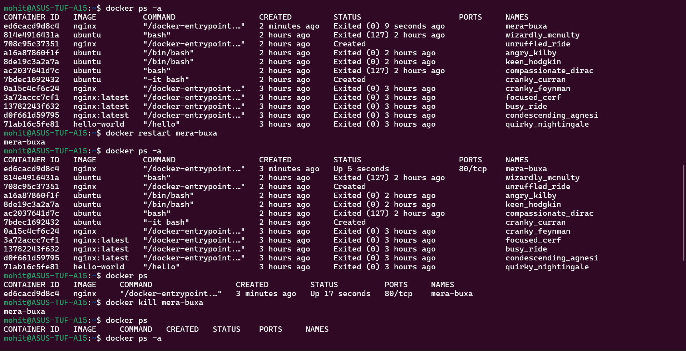

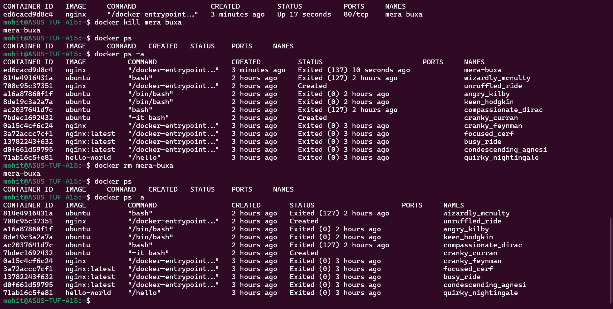

Task 4:-
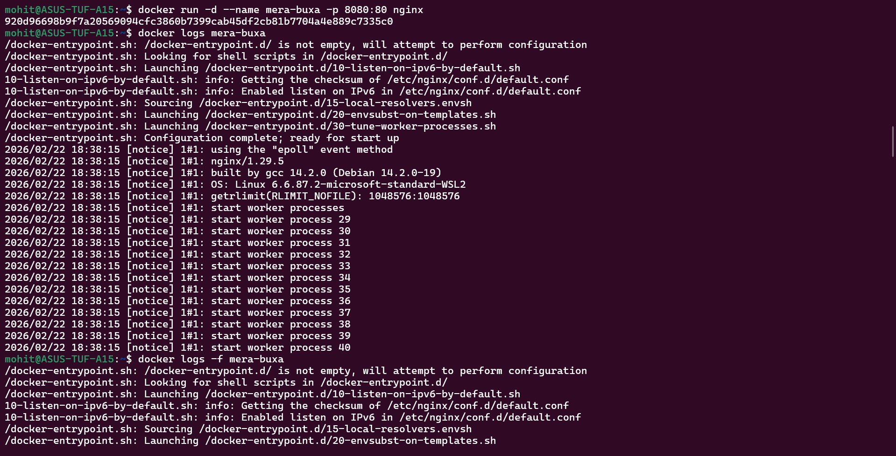

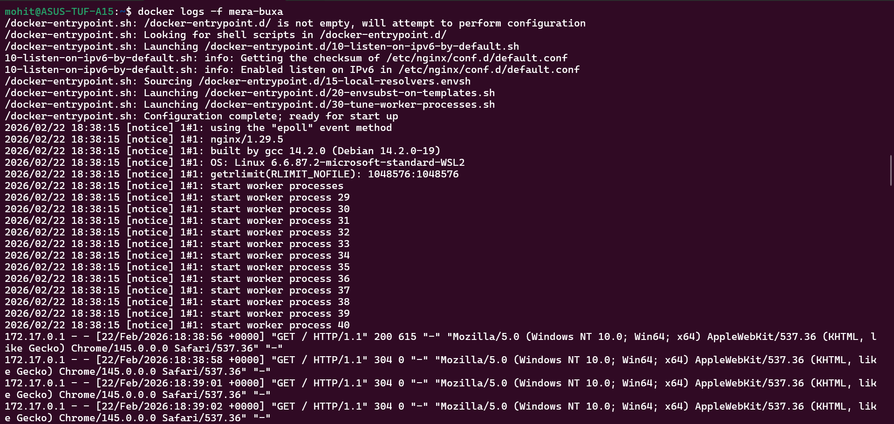

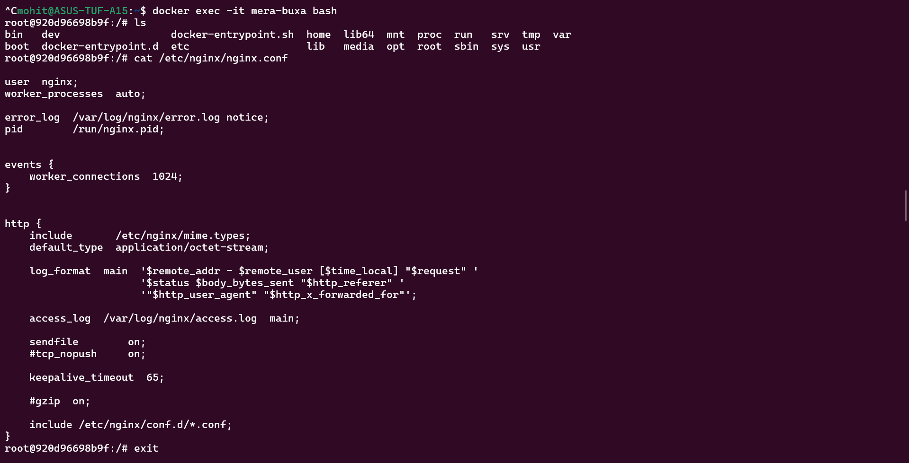

IP address:- 172.17.0.2
Port mappings:- "80/tcp"
Mounts:-  "Mounts": []

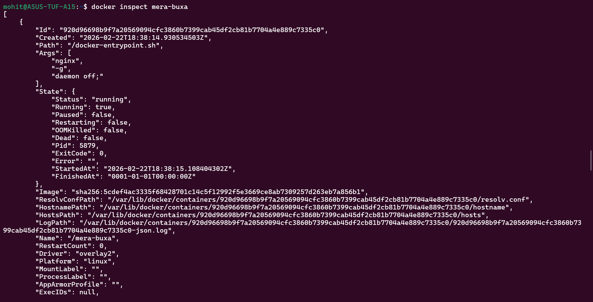

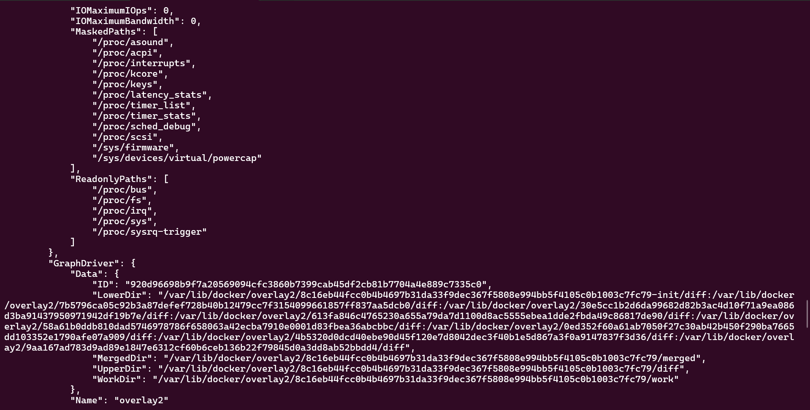

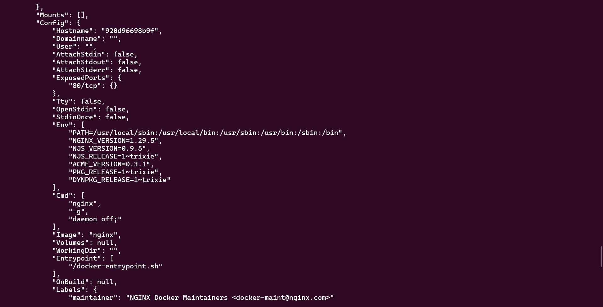

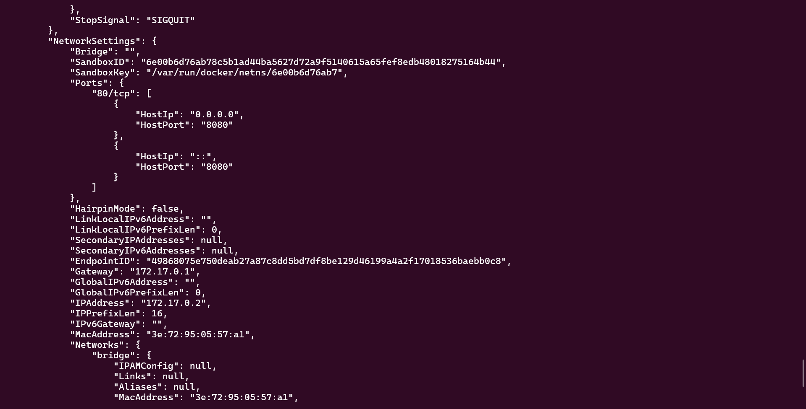

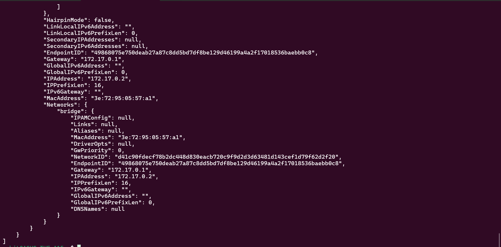

Task 5:- 

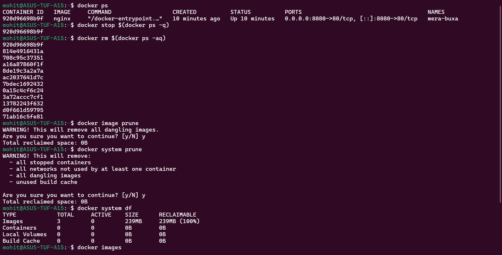

