Task 1:- 

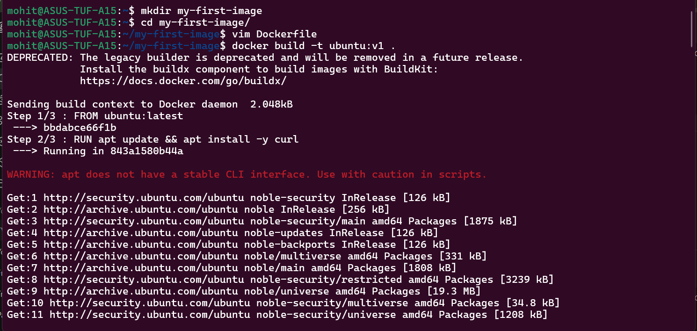

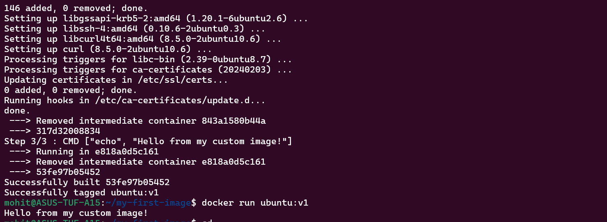

Dockerfile:- 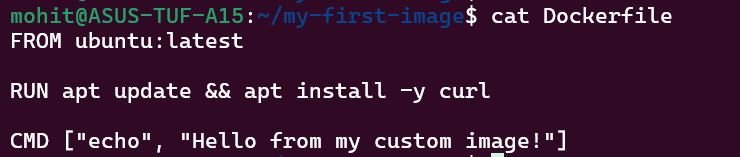

Task 2:-

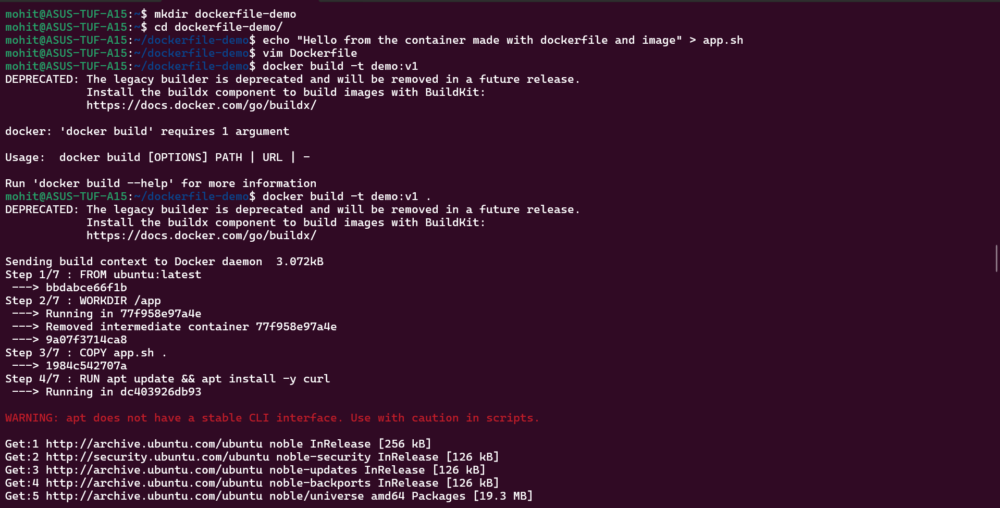

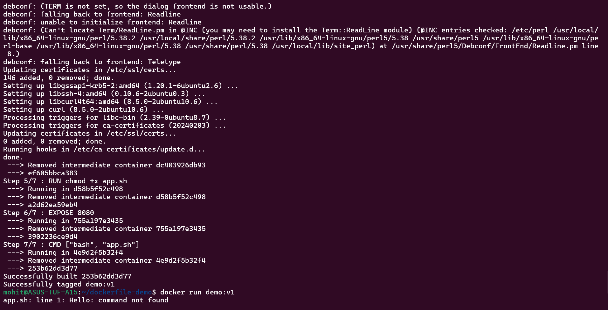

Dockerfile:- 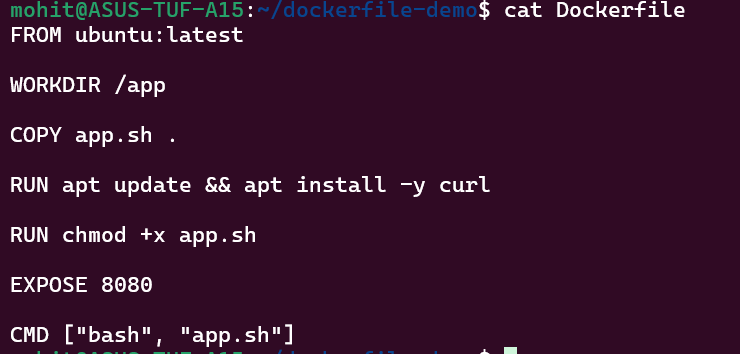

Task 3:-

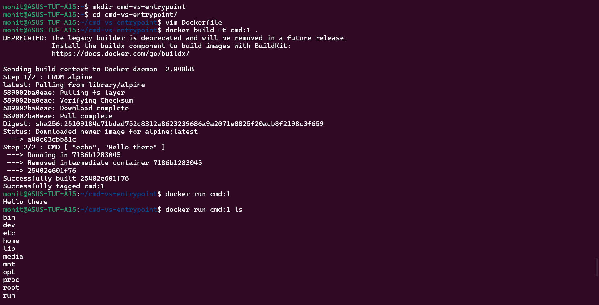

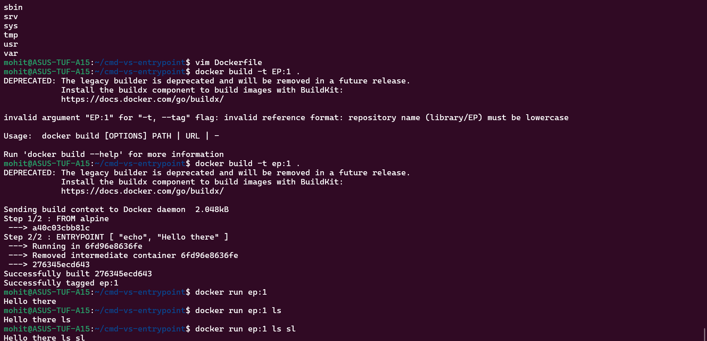

Dockerfile:- 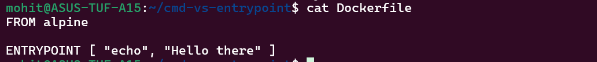

CMD gets replaced if we pass a new command whereas Entrypoint is fixed. The passed commands/arguments get appended.

Task 4:-

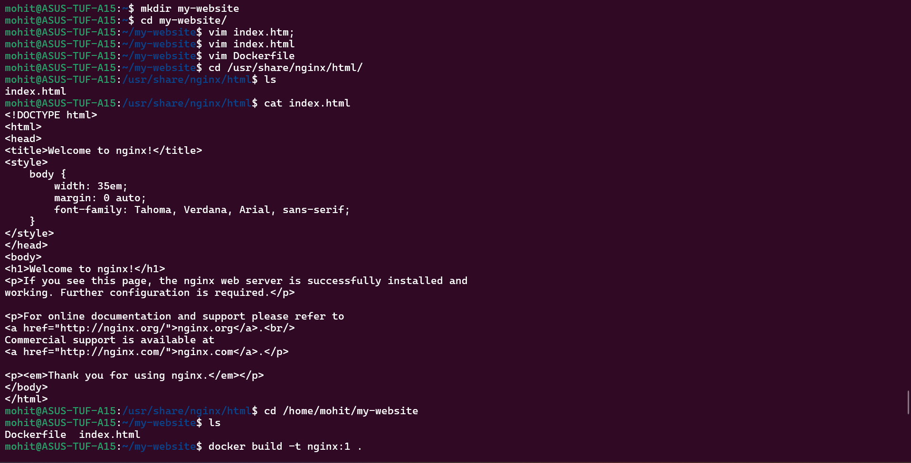

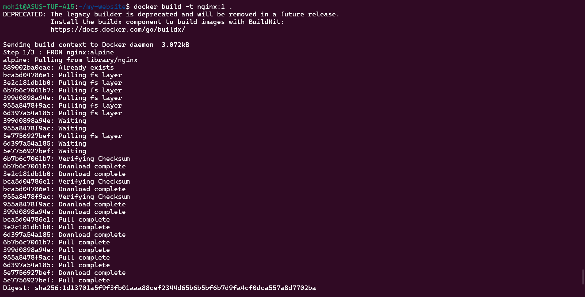

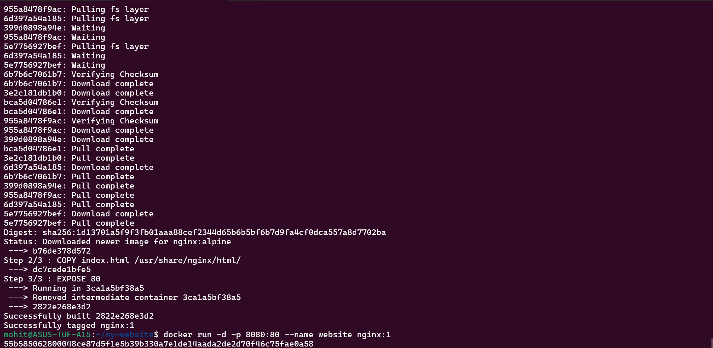

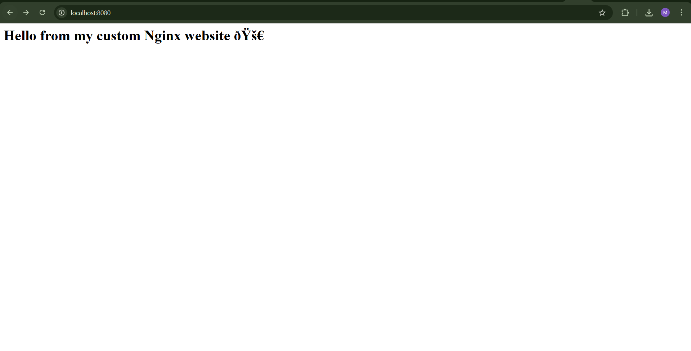

Dockerfile:- 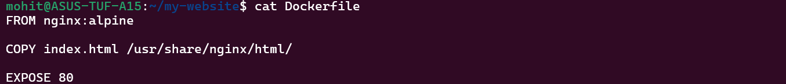

Task 5:-

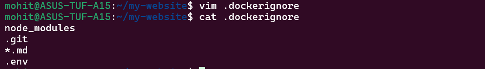

Now when you run "docker build -t <name>:<version> ." command, it sends entire directory to docker daemon. When we use .dockerignore file, .dockerignore will prevent large folders, secrets and unnecessary files. This will prevent the size of images getting big and reduces build time.

Task 6:-

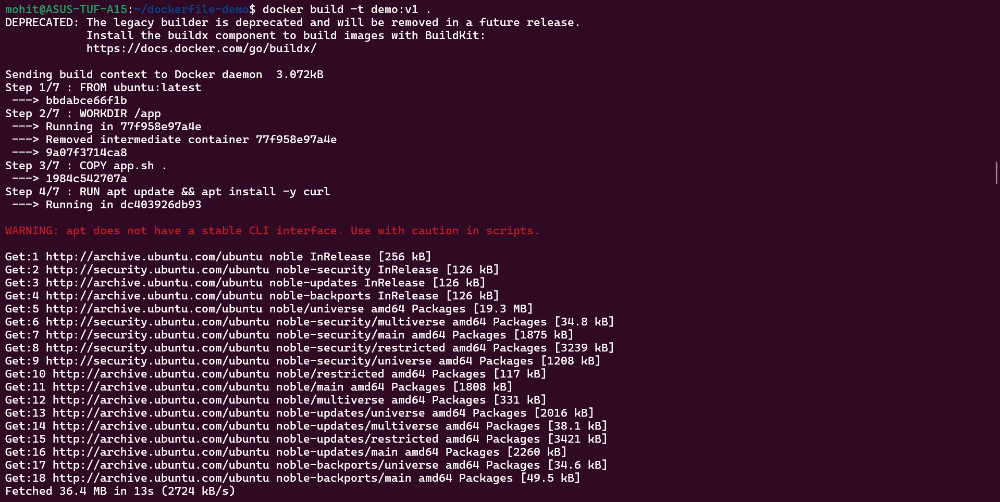

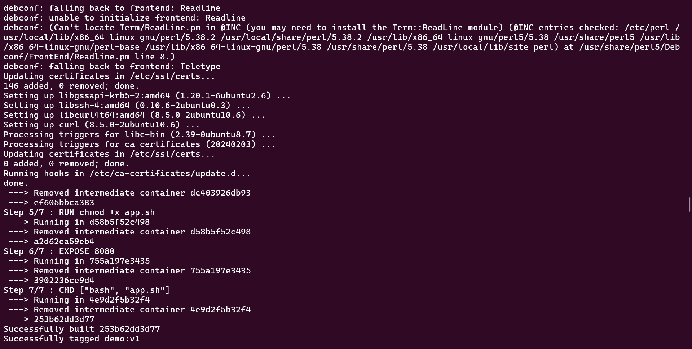

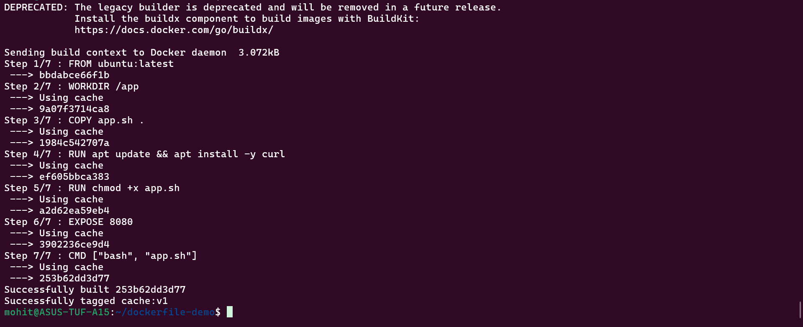

Docker caches layer so when you build the same dockerfile again, it will use the cache and also display the message "using cache".
Docker build layer by layer. If you change one layer then all the layers after it rebuild. So it is best to put the frequently changed layer to the last.