Task 1:- 

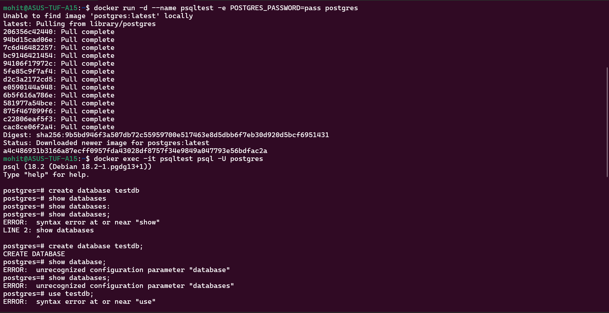

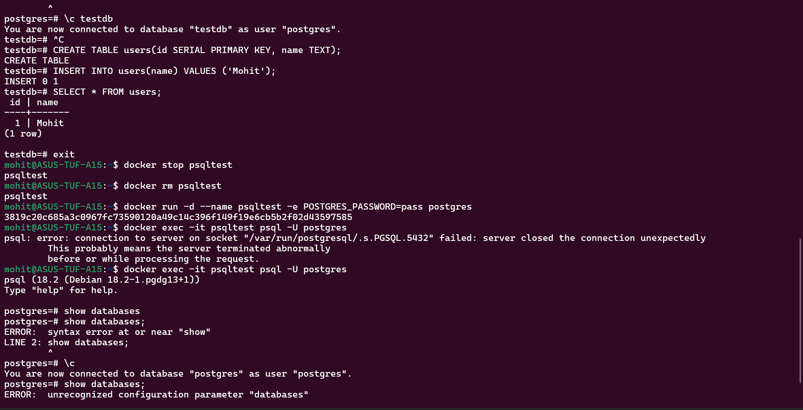

Data is gone because containers are ephemeral. File System inside containers live in writable layers. When container is removed, writing layer is destroyed.

Task 2:-

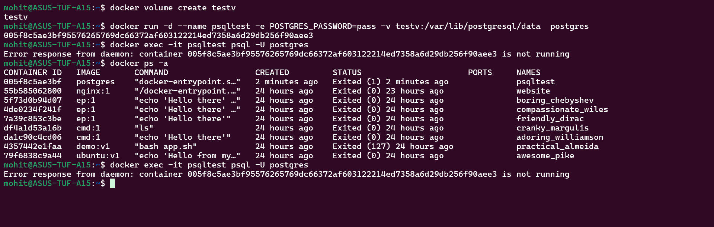

Data is still there because Volume exists outside container lifecycle.
Container deleted but Volume still exists.

Task 3:-

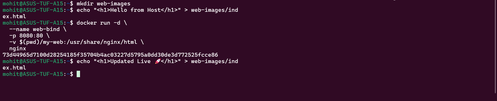

Task 4:-

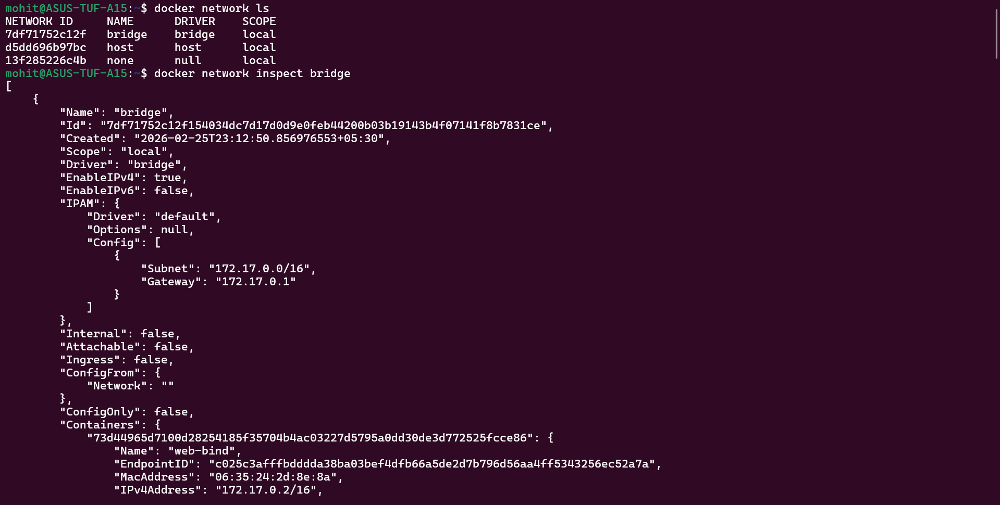

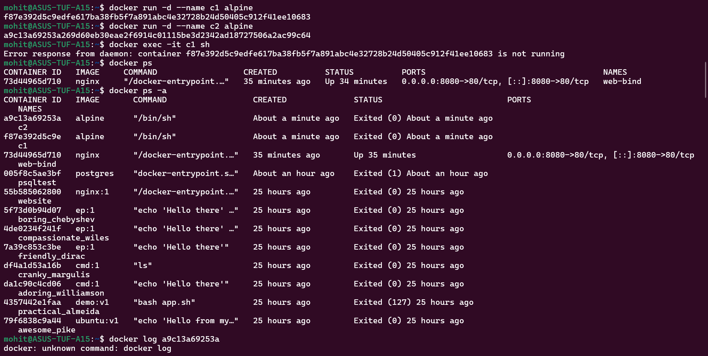

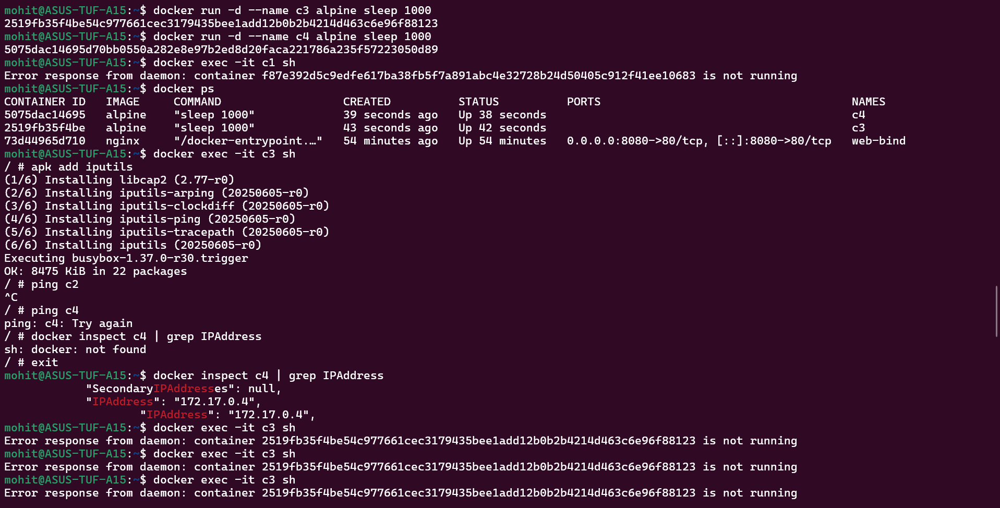

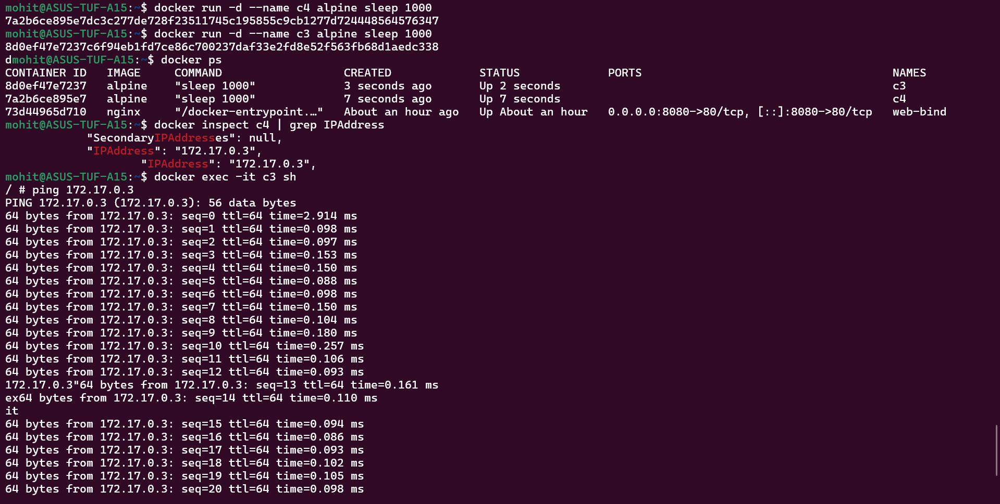

Default bridge does NOT enable automatic DNS resolution by name.

Task 5:-

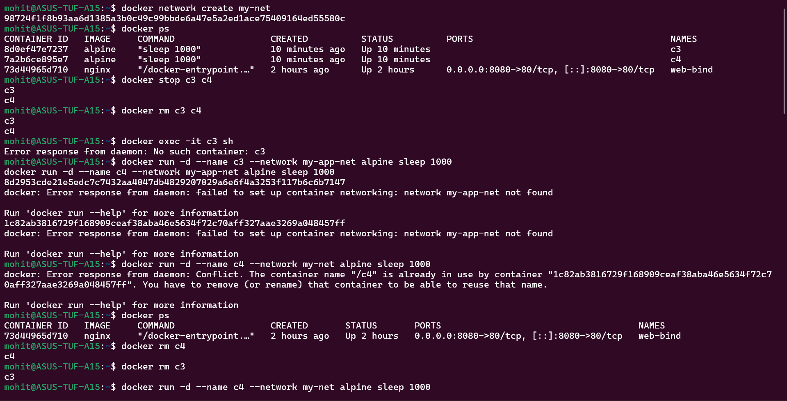

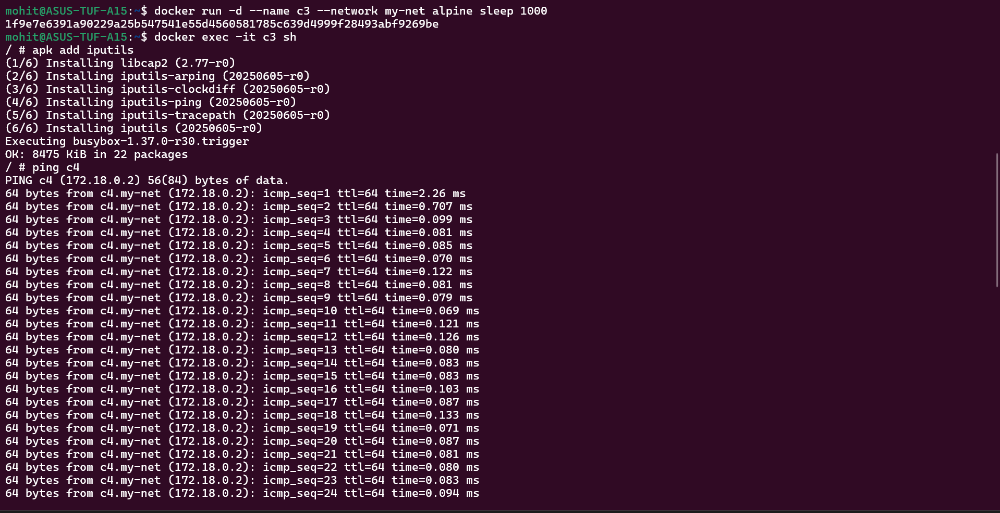

Custom bridge networks enable:
Embedded DNS
Automatic name resolution
Isolated networking

Default bridge does NOT.

Task 6:-

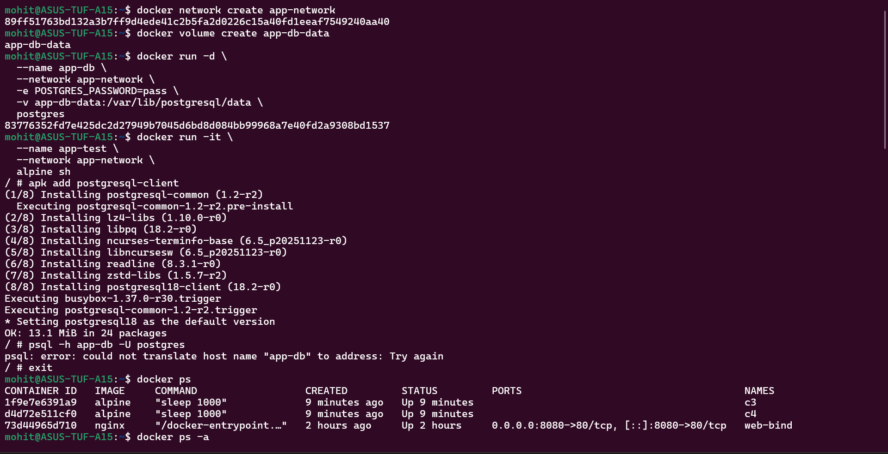

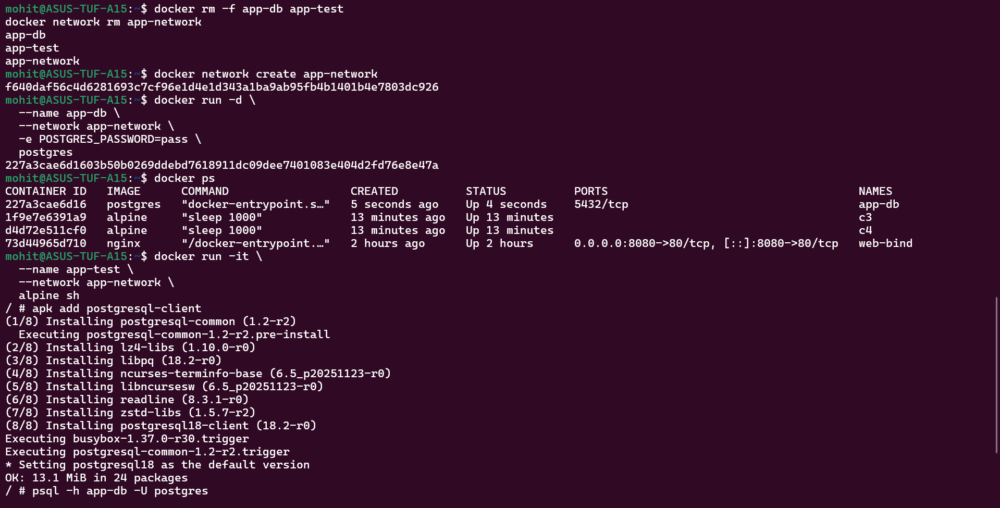

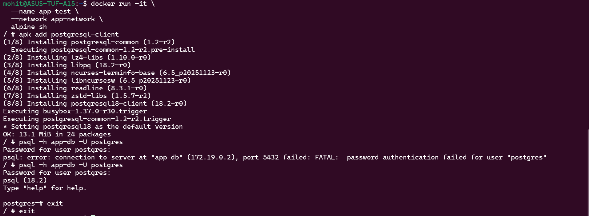

It connects by container name.