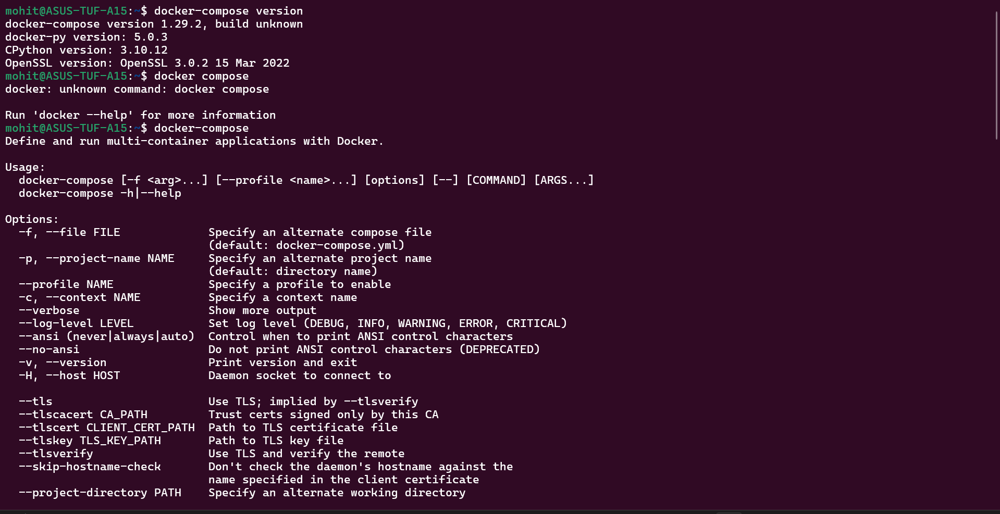
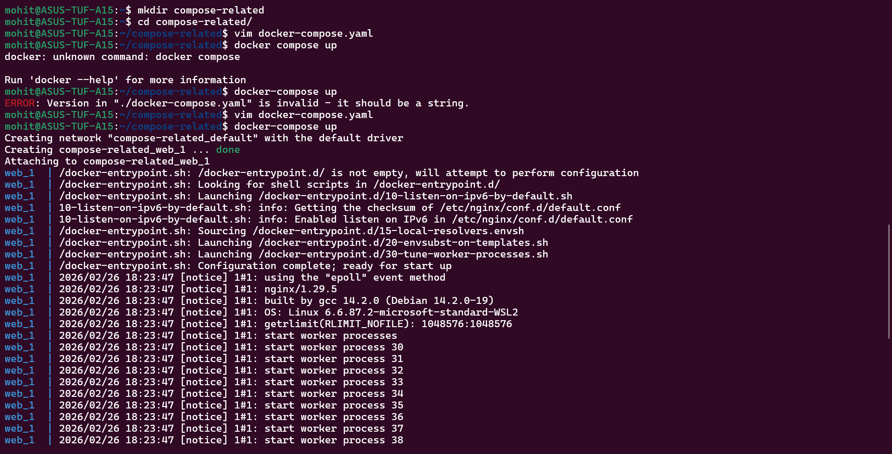
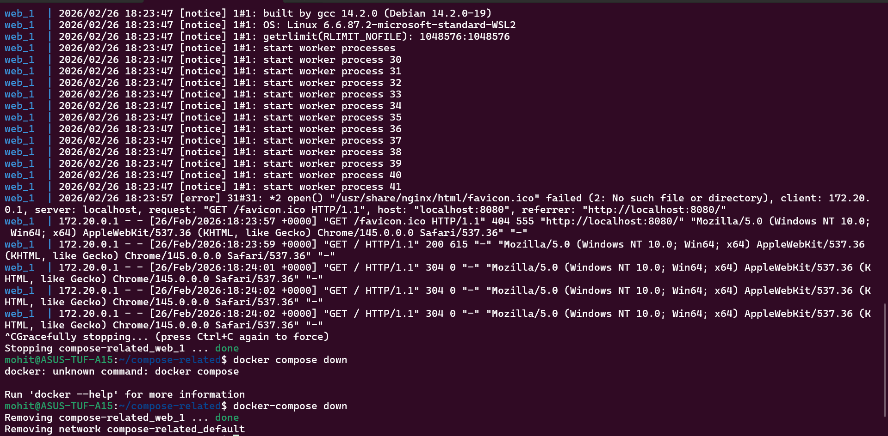
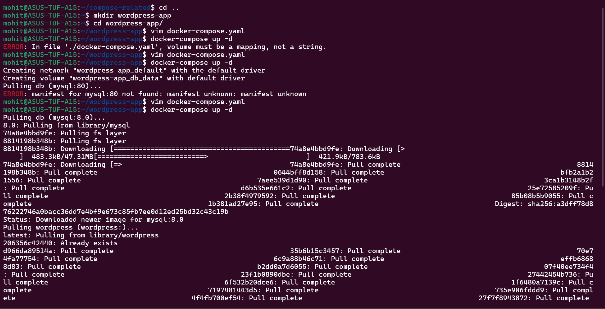
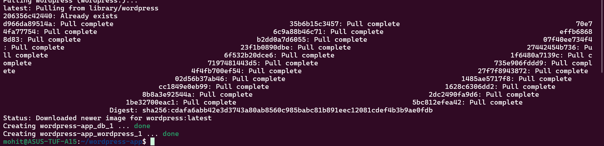
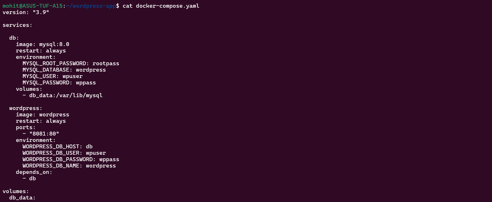
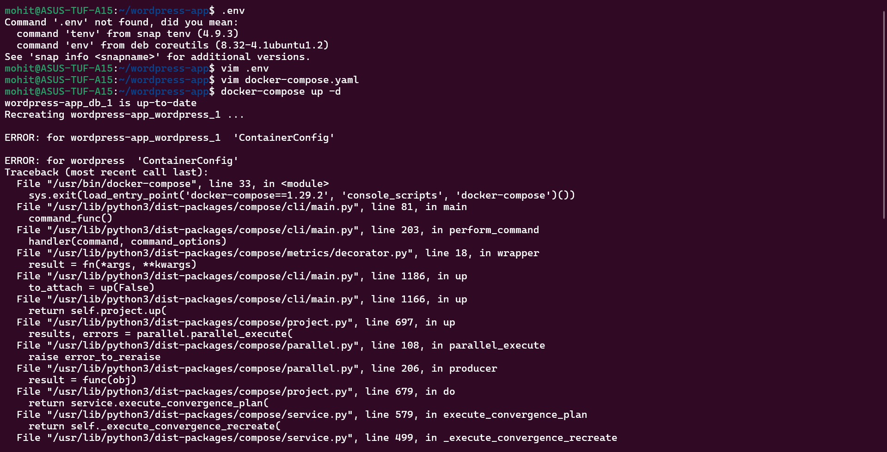
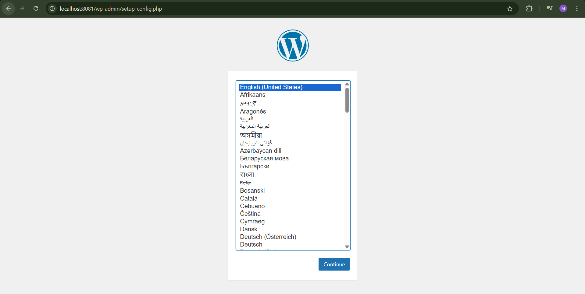
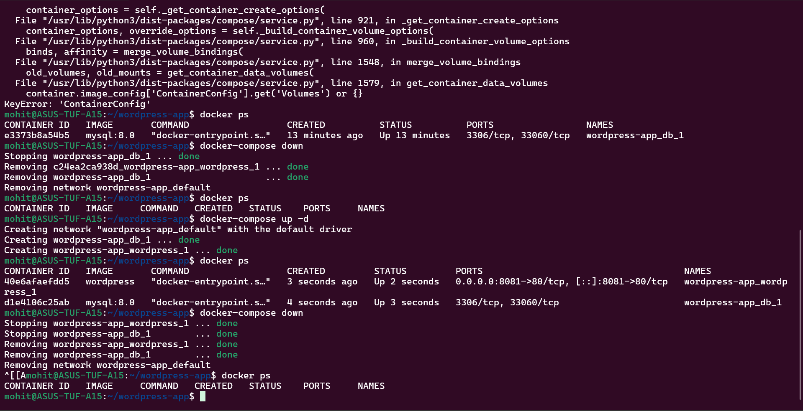
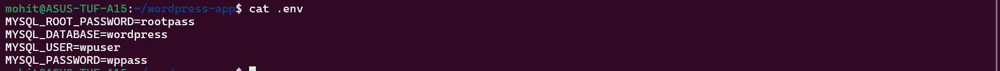

Task 1:-

Task 2:-

docker compose file:- 

Compose automatically creates network for you, pulls image, starts container and connects everything all from one file.

Task 3:-

docker compose file:- 

Task 4:-

Start detached:
docker compose up -d

View running services:
docker compose ps

View logs (all services):
docker compose logs

Follow logs:
docker compose logs -f

Logs for specific service:
docker compose logs db

Stop without removing:
docker compose stop

Remove everything:
docker compose down

Remove including volumes:
docker compose down -v

Rebuild after changes:
docker compose up -d --build

Task 5:-

.env files:- 