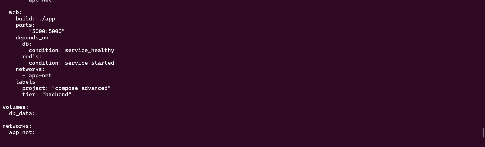
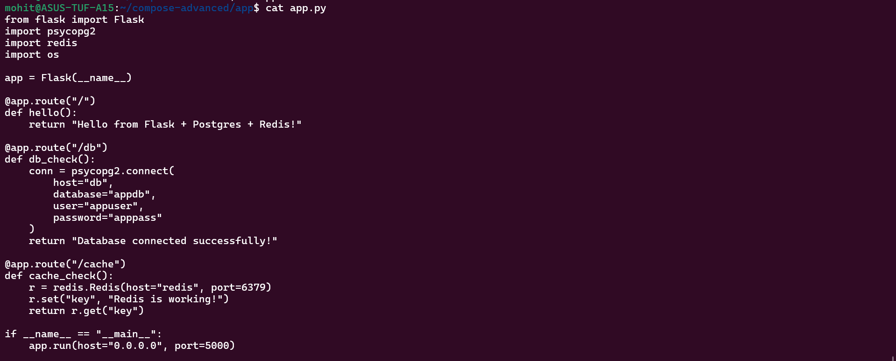
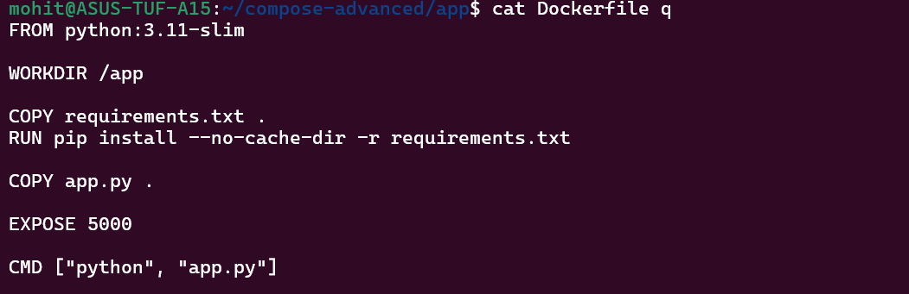
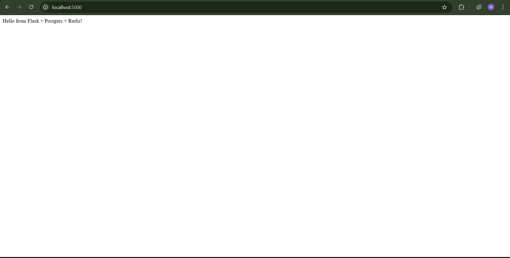
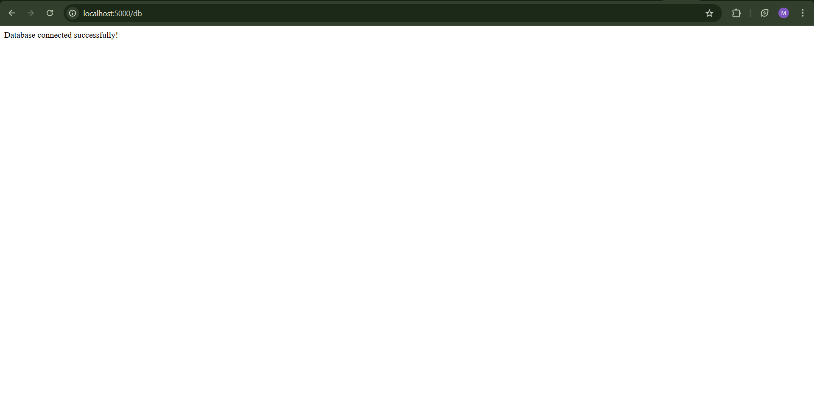
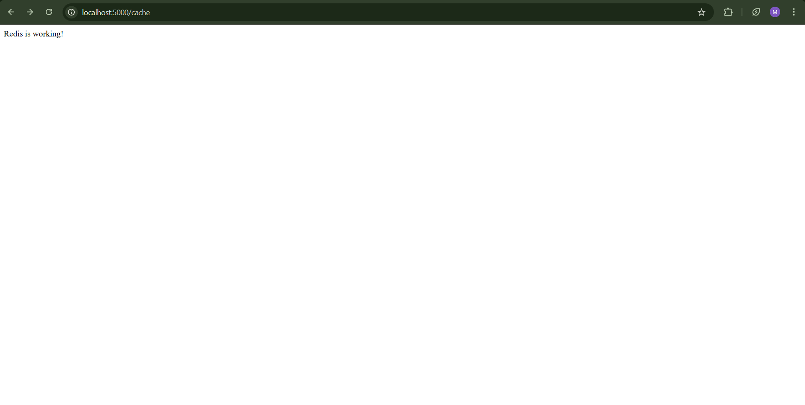

Task 1, 2, 3, 4, 5 and 6 are added and the files are added and also the answers for the questions are also added:-

Files:-

1) Docker compose file 

2) Code files:- app.py, requirements.txt and Dockerfile

Answers:- 

Task 2:-

This means:
App will wait until DB passes healthcheck
Not just “container started”
But “database ready to accept connections”

Task 3:-

restart: always
Always restart
Even after system reboot

restart: on-failure
Restart only if container exits with error
Not if manually stopped0

Task 5:-

All 3 web will try to bind to port 5000 which is impossible. Only 1 will be able to do that, so scaling will break.

Why Scaling Fails With Port Mapping?
Because port binding is host-level and only one process per port can be bind. Also compose is not a load balancer. 

We use Load balancer or nginx for the scaling.

Website and path screenshots:- 

