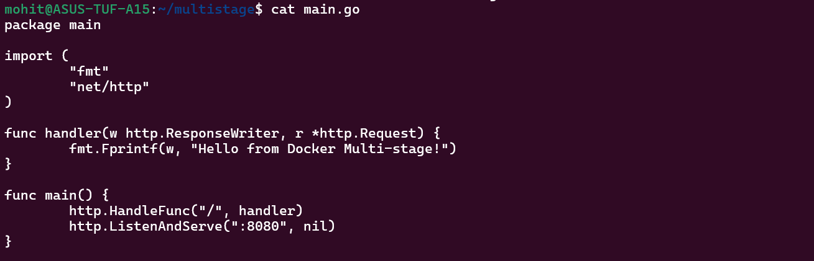
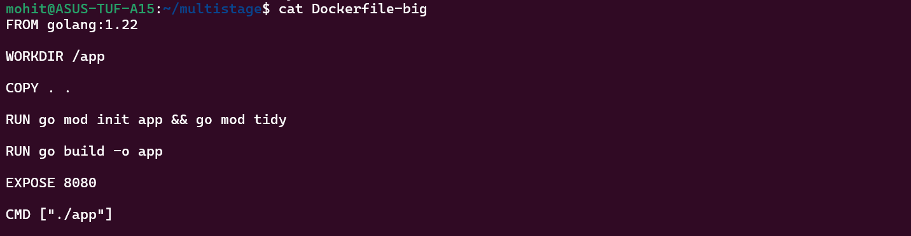
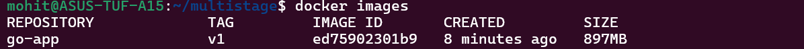
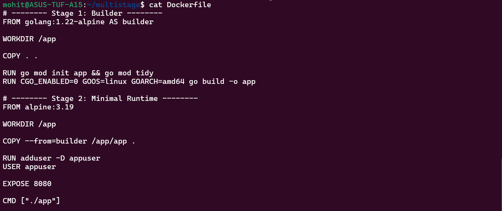
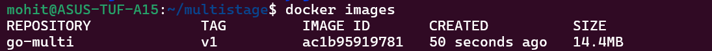
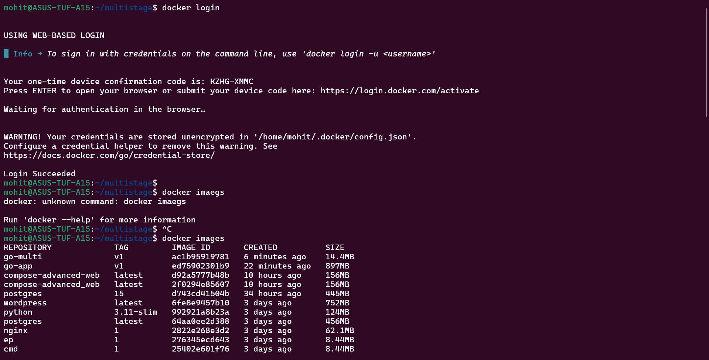
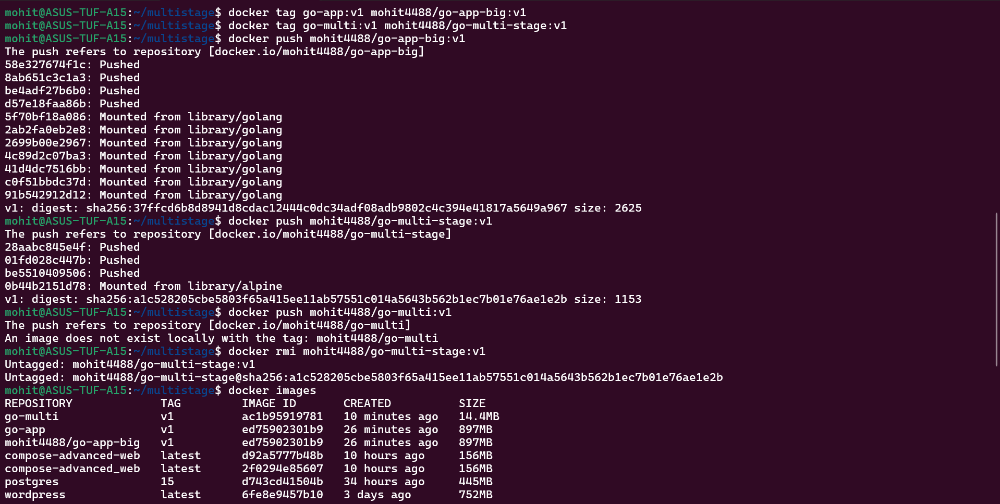
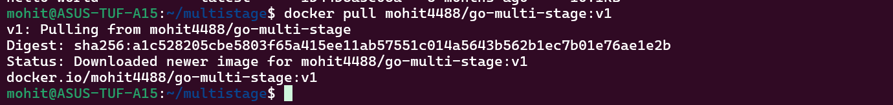
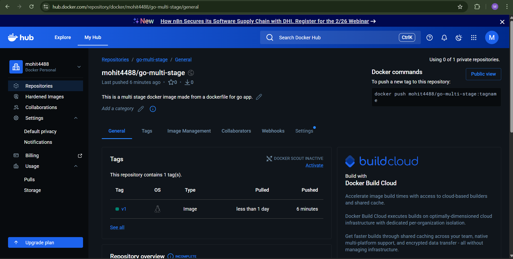
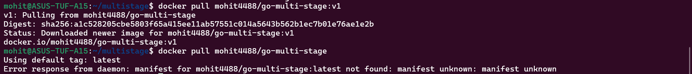

Task 1:-

main.go - 

Dockerfile-big -

Image Size -

This image includes Go compiler, build tools and entire OS.

Task 2:-

Dockerfile Multi-stage:- 

Image Size -

This image is smaller but serves the same purpose because final image does NOT include Go compiler. It only contains compiled binary and uses minimal Alpine base image, No build tools and fewer layers.

Task 3:-

DockerHub Repo for my multistage image:- https://hub.docker.com/repository/docker/mohit4488/go-multi-stage/general

Task 4:-

 

Latest version was by default extracting but got an error because I have pushed only the v1 version not the latest.

Task 5:-

I will remember all the Image best practice. Thank you for the guidance and information.