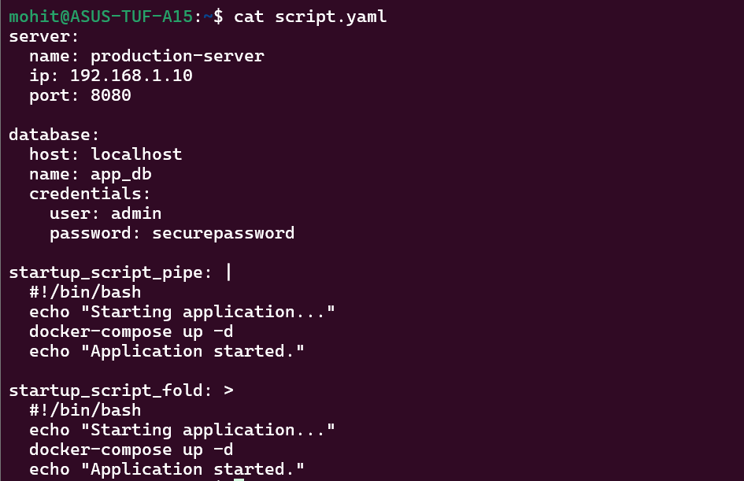

Task 6:- 

Correct block:
tools:
  - docker
  - kubernetes

Broken block:
tools:
- docker
  - kubernetes

Problem is the first list item is not properly indented.

I have learned:-
1. YAML depends entirely on indentation (spaces only).
2. Lists can be written in block or inline format.
3. `|` preserves newlines, `>` folds them into one line.