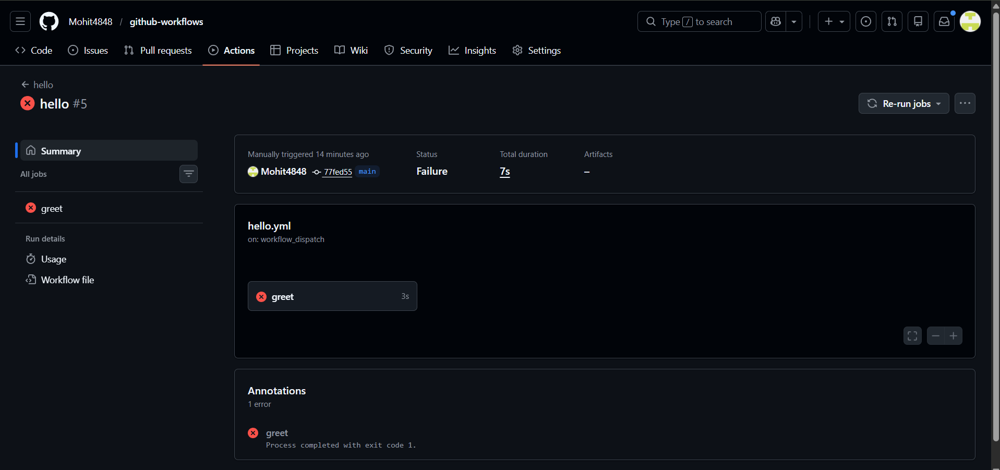
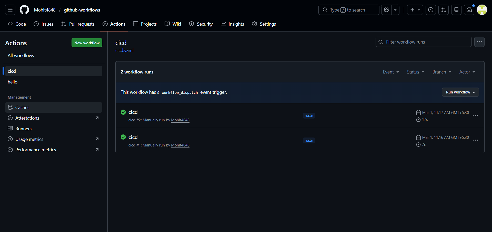
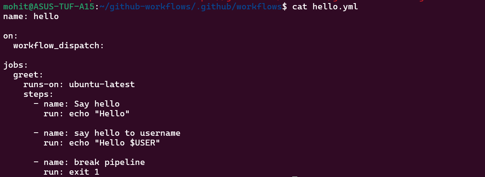
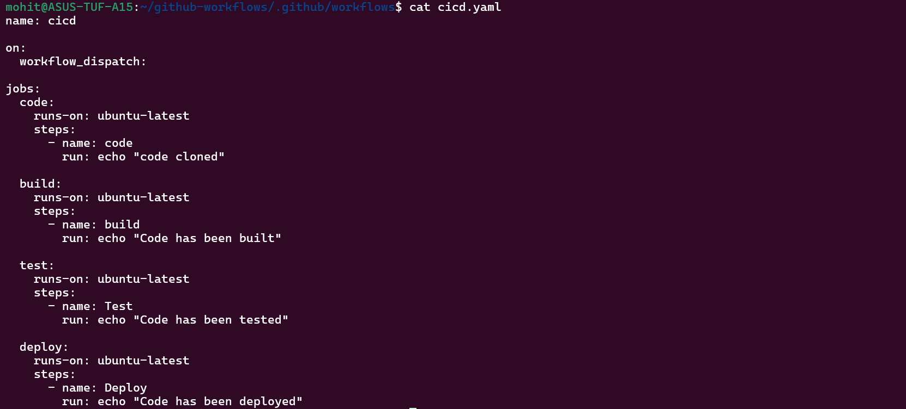

on:
Defines what event triggers the workflow.
Example:
on: push

Means:
Pipeline runs every time code is pushed.

jobs:
Defines tasks executed in the pipeline.
Example:
jobs:
  greet:

You can have multiple jobs:
build
test
deploy
runs-on:

Specifies the machine type used by the runner.
Example:
runs-on: ubuntu-latest
GitHub starts a Linux VM to run the job.

steps:
Steps are individual commands executed in sequence.
Example:
steps:
  - checkout
  - run commands

uses:
Runs a prebuilt GitHub Action.
Example:
uses: actions/checkout@v4
This downloads your repo onto the runner.

run:
Executes shell commands.
Example:
run: echo "Hello"

name:
Gives readable names to jobs or steps.
Helps understand logs.

Pipeline failed:-

Green pipeline run:-

Workflow file .yaml:-

