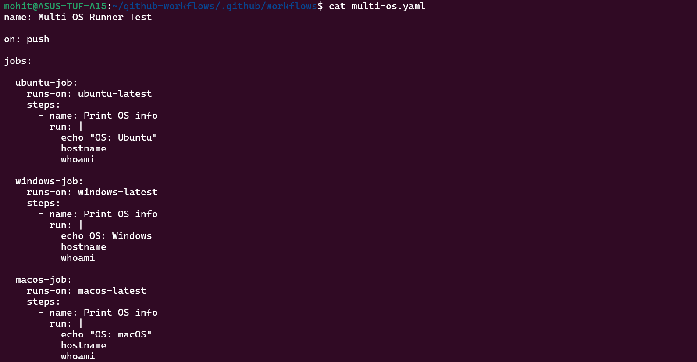
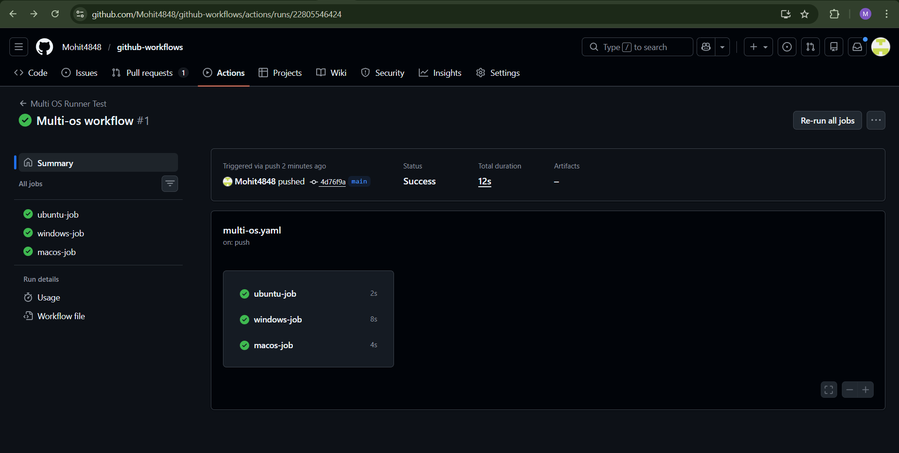
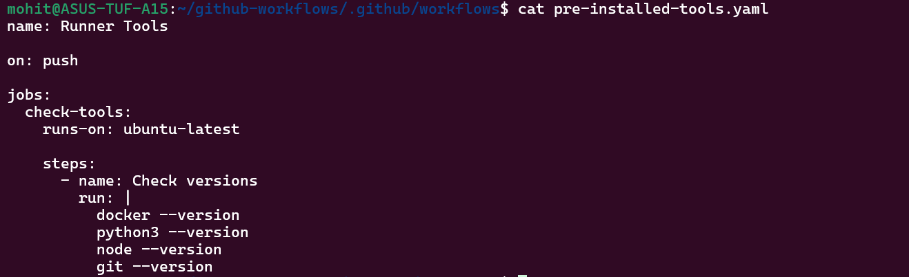
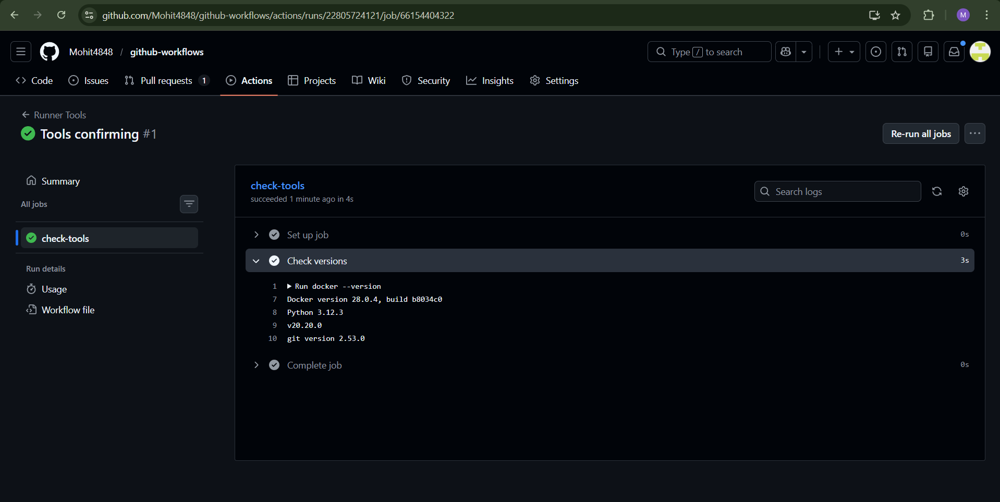
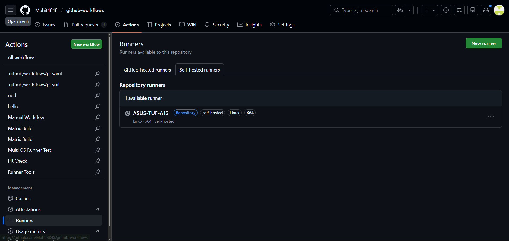
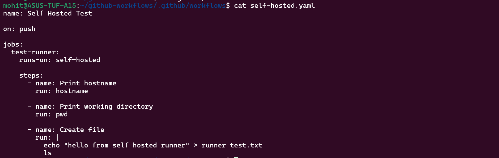
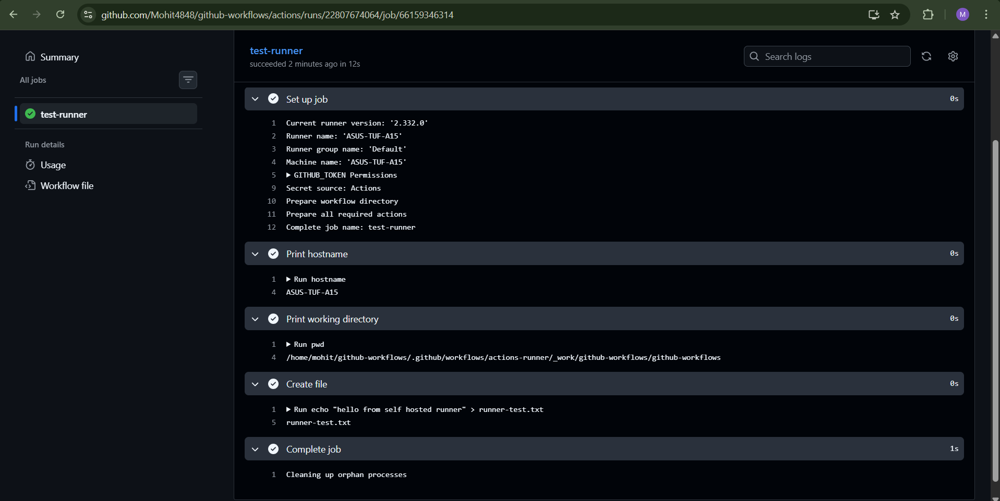
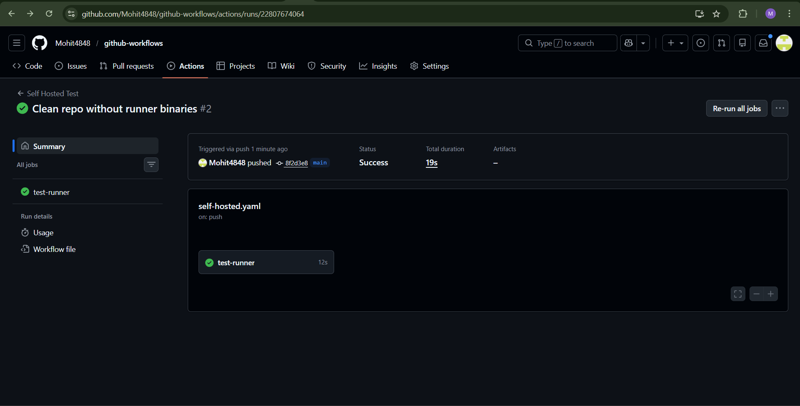
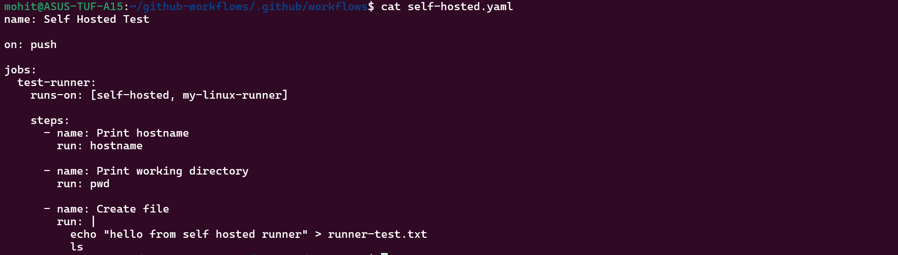

Task 1:-

What is a GitHub-Hosted Runner?

A GitHub-hosted runner is a temporary virtual machine created by GitHub to execute workflow jobs.
It is automatically provisioned and is automatically destroyed after the job. It is pre-installed with development tools and managed completely by github. 

We do not maintain it.

Task 2:-

Why does it matter that runners come with tools pre-installed?

In DevOps pipelines, without pre-installed tools we have to install all the necessary tools one by one while running our pipeline, hence making our pipeline run slow.

Github runners come with pre-installed tools making the pipeline faster.

Task 3:-

Task 4:-

Task 5:-

Why labels are important?

It is important because you can have many self-hosted runners. Labels helps pipelines to target the correct machine.

Task 6:-

GitHub-Hosted vs Self-Hosted
Feature	                    GitHub Hosted	                Self Hosted
Who manages it?	            GitHub	                        You
Cost	                    Free (limited minutes)	        Your infrastructure cost
Pre-installed tools	        Many tools installed	        You install them
Good for	                General CI builds	            Custom environments
Security concern	        Shared environment	            Must secure your machine