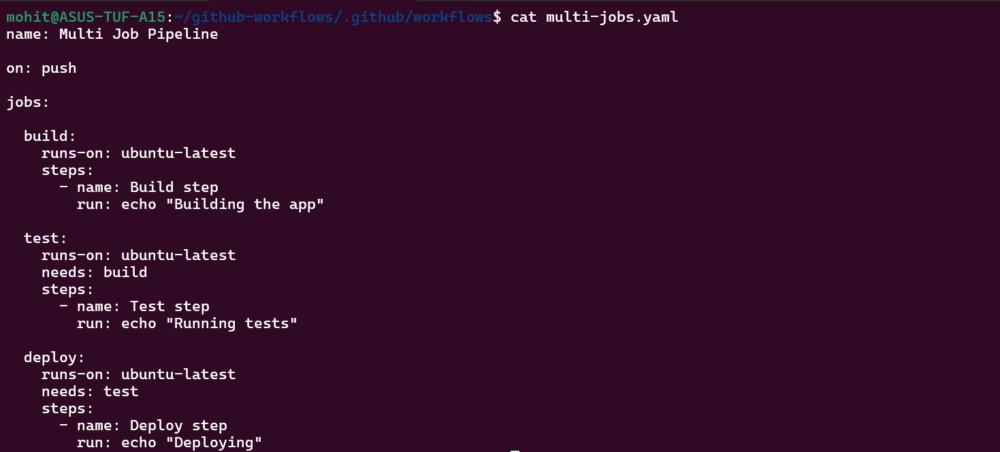
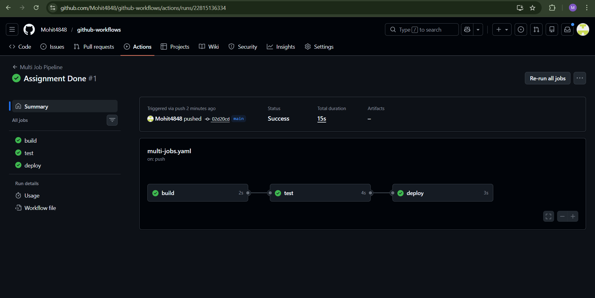
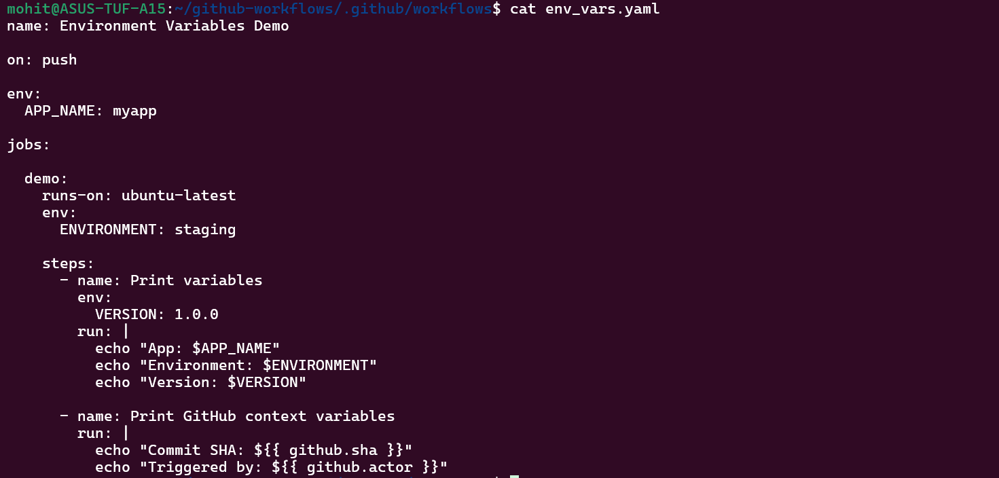
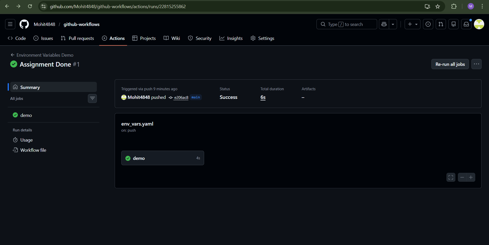
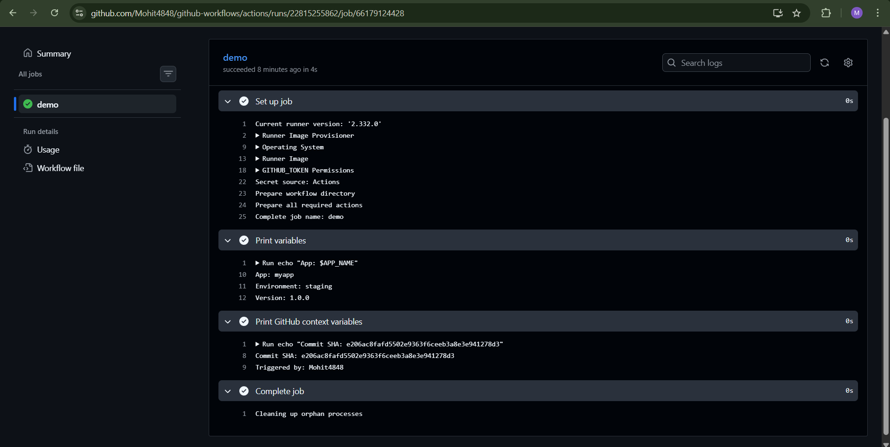
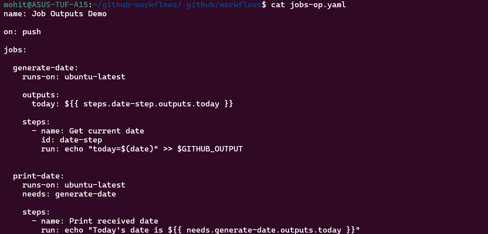
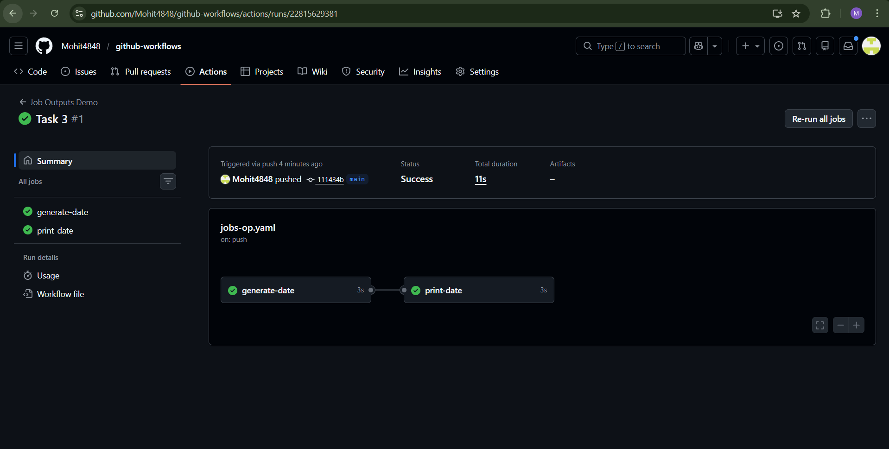
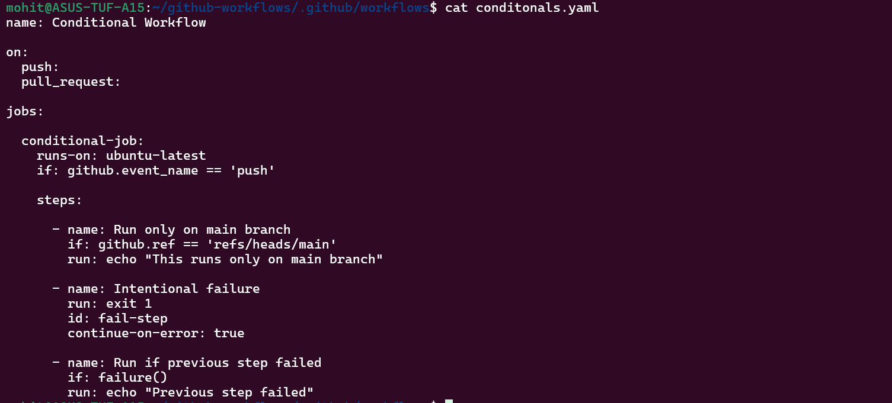
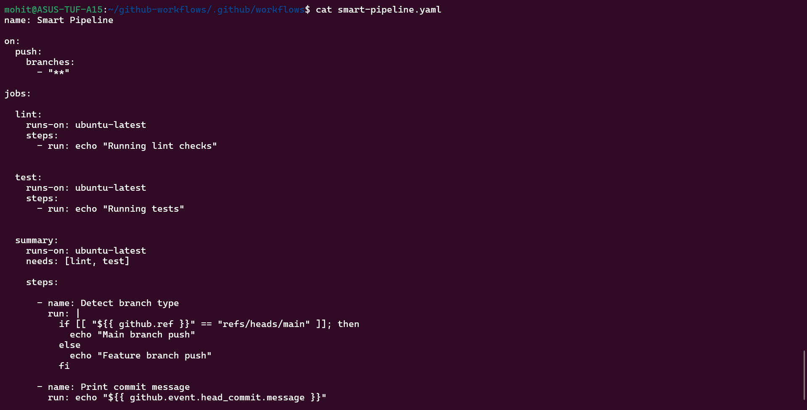
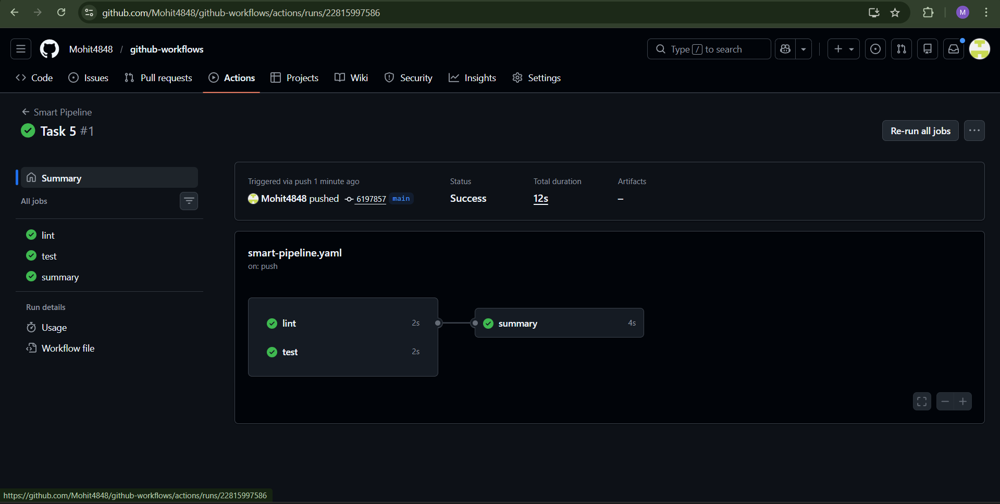

Task 1:-

Without needs: the jobs run parallel but with needs we create dependencies so the next job won't run until the previous job gets completed if you have put needs:<prev_job_name>.

Task 2:-

Task 3:-

Why would you pass outputs between jobs?

We pass outputs between jobs because it allows jobs to share data safely.

Task 4:-

A step with `continue-on-error: true` — what does this do?

Normally without this, the job will stop after the step fails. But with putting the failing steps put within continue block, it run the further steps even after previous job failing.

It is useful as lint errors shouldn't block pipeline. (ye google mai suggestion thi tips mai yaad rakhne ke liye daal diya apna)

Task 5:- 

