Task 1:-

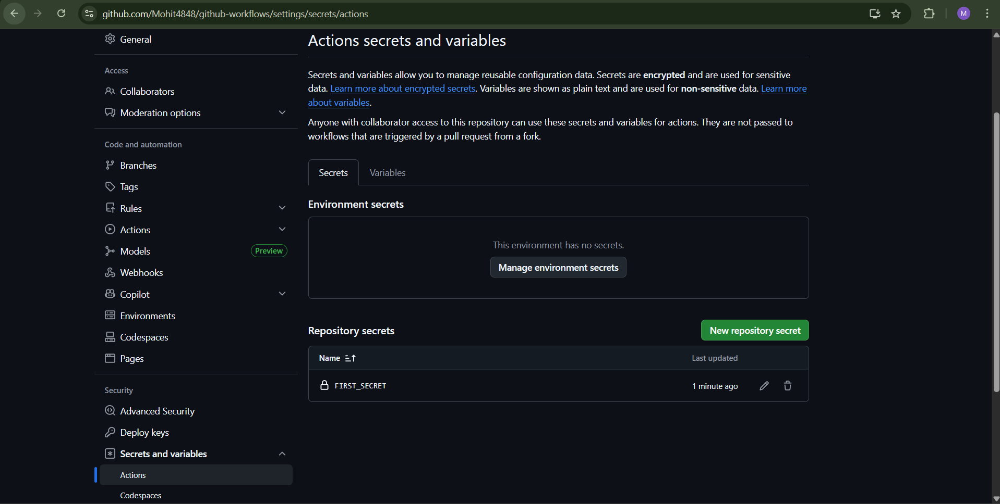

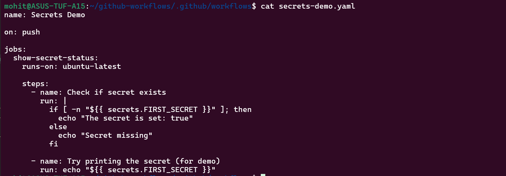

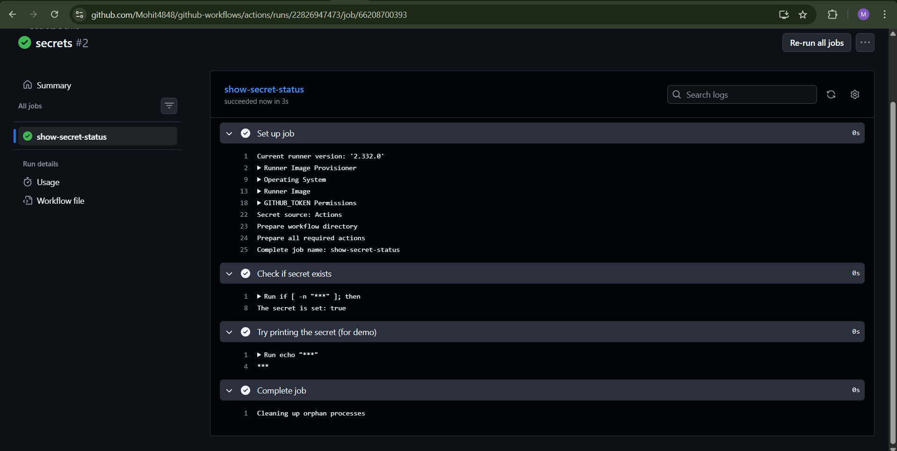

Secrets are encrypted, hidden from logs and are available during only workflow runtime.

Why should you never print secrets in CI logs?

It is so because CI logs are often publicly accessible and stored for months and are readable by contributors. If secrets are printed then they will be leaked.

Task 2:-

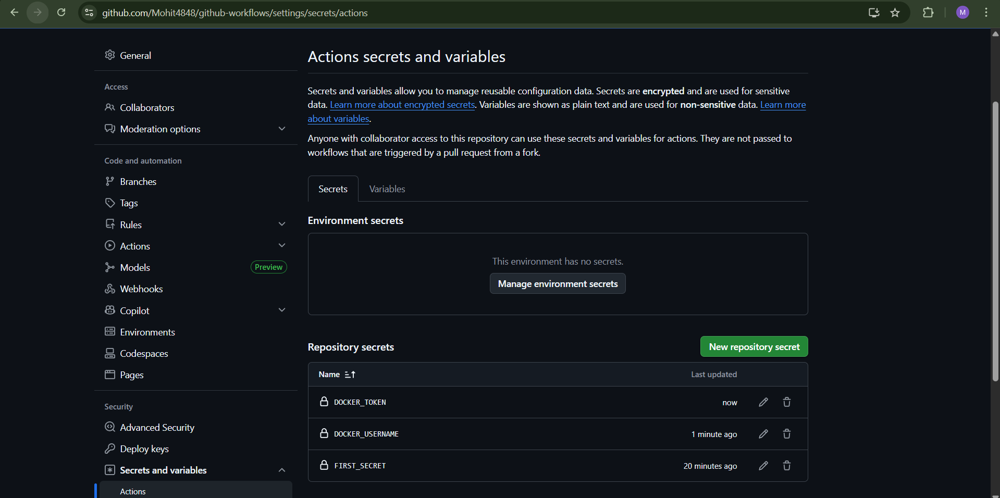

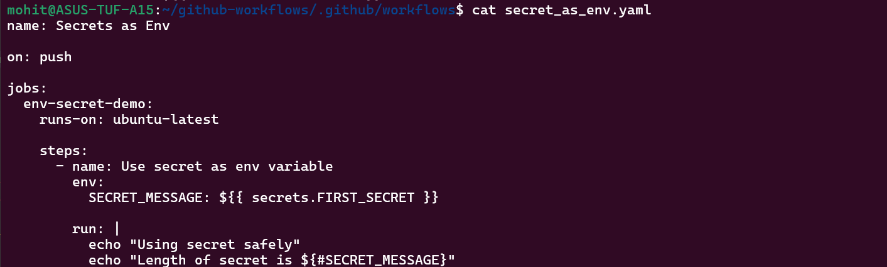

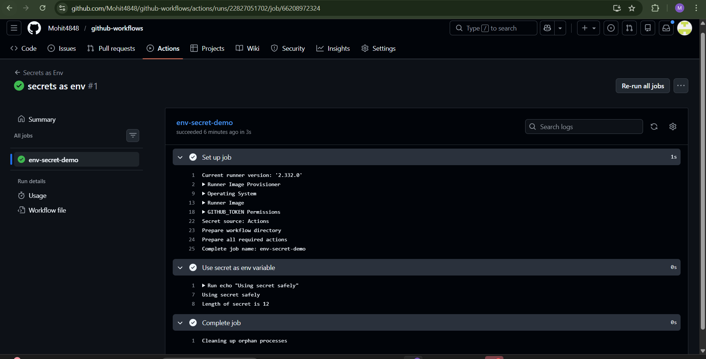

Task 3:-

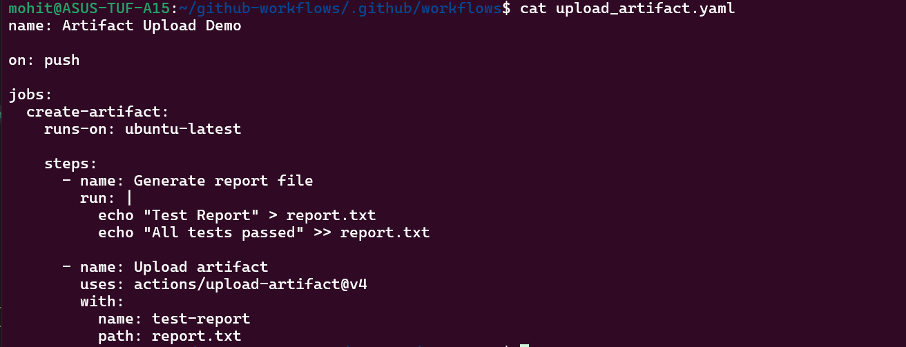

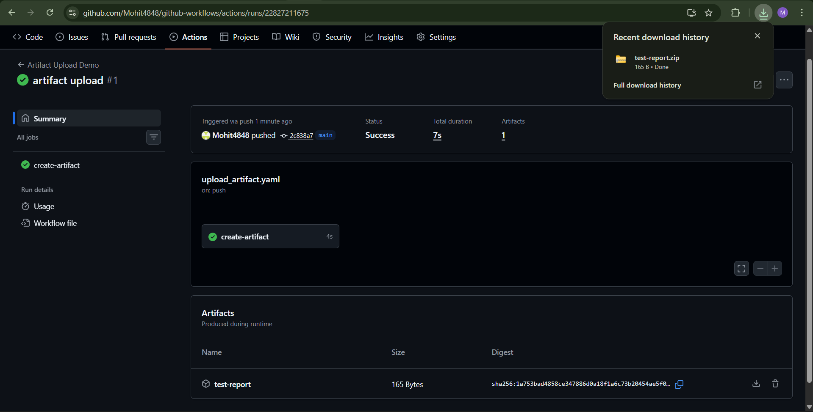

Can you see and download it from GitHub?

Yes, as you can see in the screenshot, I can download and see the artifacts demo file.

Task 4:-

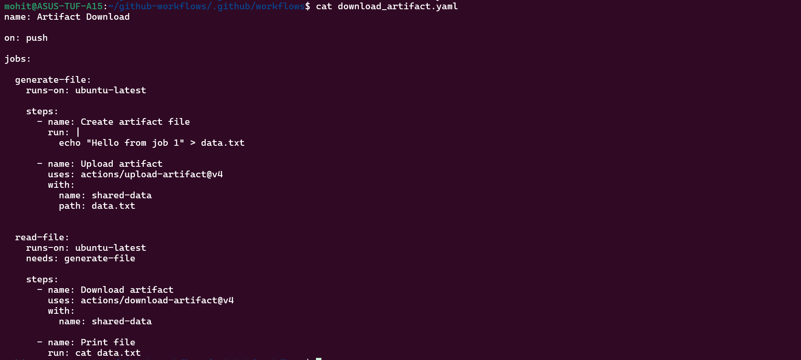

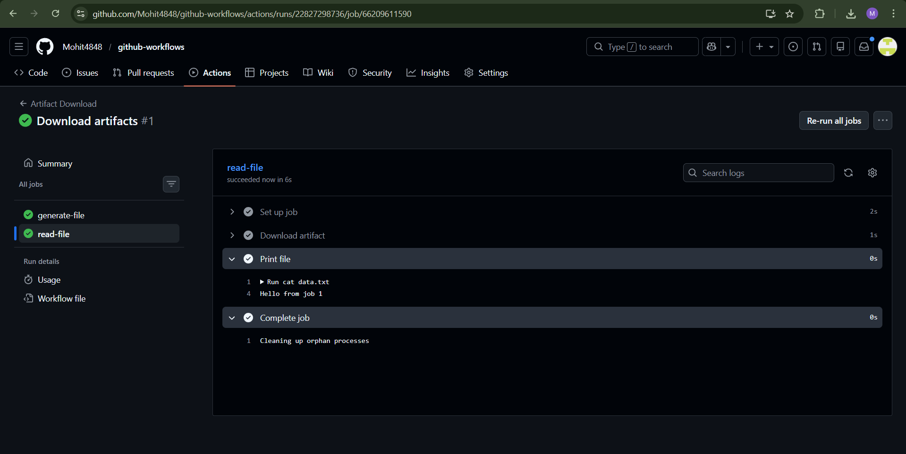

When would you use artifacts in a real pipeline?

We will use it in different steps/jobs while deploying the application. Eg. Build will build the code and then test will test the code build by the build job and then deploy job will deploy the code that has been built by build job and tested by tested job.

Task 5:-

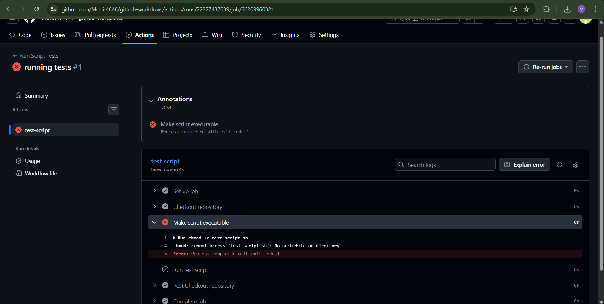

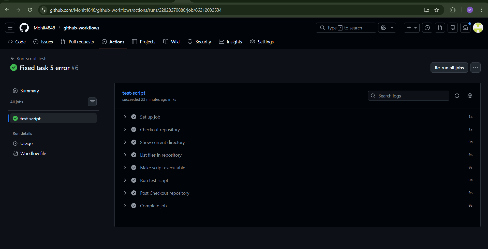

Task 6:-

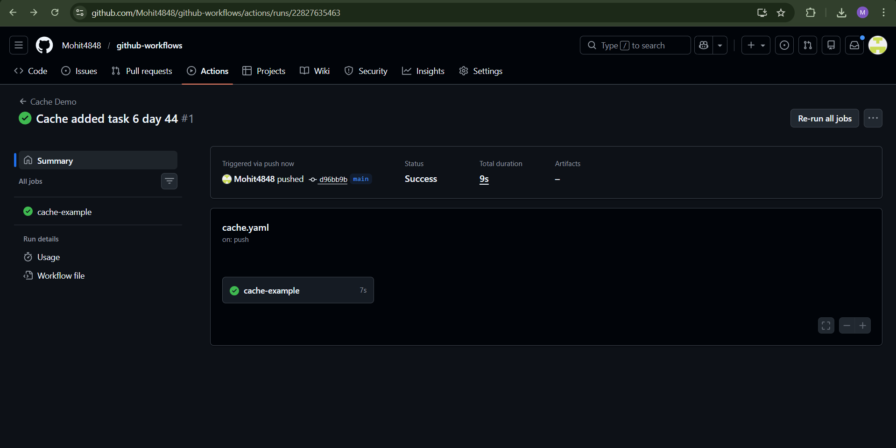

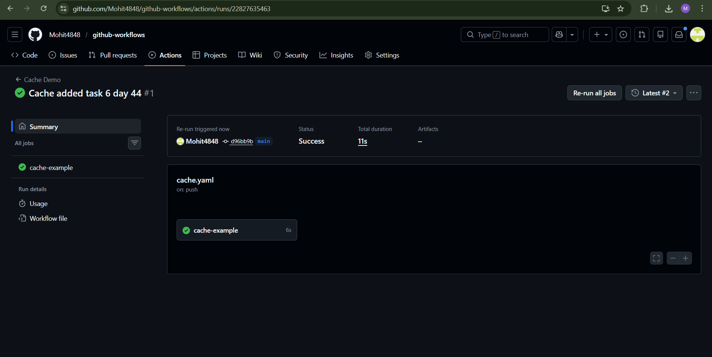

Cache is stored in github actions infrastructure.
It speeds pipeline because without cache, dependencies are downloaded in every run but with cache it uses previously downloaded packages.