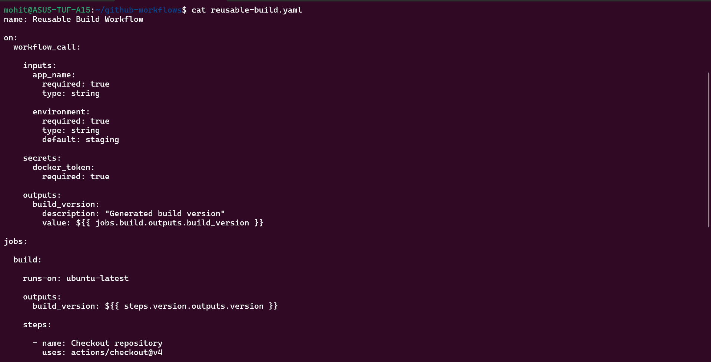
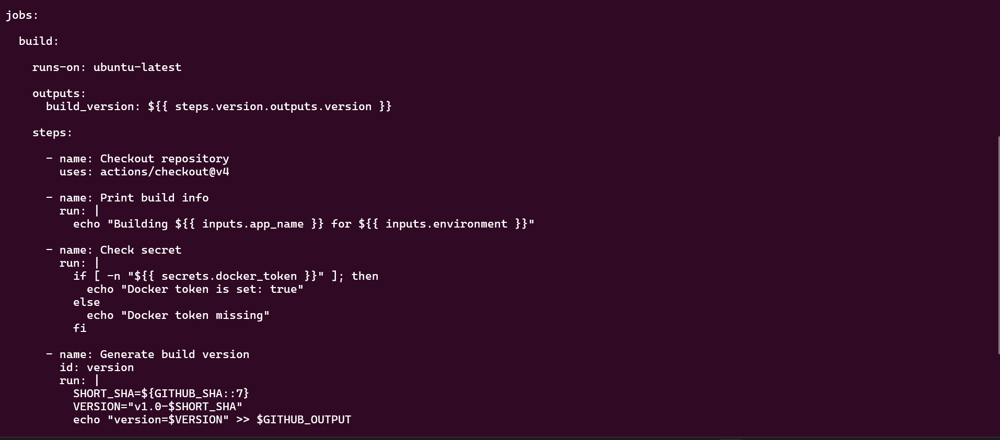
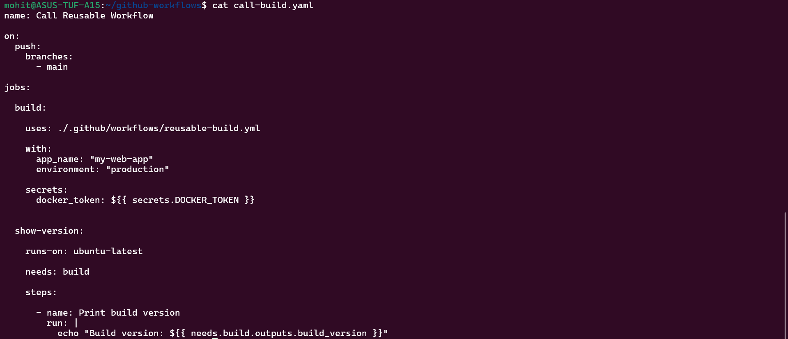
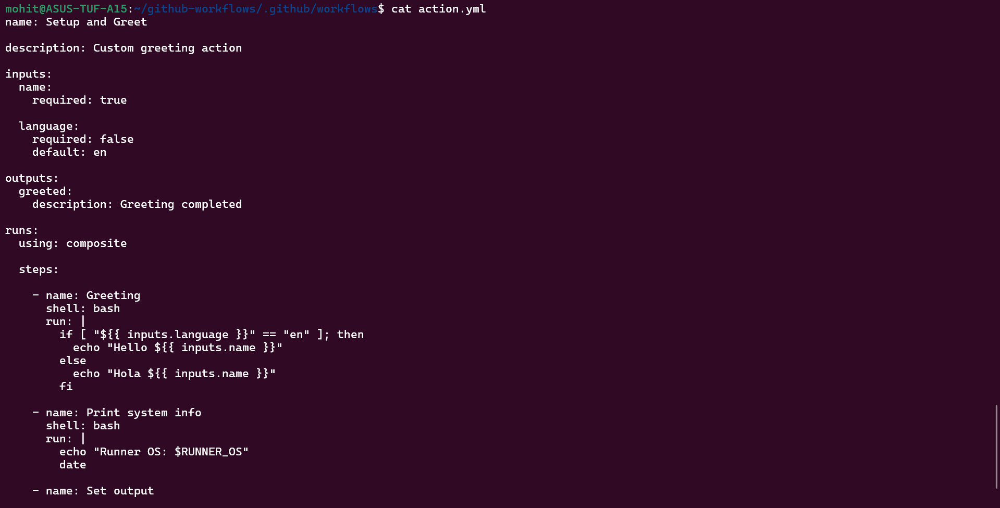
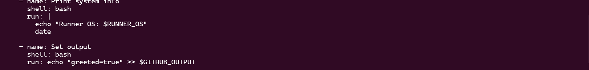

Task 1:-

a) What is a reusable workflow?

A reusable workflow is a GitHub Actions workflow that can be called by other workflows, similar to how a function is called in programming.
Instead of rewriting the same pipeline logic in multiple repositories, we create one reusable workflow and call it from many workflows makes the DRY rule successful.

b) What is workflow_call?

workflow_call is a special trigger that allows a workflow to be executed by another workflow instead of events like push or pull_request.

c) Difference between reusable workflow and action

Main difference:

Feature	            Reusable Workflow	Action
Level	            Job-level	        Step-level
Can contain jobs	Yes	                No
Can contain steps	Yes	                Yes
Used across repos	Yes	                Yes

Task 2:-

Task 3:-

Task 4:-

Task 5:-

Task 6:-

Feature	Reusable Workflow	Composite Action
Triggered by	workflow_call	uses
Contains jobs	✅ Yes	❌ No
Contains steps	✅ Yes	✅ Yes
Location	.github/workflows	.github/actions
Accept secrets	✅ Yes	⚠️ indirectly
Best for	Full pipelines	Reusable step logic