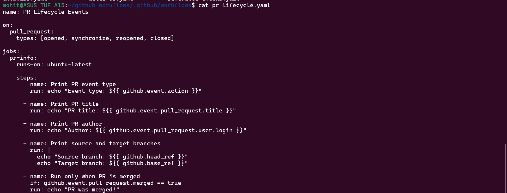
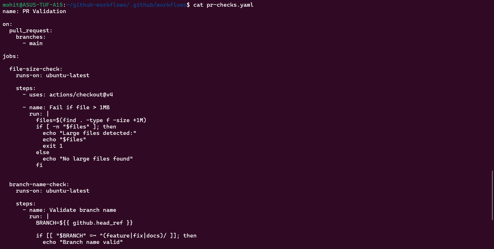
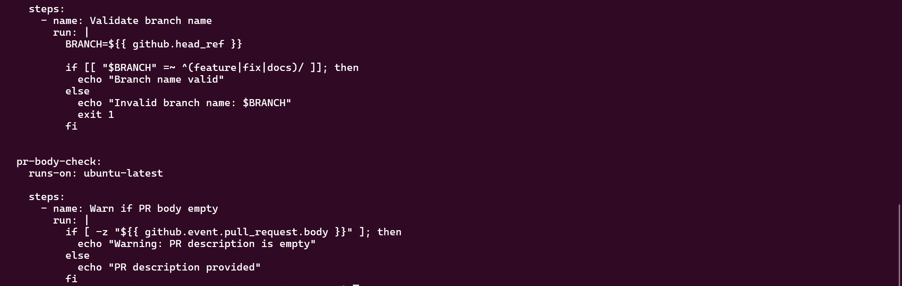
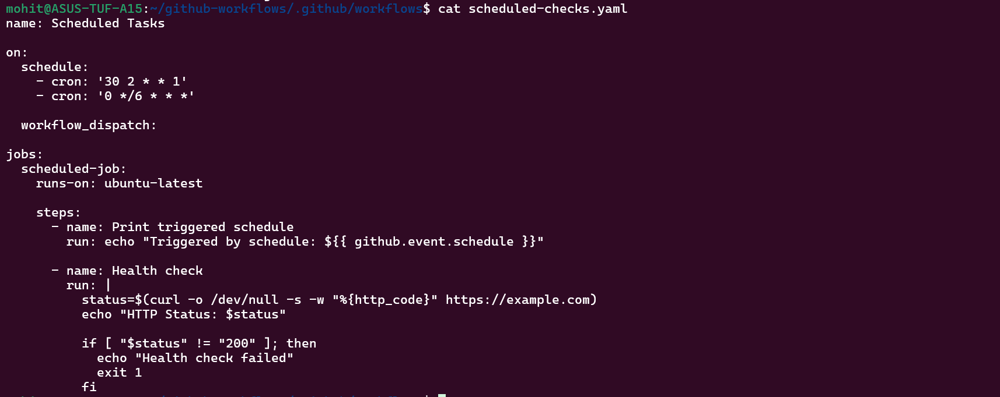
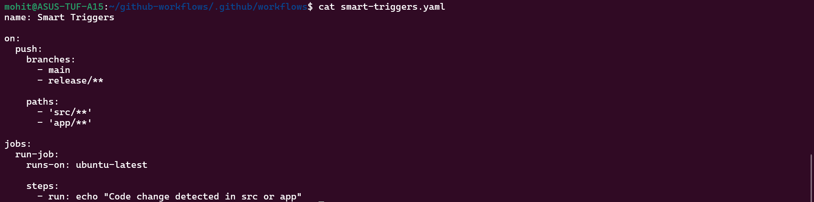
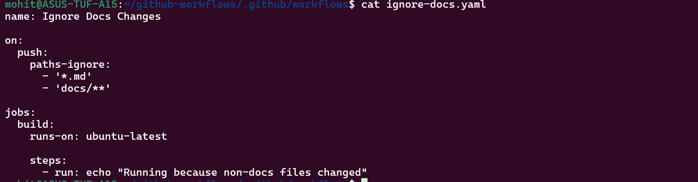
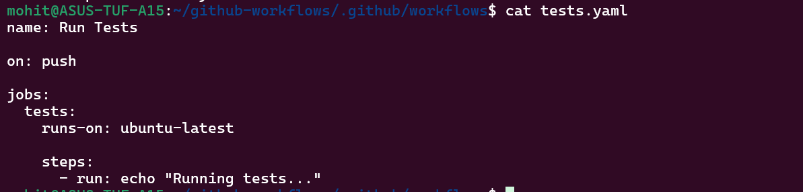
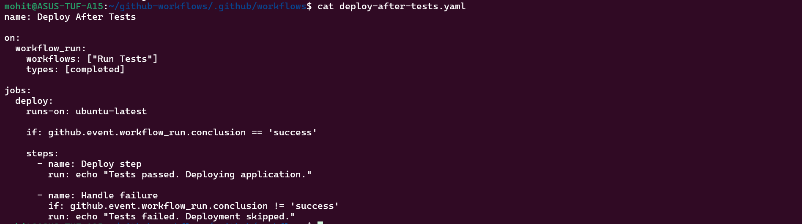
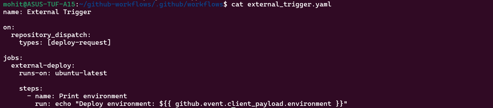

Task 1:-

Task 2:-

Task 3:-

Task 4:-

paths vs paths-ignore

Use paths when you want to run workflow only for specific code folders.

Use paths-ignore when you want to skip workflow for documentation changes.

Task 5:-

Task 6:-

workflow_run vs workflow_call
Feature	          workflow_run	                    workflow_call
Purpose	          chain workflows	                reuse workflows
Triggered by	  another workflow finishing	    explicit call
Used for	      pipeline stages	                shared pipelines
Example	          test → deploy	                    reusable build pipeline