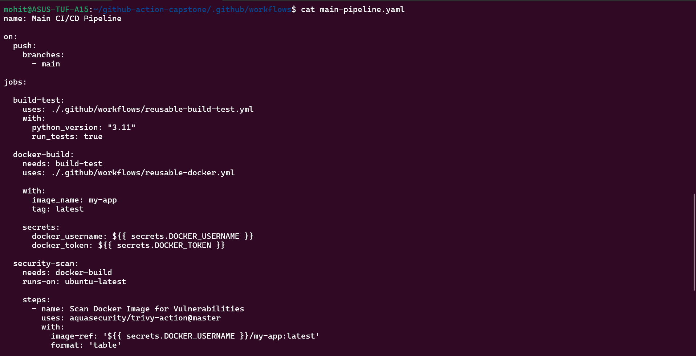
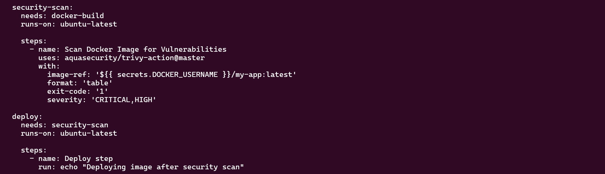
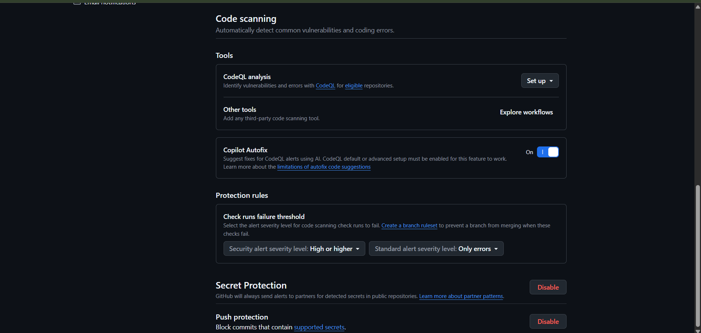
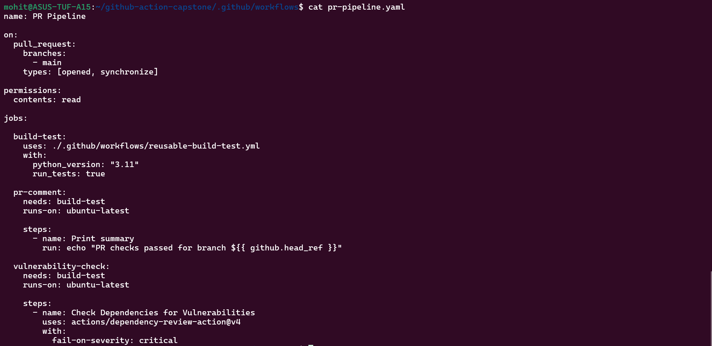
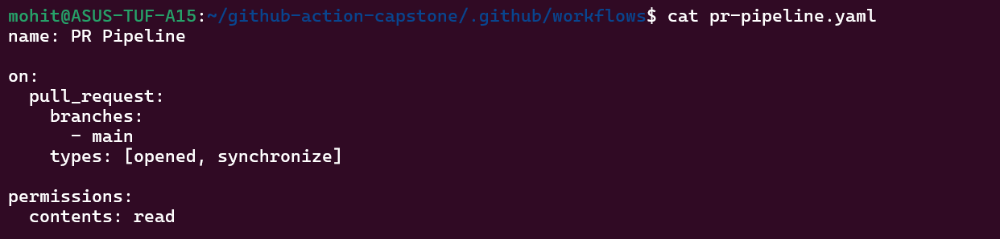
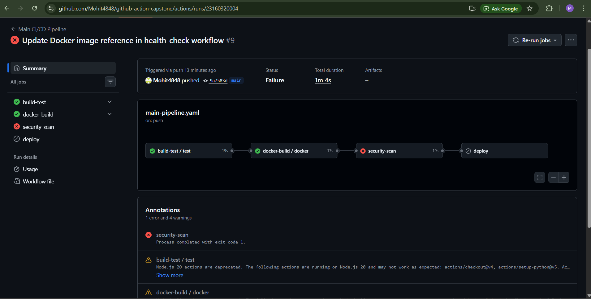
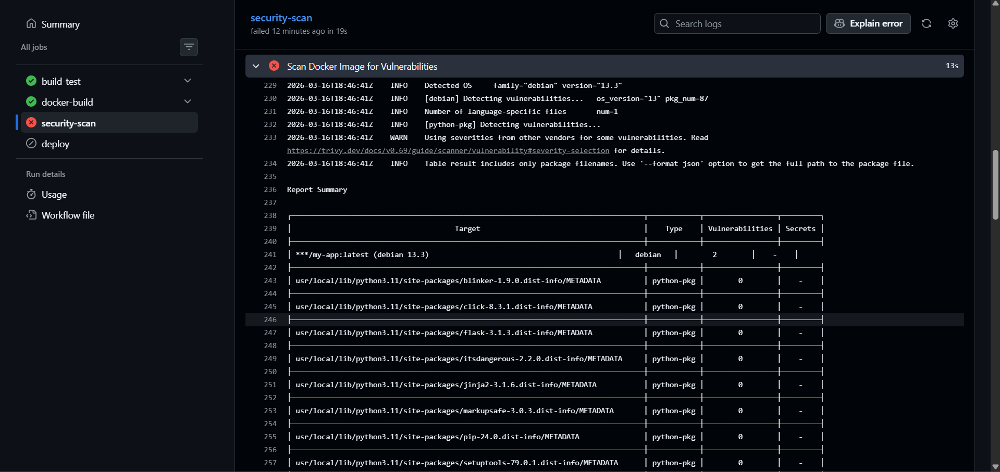

Task 1:-

Task 2:-

Task 3:-

Task 4:-

DevOps Summary:-

DevSecOps means integrating security checks directly into the CI/CD pipeline so vulnerabilities are detected early during development. Instead of security being done after deployment, automated scans such as dependency checks and container vulnerability scans ensure insecure code or images never reach production.

My security scan failed so trivy is working perfectly fine.

