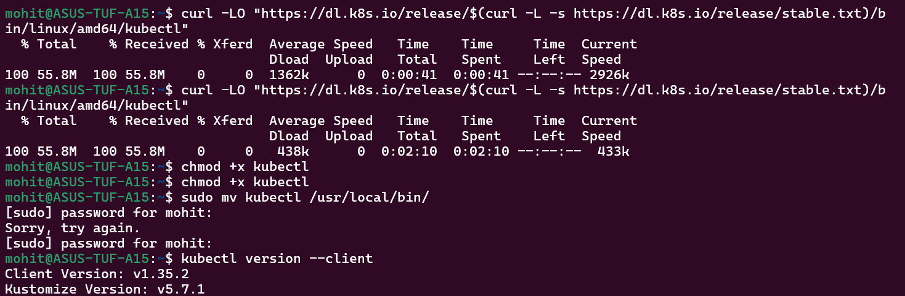
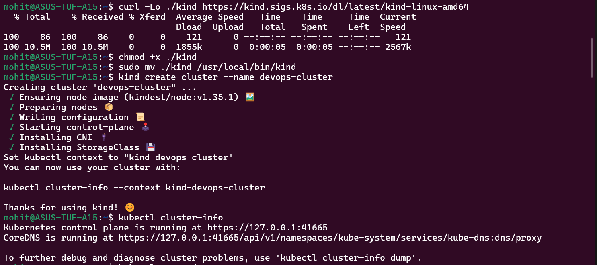
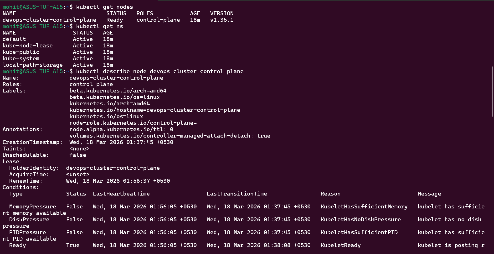
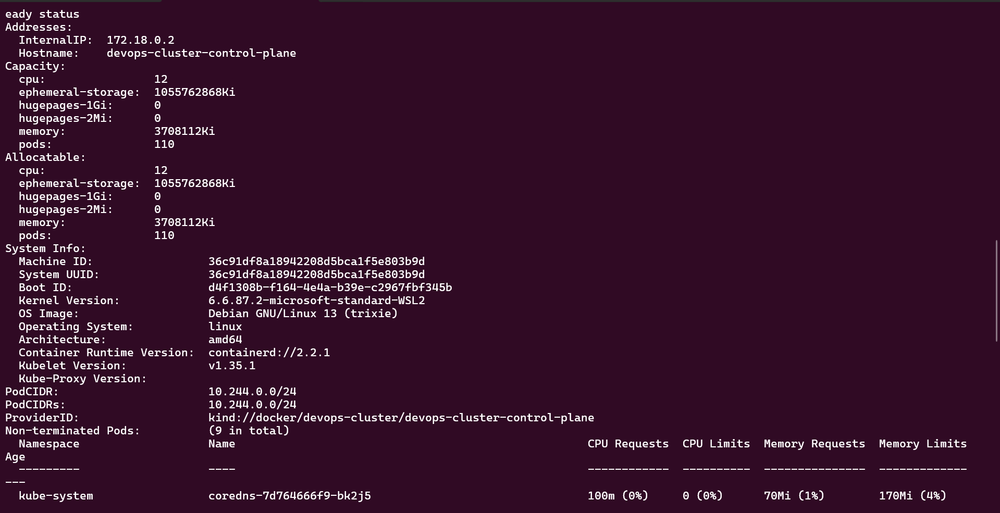
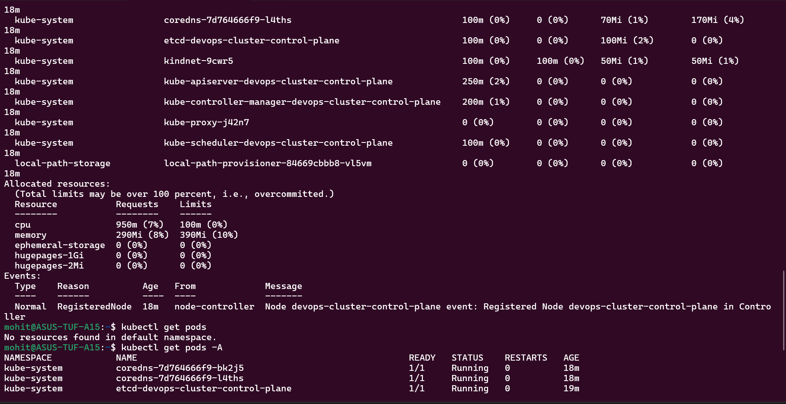

Task 1:-

Why Kubernetes was created?

Docker made it easy to package applications into containers, but it cannot manage containers across multiple servers. When applications scale to hundreds of containers, you need a system that can:
schedule containers across machines
automatically restart failed containers
handle networking between containers
scale applications automatically
perform rolling updates
Kubernetes solves this problem by acting as a container orchestration platform.

Who created Kubernetes

Kubernetes was originally created by Google in 2014 and later donated to the Cloud Native Computing Foundation (CNCF).
It was inspired by Google's internal cluster management system called:
Borg

Google had been running containers internally for over a decade before Kubernetes.

Meaning of Kubernetes
"Kubernetes" is a Greek word meaning:
helmsman (ship pilot)
This represents steering containers like a ship captain.

That’s also why the abbreviation is:
K8s
(K + 8 letters + s)

Task 2:-

Control Plane (Master Node)

These components manage the cluster.
API Server
kube-apiserver
Entry point to the cluster
All commands go through it
kubectl talks to the API server

Example:
kubectl apply -f pod.yaml

etcd
Cluster database

It stores:
cluster configuration
running pods
services
nodes
Think of it like:
Kubernetes brain storage

Scheduler
kube-scheduler

Responsible for:
deciding which node runs a pod
Example decision factors:
CPU availability
memory
node labels

Controller Manager
kube-controller-manager

Controllers constantly compare desired vs actual state.
Example:
Desired state:
3 pods running
Actual state:
2 pods running
Controller creates 1 more pod.

Worker Node Components
These actually run containers.

kubelet
Runs on every worker node.
Responsibilities:
talks to API server
starts containers
monitors pods
kube-proxy

Handles networking between pods.
Example:
Pod A → Pod B communication
It manages iptables rules.

Container Runtime
The software that runs containers.

Examples:
containerd
CRI-O
Docker (older)
What happens when you run:
kubectl apply -f pod.yaml

Flow:
kubectl
   ↓
API Server
   ↓
etcd stores state
   ↓
Scheduler chooses node
   ↓
kubelet on that node
   ↓
container runtime starts container

If API Server goes down
Cluster cannot accept commands.
But running pods continue running.

If Worker Node goes down
Controller detects node failure and:
reschedules pods to other nodes

Task 3:-

Task 4:-

Task 5:-

