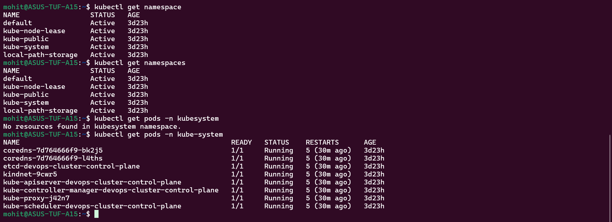
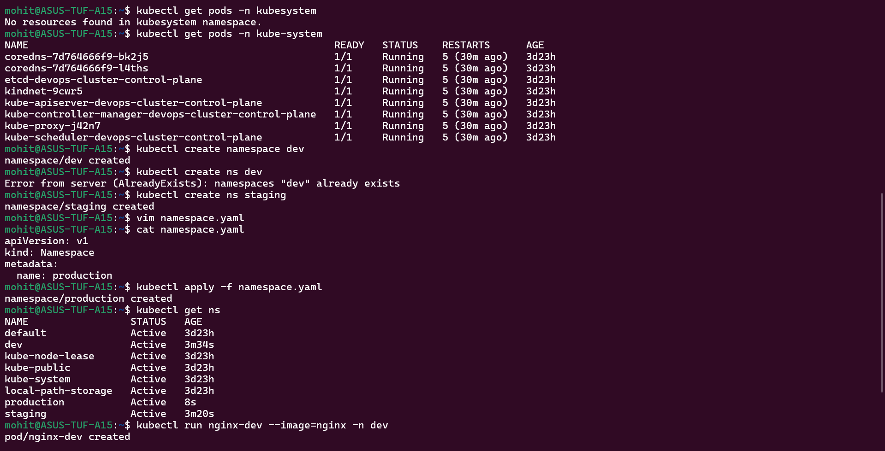
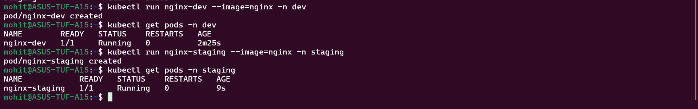
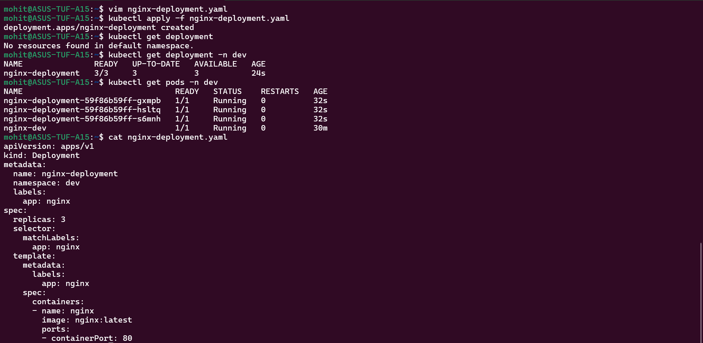
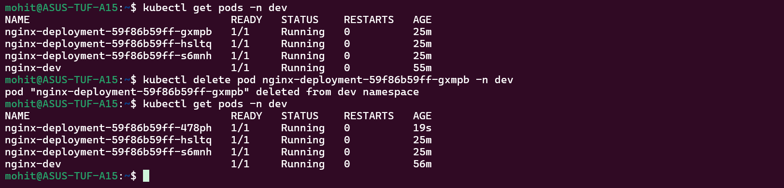
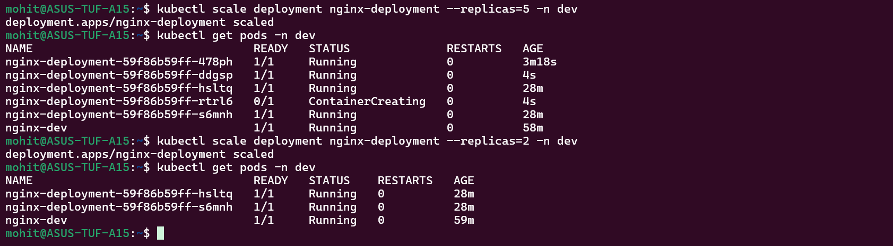
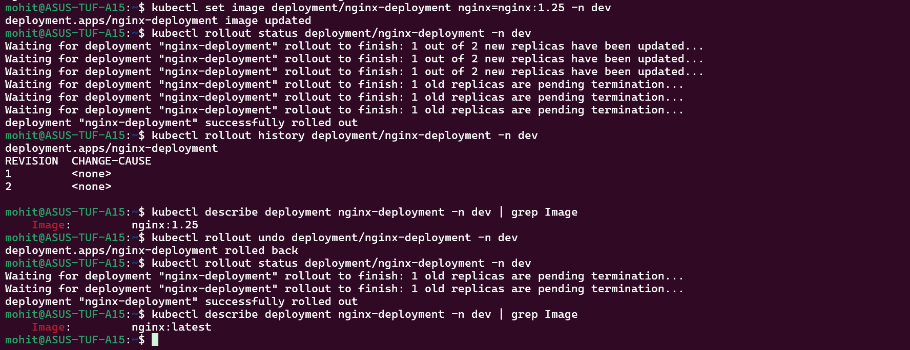
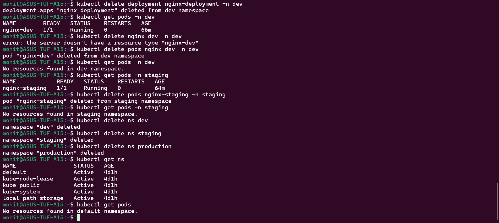

Task 1:-

These pods are Kubernetes control plane components responsible for managing the cluster.

Task 2:-

Task 3:-

Task 4:-

New pod has a different name as it is newly created.

Task 5:-

Scale UP - New pods created 
Scale Down - Extra Pods destroyed

Task 6:-

The image will be back to the initial one that we mentioned in the deplyment yaml once we use rollout undo command.

Task 7:-

Everything is cleaned up and deleted and back to as it was.