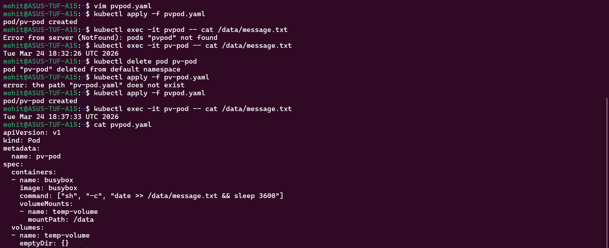
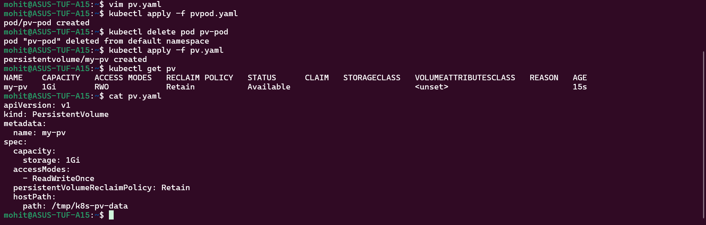
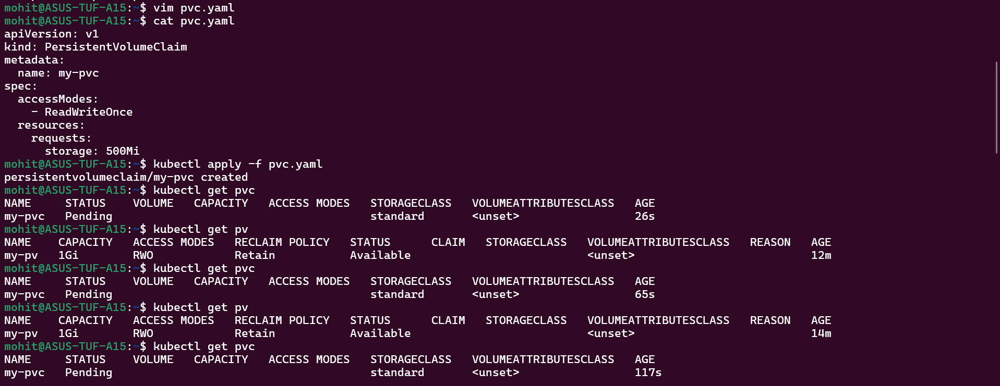
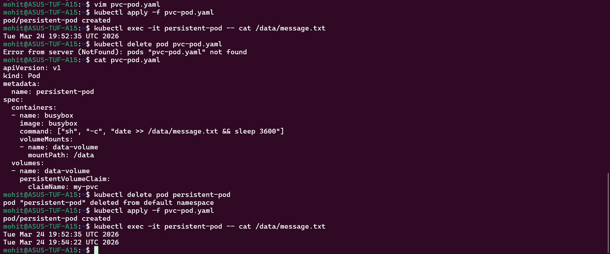
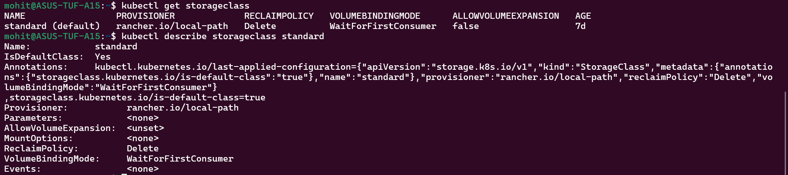
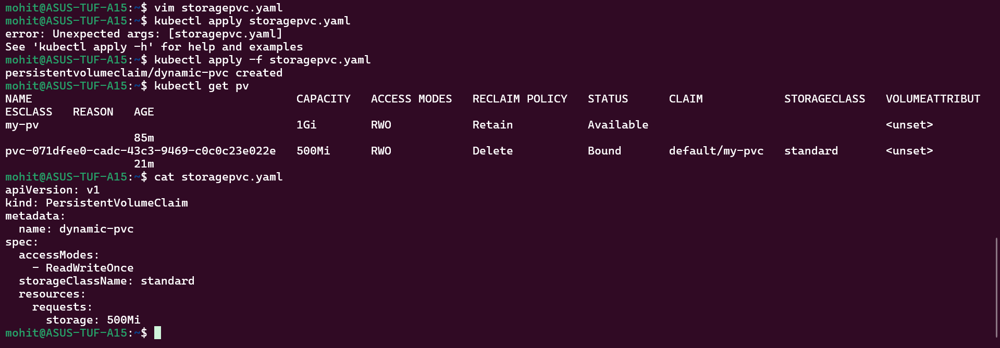
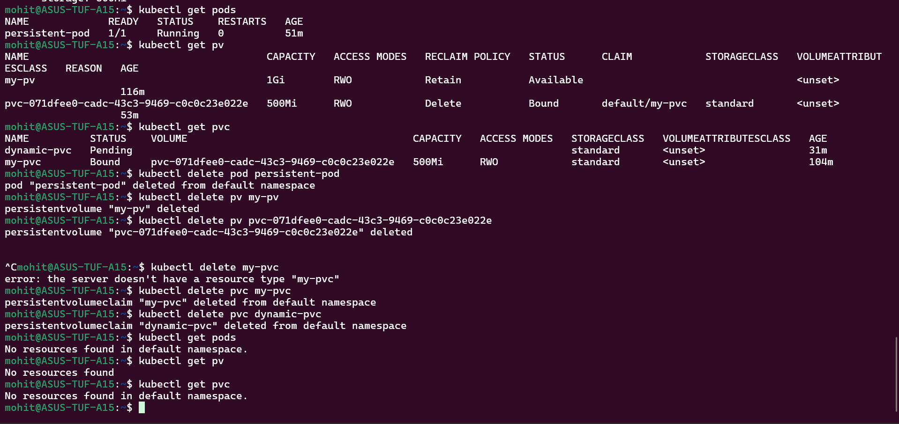

Task 1:-

Task 2:-

Task 3:-

PV didn't get bind to PVC as both storage class is different. Our PVC is in standard storage class while our PV is in default(<unset>) storage class. What we can do, either we can change the storage class of our PVC to default(<unset>) or we can add a line inside our manifest file for PV to set the storage class to standard, same as PVC.

Task 4:-

Task 5:-

Task 6:-

Task 7:-

