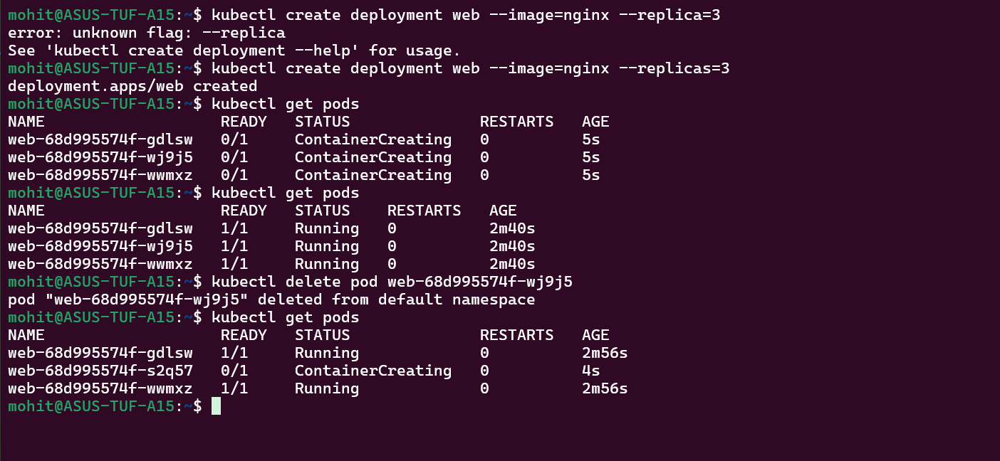
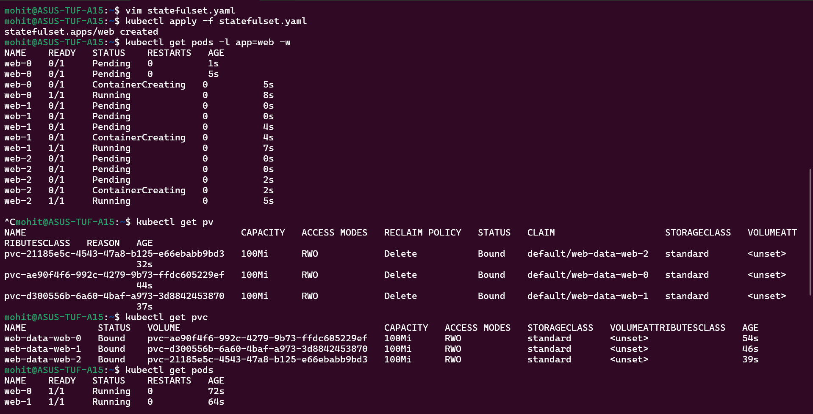
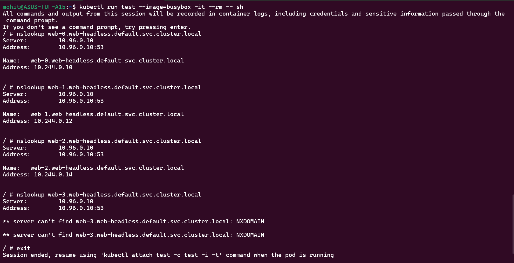
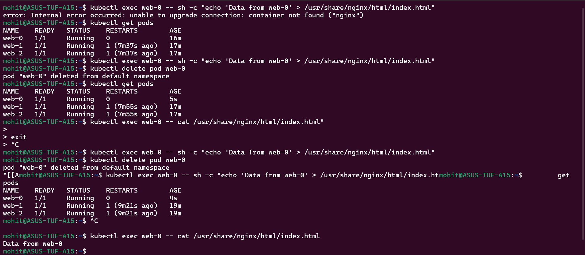
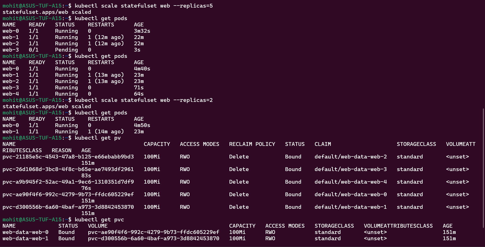
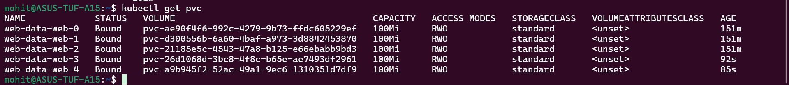
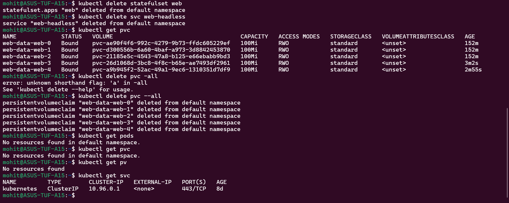

Task 1:-

DB nodes need fixed naming of pods in order to map data. They need stable and ordered naming of pods in order to find a member or binding the specific volume.

Task 2:-

Normal service has one IP so load get balanced between pods but in headless service, each pod gets its own DNS/pod, that means direct access to each pod.

Task 3:-

Task 4:-

Task 5:-

Data is there because of PVC.

TAsk 6:-

After scaling down there are still 5 pvc exist as in statefulset, data must not be lost.

Task 7:-

