Task 1:-

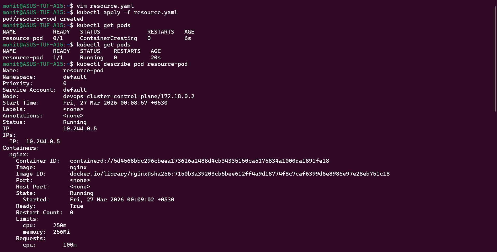

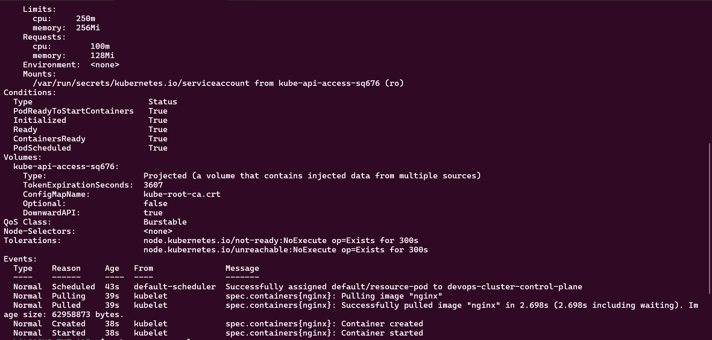

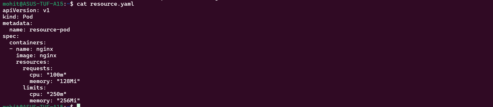

Pod has qos class as burstable.

Task 2:-

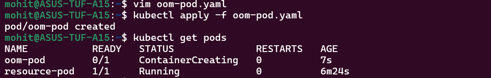

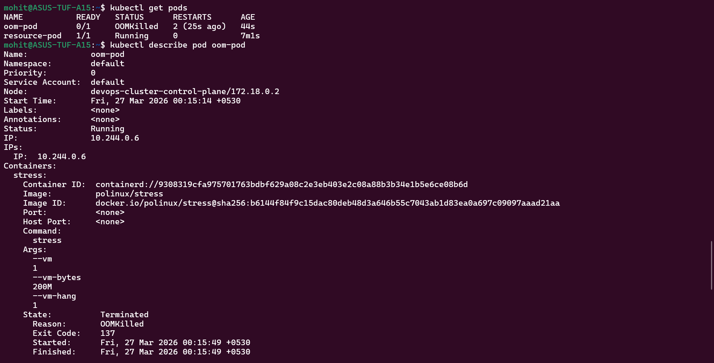

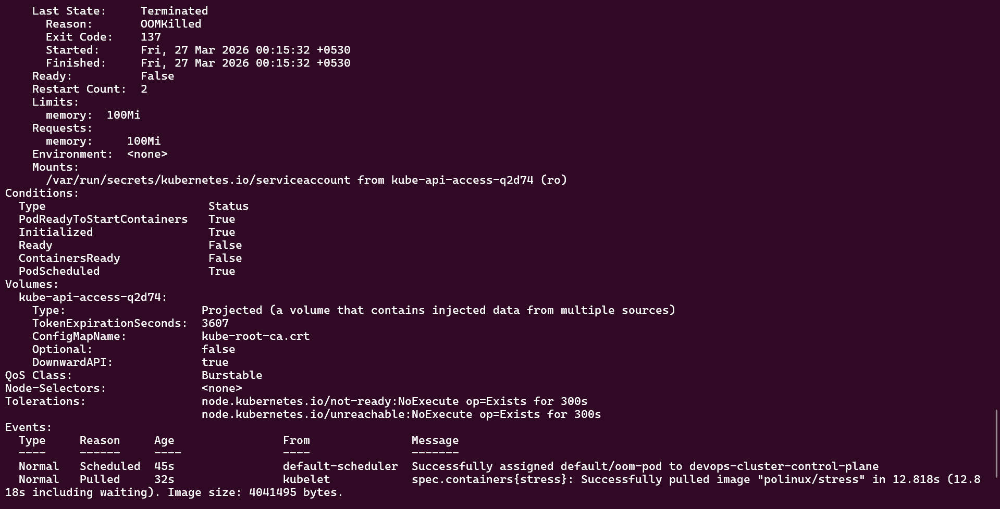

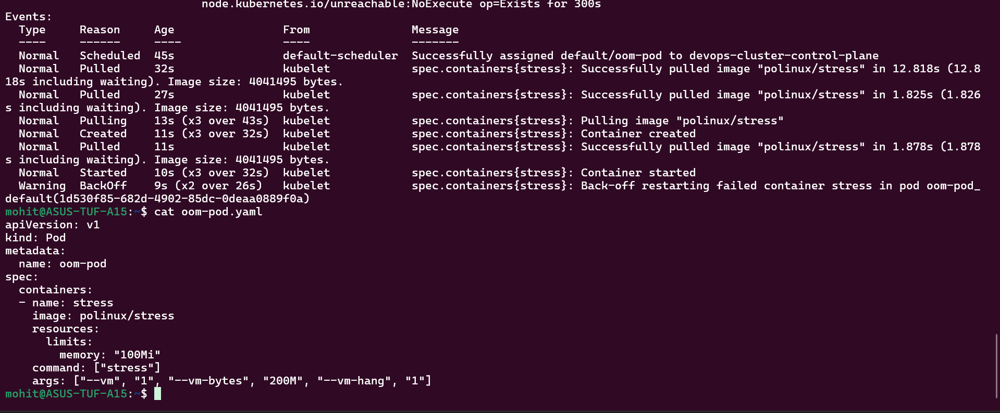

137 is the code OOM killed container has.

Task 3-

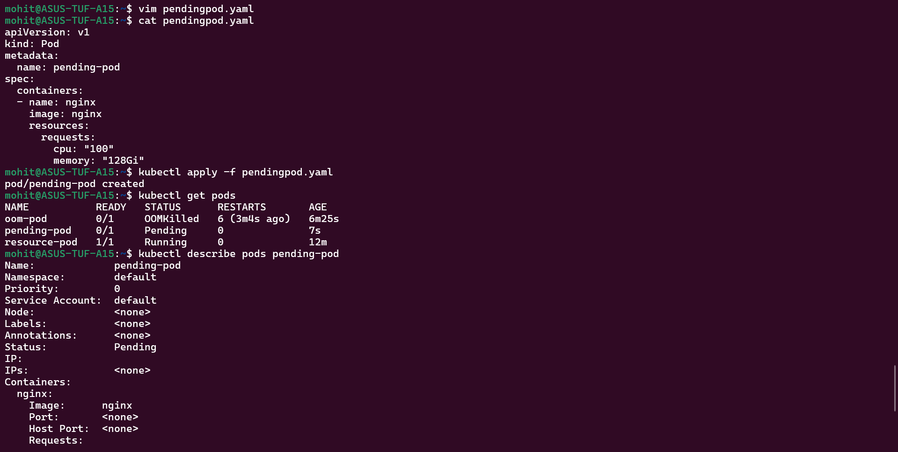

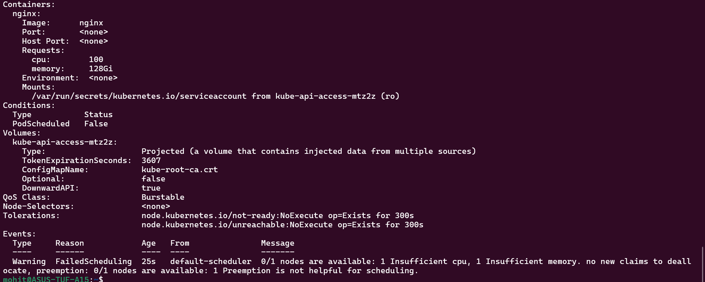

The scheduler produced the error:- insufficient memory,  insufficient cpu

Task 4:-

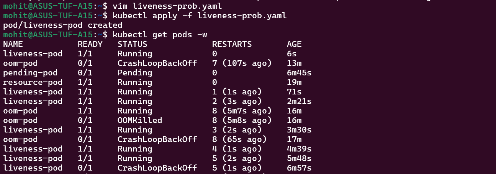

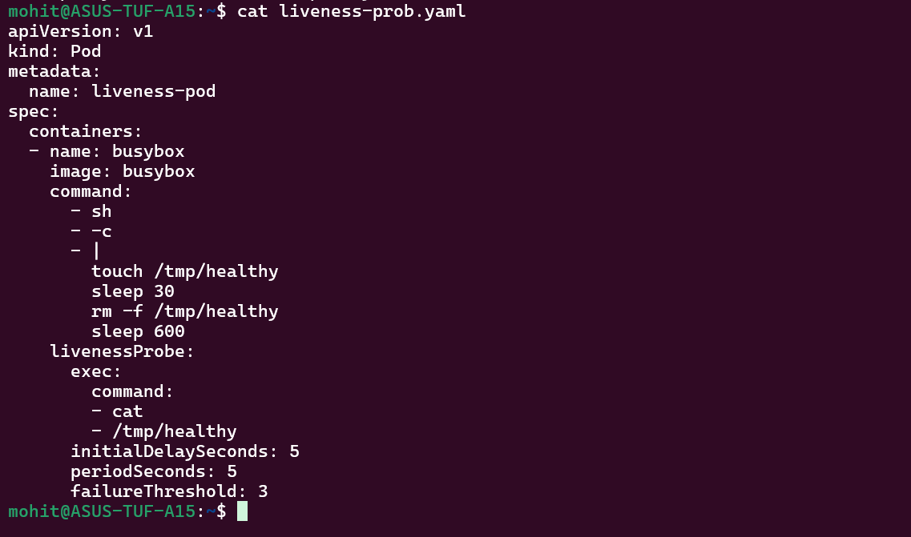

The container started 3 times before failing.

Task 5:-

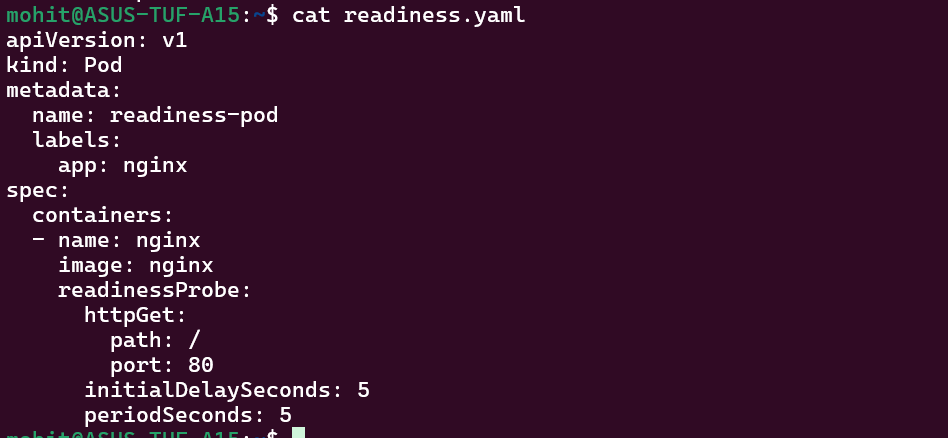

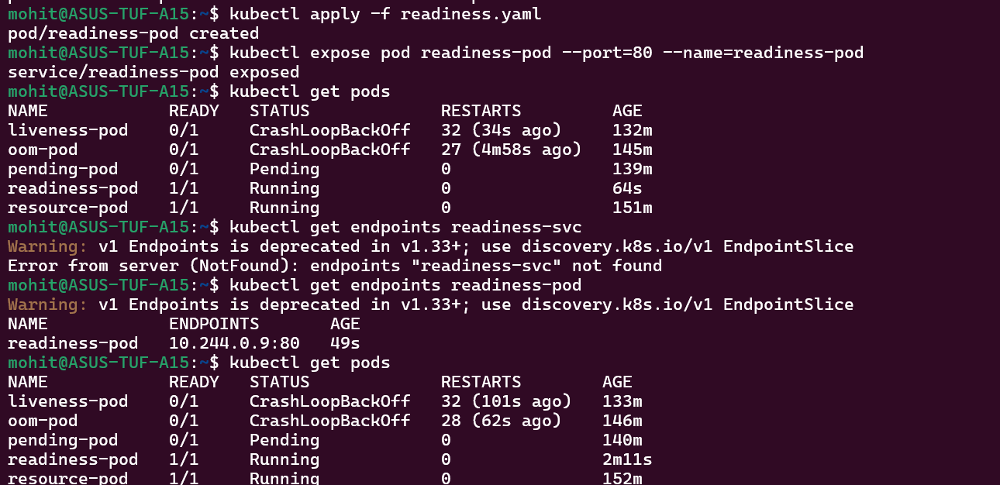

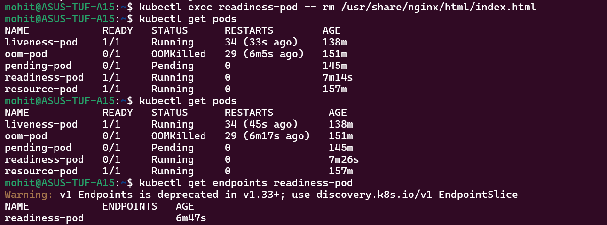

Task 6:-

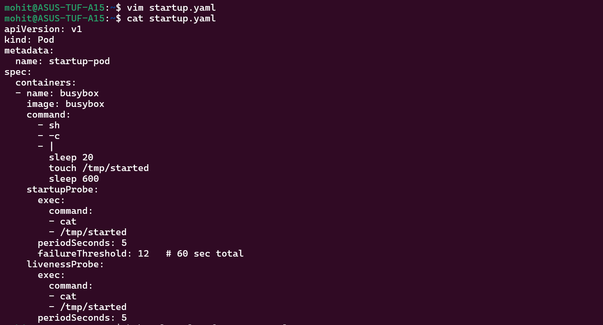

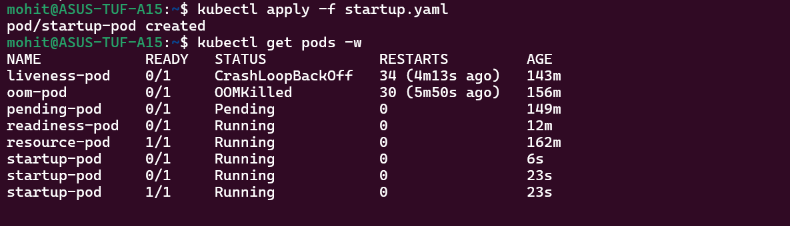

The pod will not be created as it needs 20 seconds of time to be ready. The pod will be killed by the liveness probe over and over.

Task 7:-

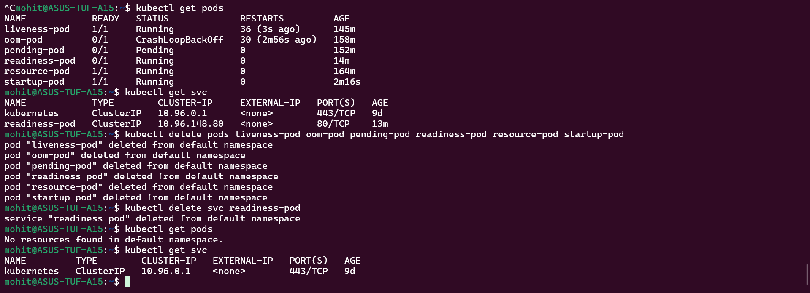