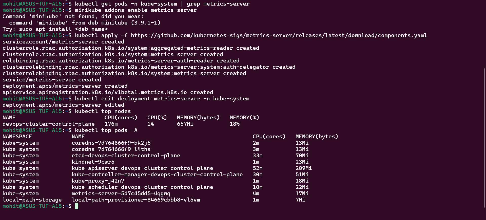
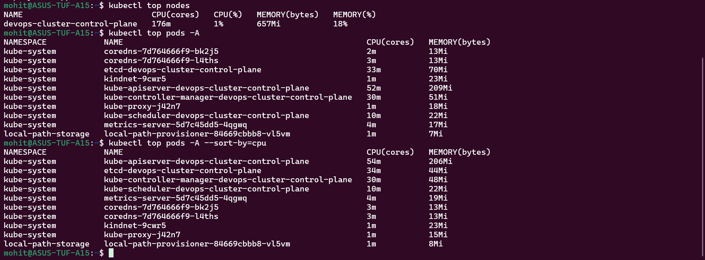
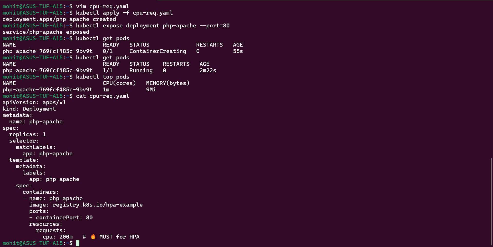
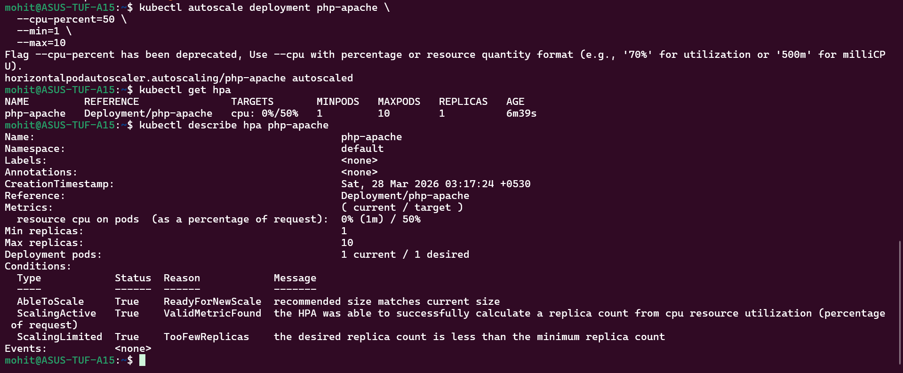
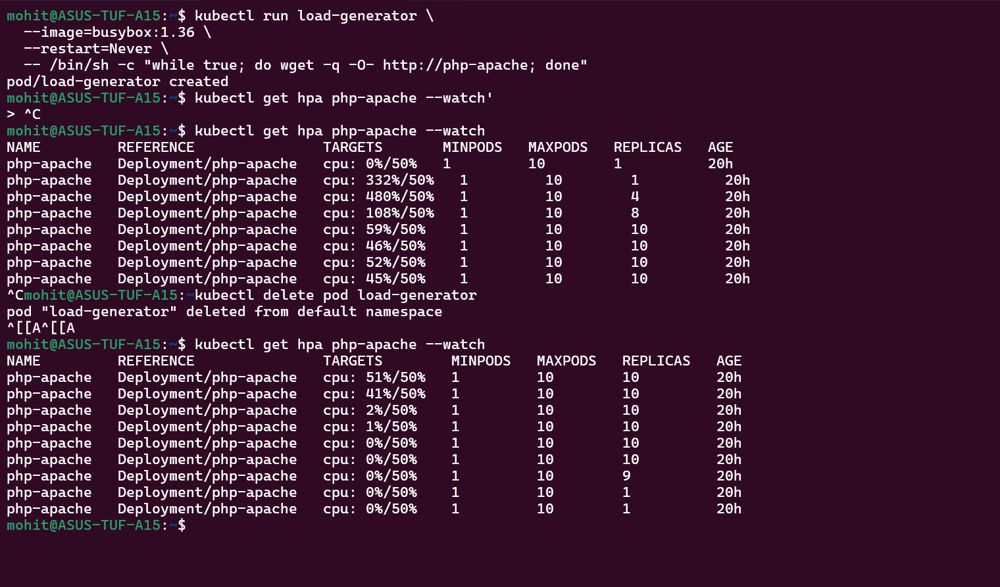
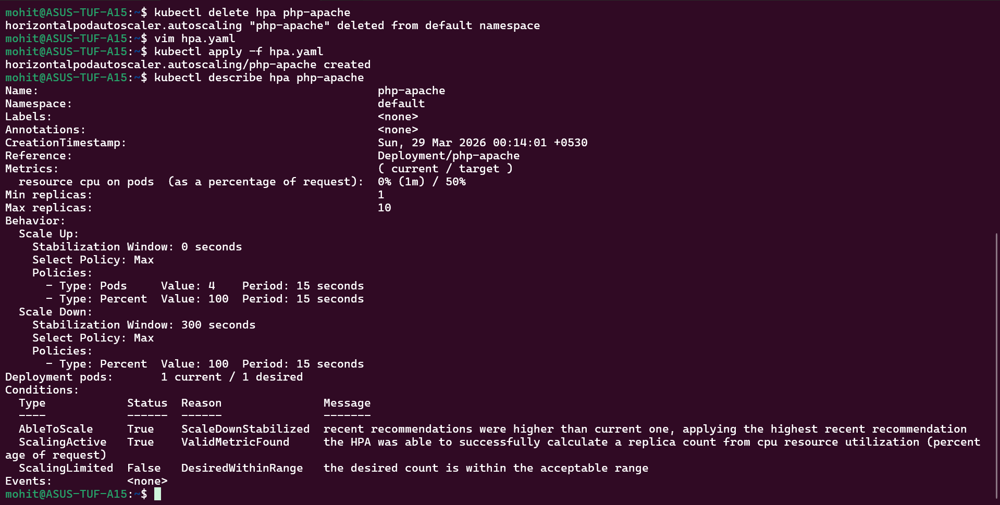
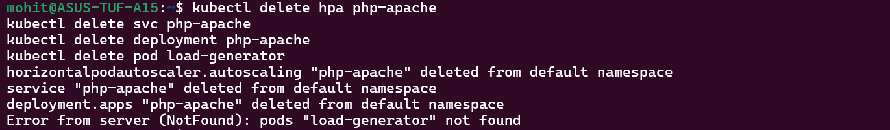
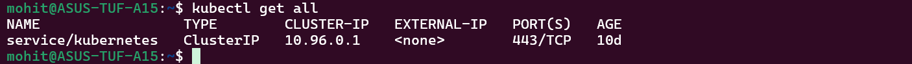

Task 1:-

1% of CPU and 657 mb of memory.

Task 2:-

The pod named kube-apiserver-devops-cluster-control-plane is using the highest CPU.

Task 3:-

1m is the current cpu usage of the pod.

Task 4:-

Task 5:-

Replicas increase depending on load.

Task 6:-

Behaviour decides how fast the scaling happens.
Scaleup:0 means scaling up happens immediately and scaledown:300 means it happens after waiting for 5 minutes.

Task 7:-

