Task 1:-

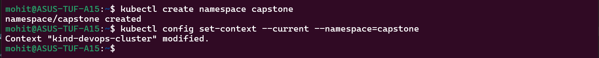

Task 2:-

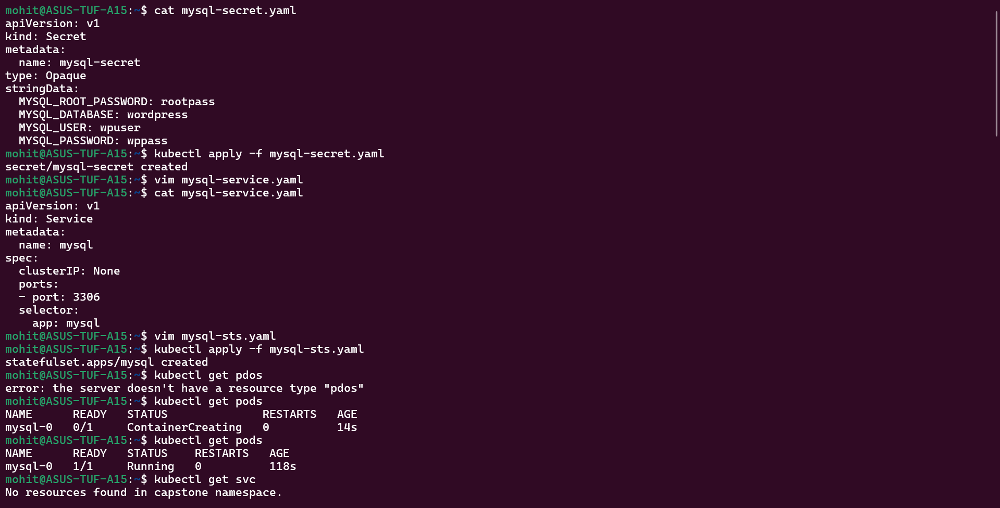

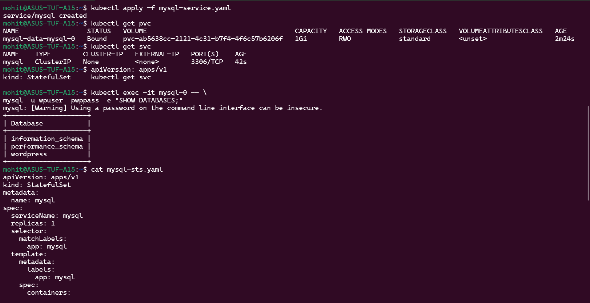

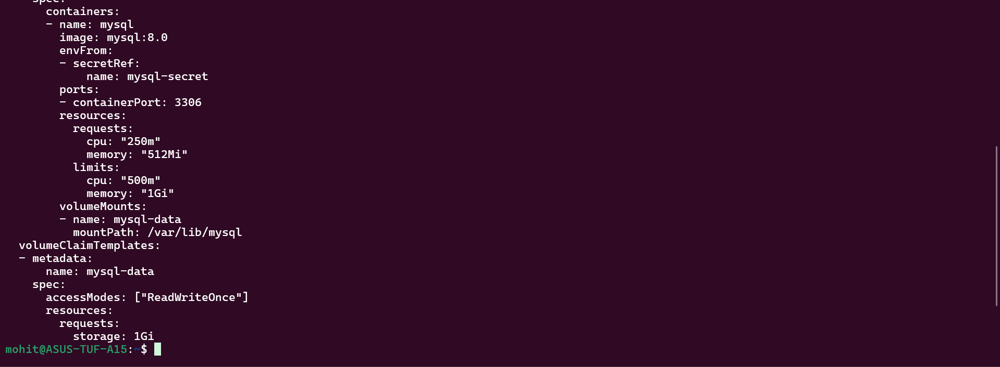

Yes, I can see the wordpress database.

Task 3:-

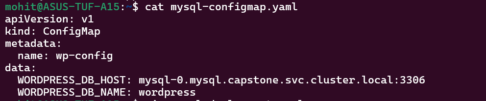

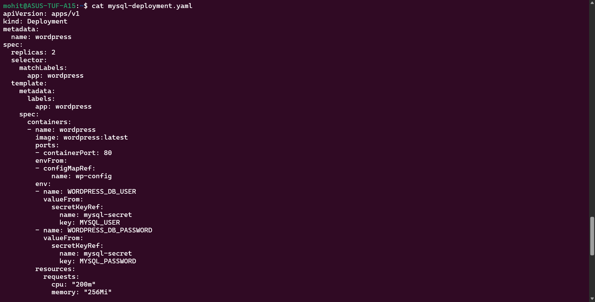

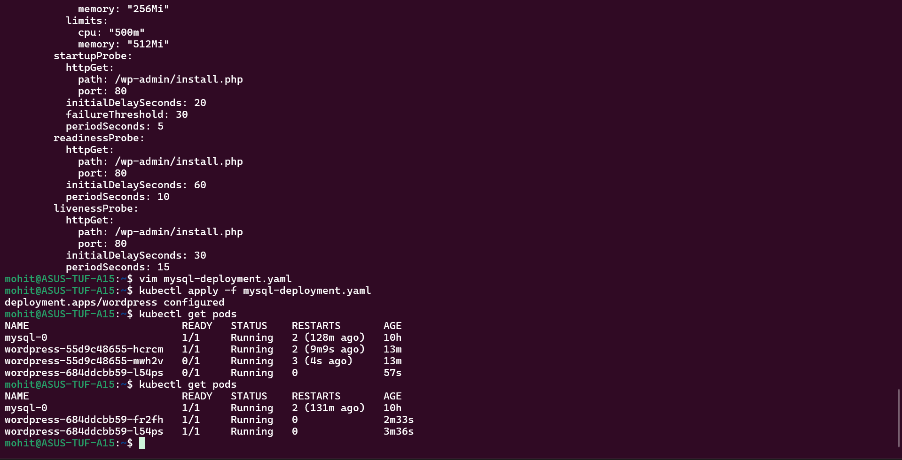

Yes, both pods are running and ready.

Task 4:-

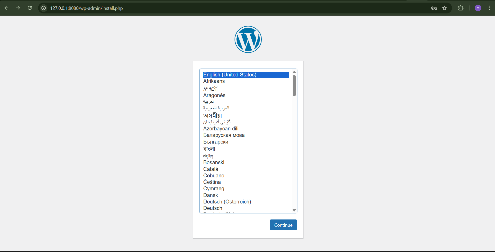

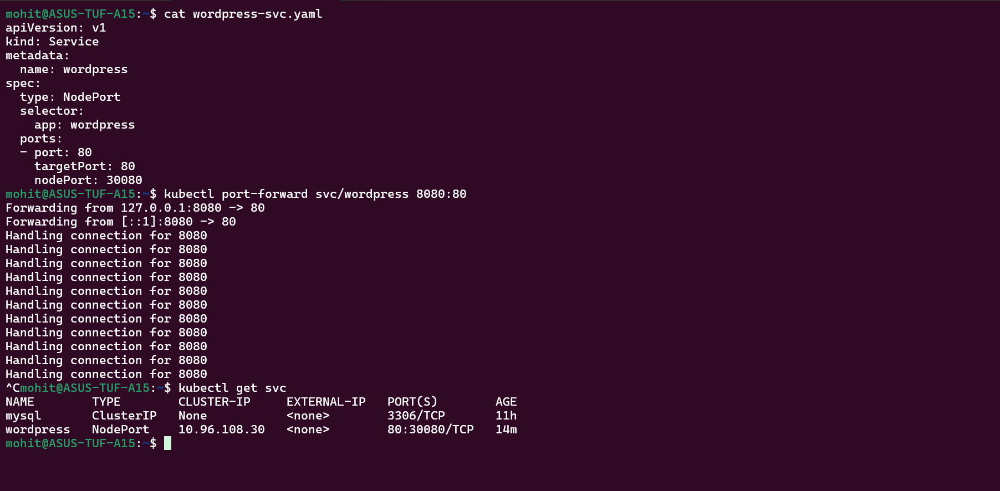

Yes, setup page is loading.

Task 5:-

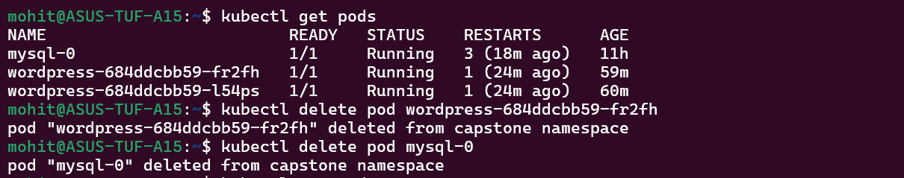

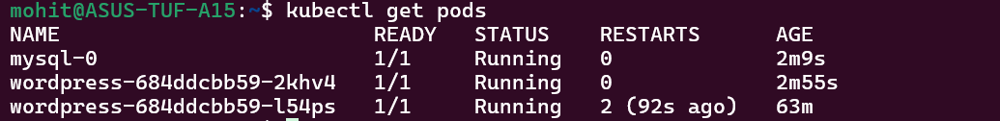

Task 6:-

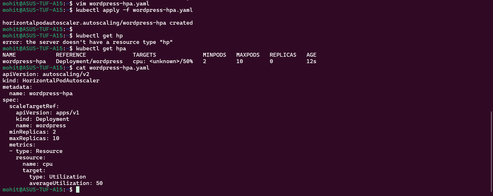

Task 7:-

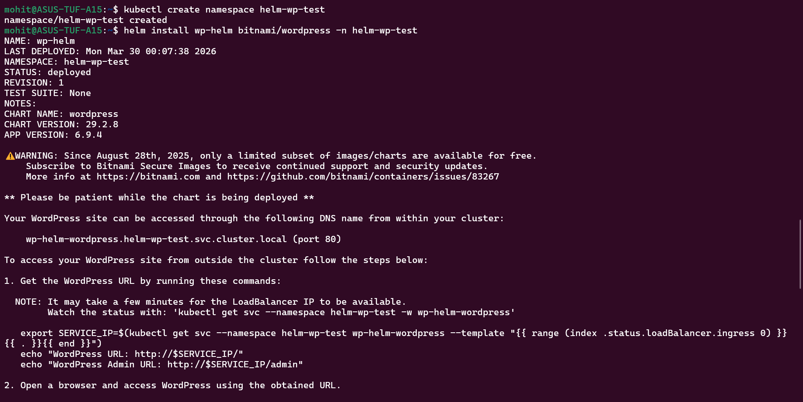

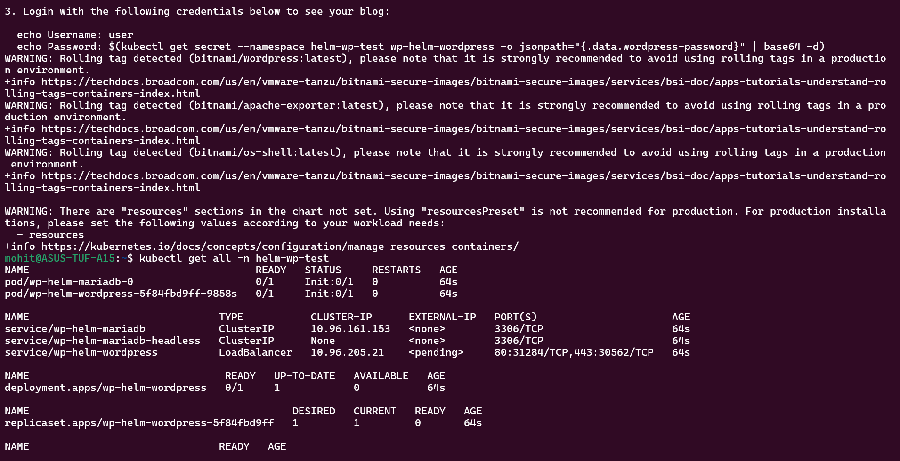

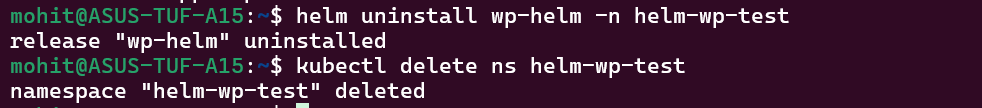

Task 8:-

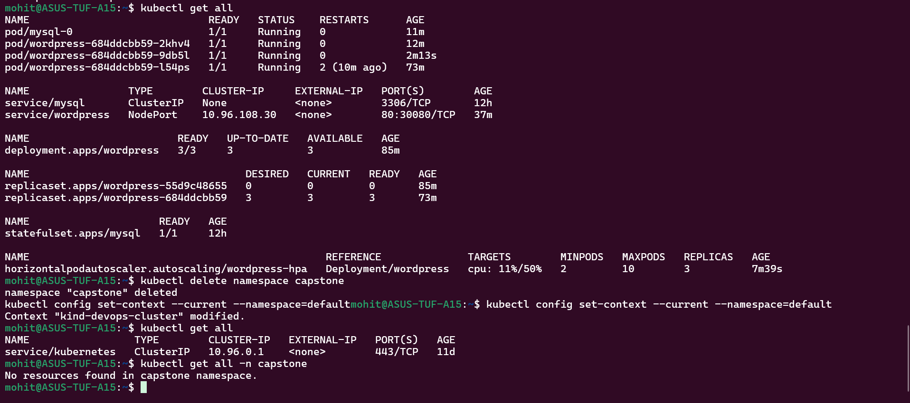

Yes, deleting the namespace removed everything.