Task 1:-

Infrastructure as Code (IaC) means managing and provisioning infrastructure using code instead of manual setup. It allows us to automate the creation of servers, networks, and resources.

IaC solves problems like manual errors, inconsistency, and slow deployments. Instead of clicking in AWS console, we define everything in code and reuse it.

Terraform is declarative and cloud-agnostic. Declarative means we define "what we want", not how to create it. Cloud-agnostic means it works with AWS, Azure, GCP, etc.

Terraform vs others:
  CloudFormation → AWS only
  Ansible → configuration, not infra creation primarily
  Pulumi → uses programming languages (Python/JS)
  Terraform → simple, declarative, multi-cloud

Task 2:-

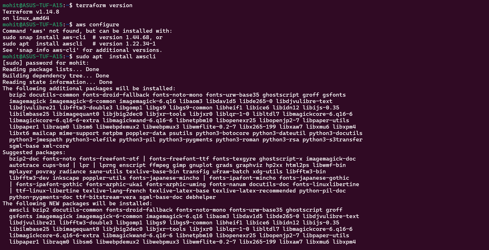

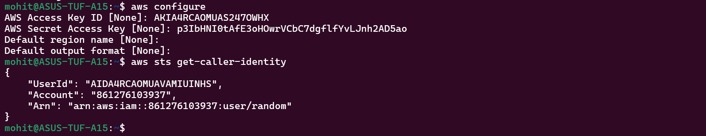

Task 3:-

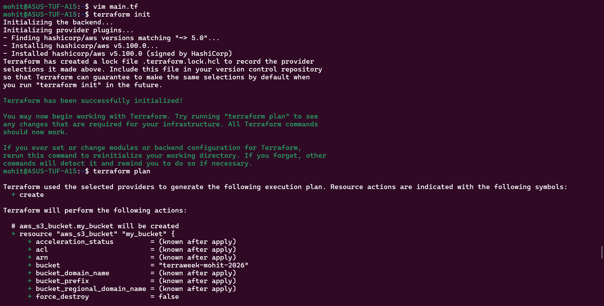

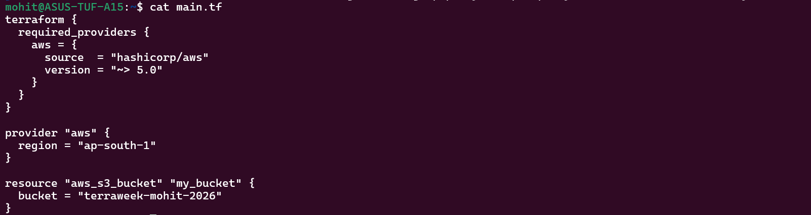

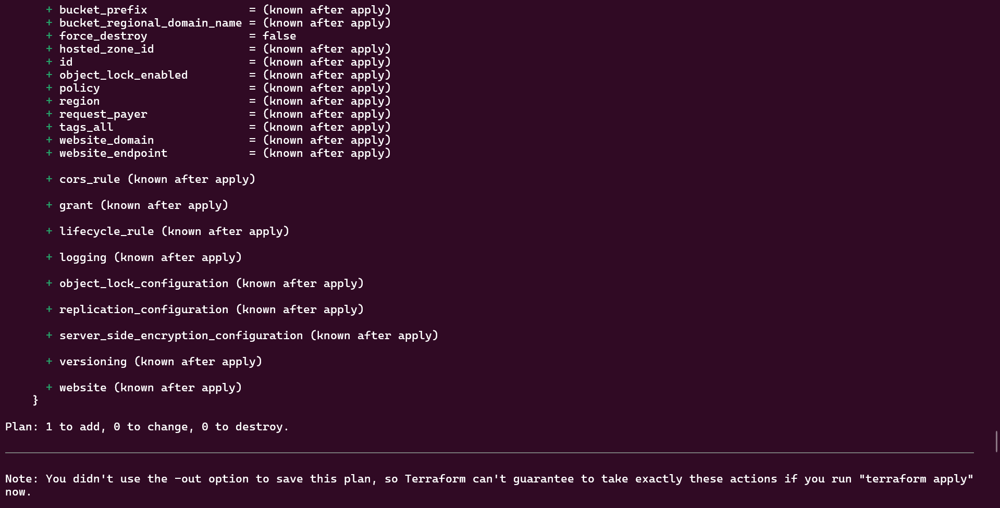

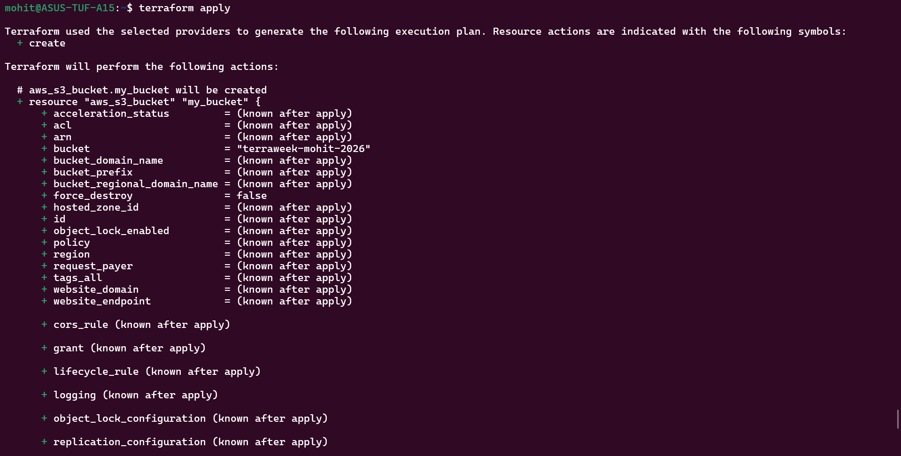

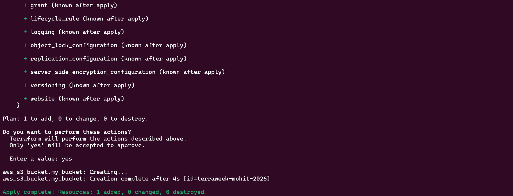

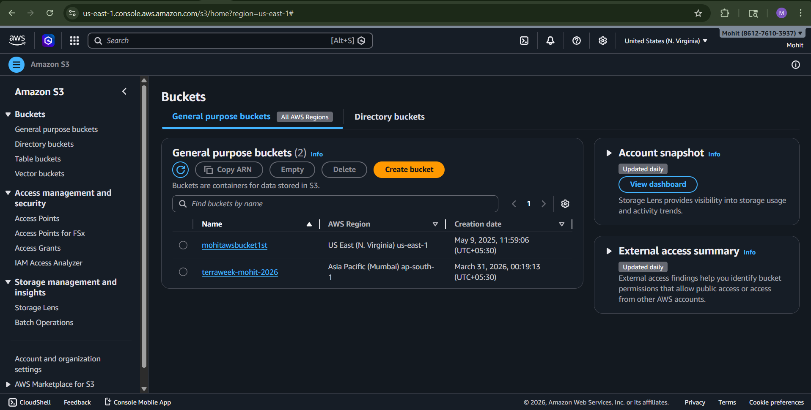

terraform init downloaded the provider aws plugin and .terraform/ directory.
.terraform/ directory contains provider's binaries and dependency files.

Task 4:-

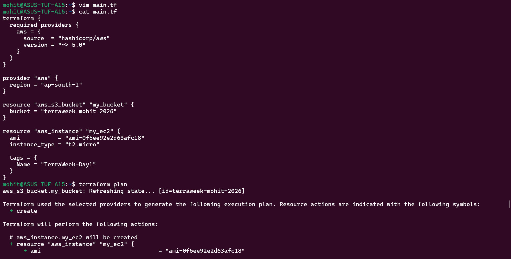

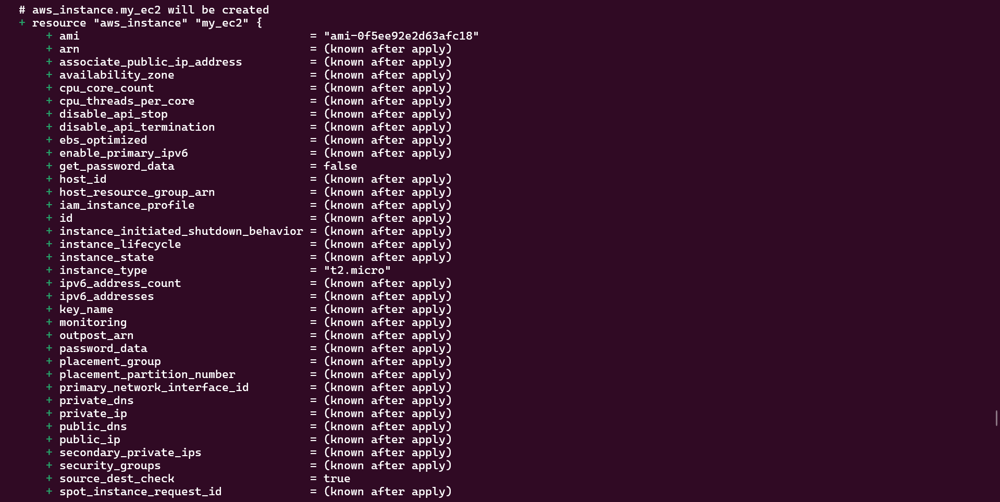

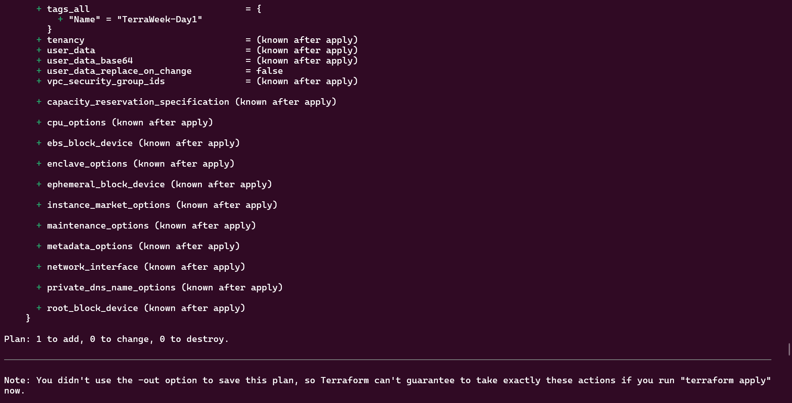

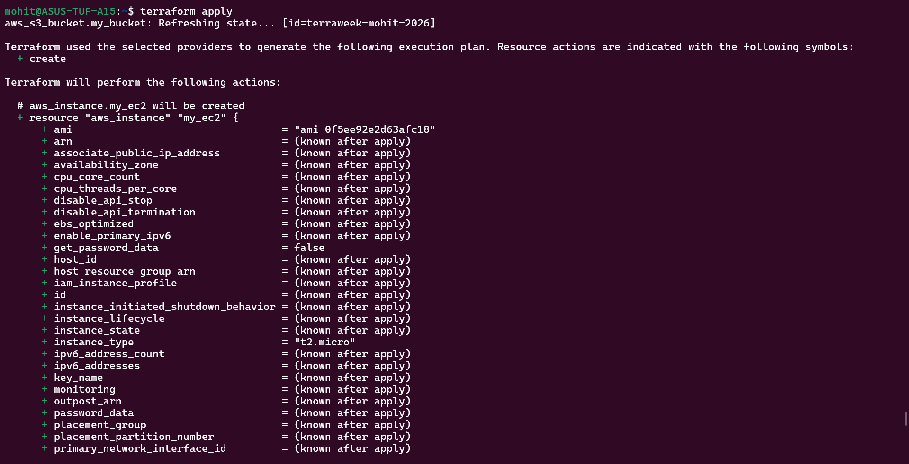

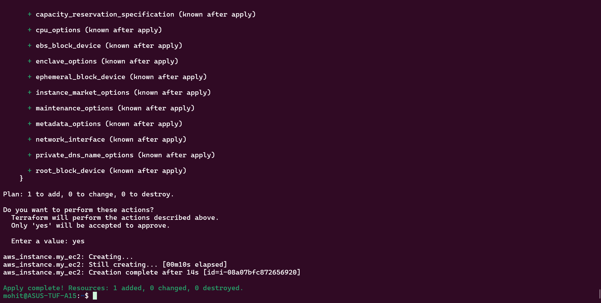

Terraform already knows s3 bucket exists because of terraform.tfstate file.

Task 5:-

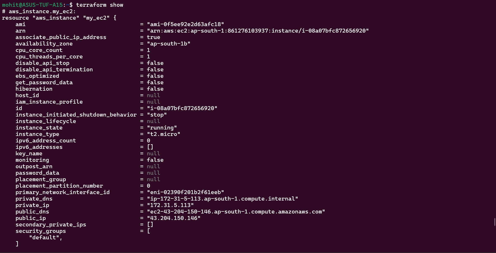

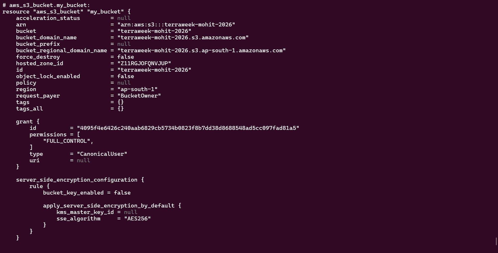

Terraform show shows us the resources that we have made and their configurations/details.

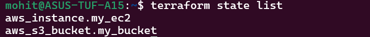

terraform state list only shows us the name of our resources not details.

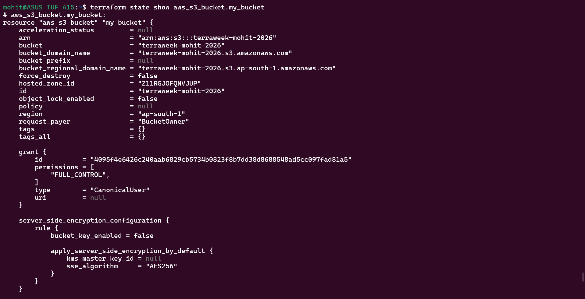

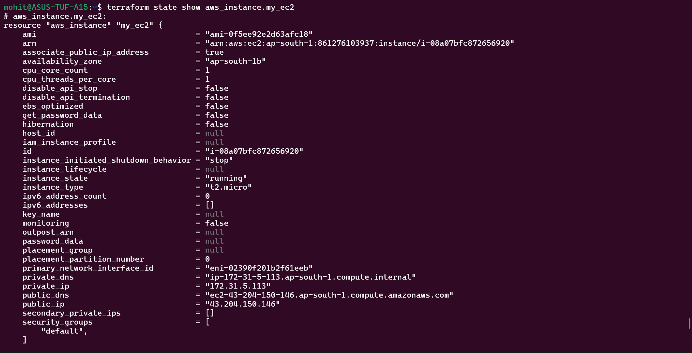

It shows the mentioned resources' details.

What does state file store?
The file stores:-

resource IDs
current configuration
metadata
dependencies

Why NOT edit manually?
You can break Terraform that will lead to infrastructure mismatch

Why not commit to Git?
because it contains:

secrets
resource IDs
sensitive data

Task 6:-

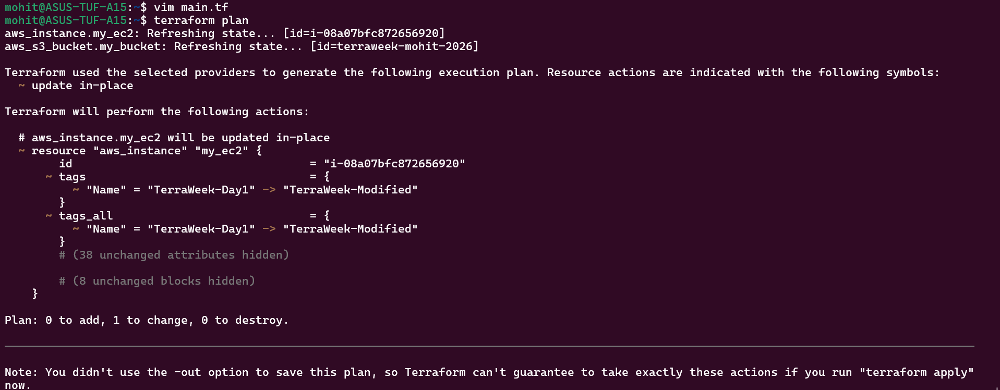

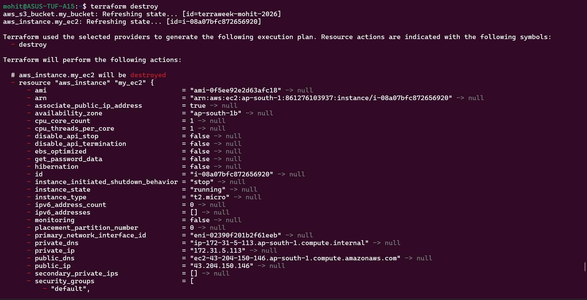

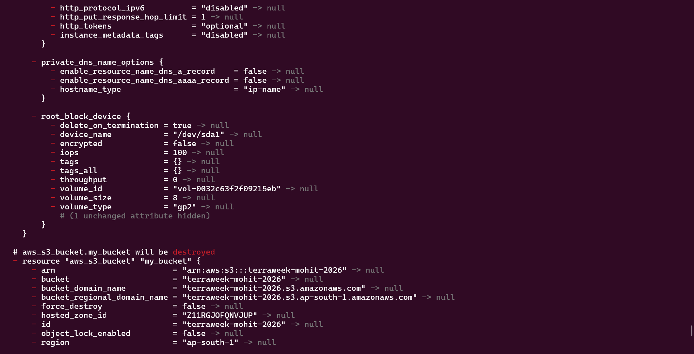

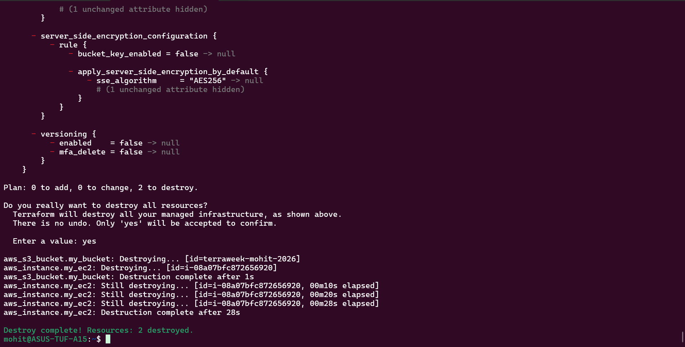

+ means create, - means destroy and ~ means update