Task 1:-

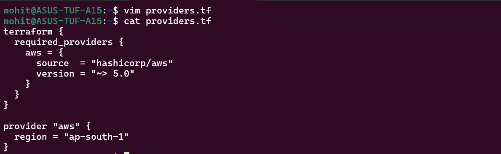

~> 5.0 means version from 5.0 to 5.9 not after that. >= 5.0 means any version before 5.0 and = 5.0.0 means the exact 5.0.0 version.

provider lock file provides:- 
Locks provider version for consistency
Ensures same version across machines

Task 2:- 

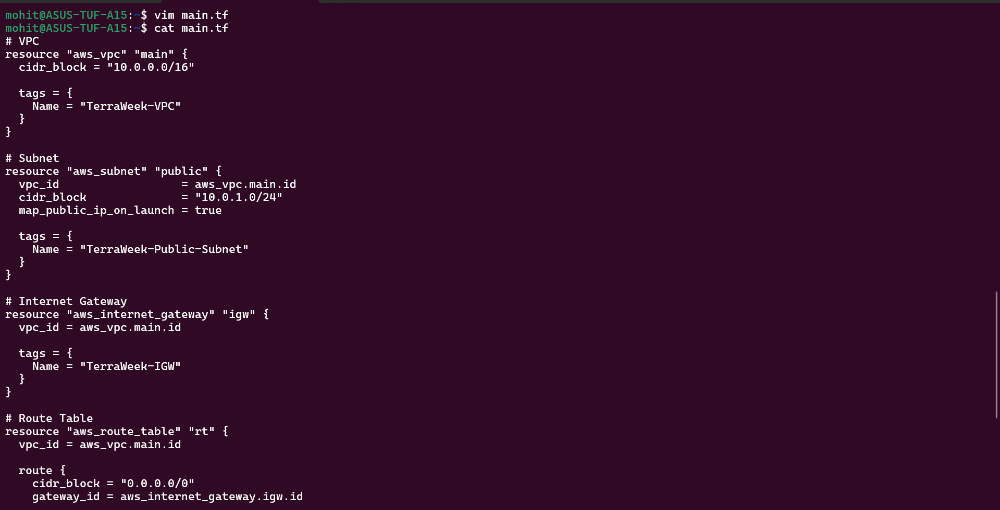

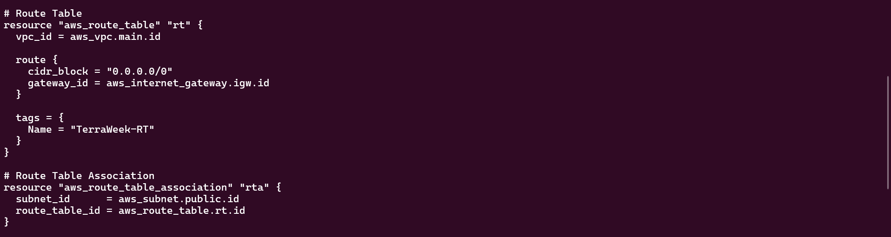

Task 3:-

Terraform knows order because of references.
Terraform builds dependency graph automatically.

If subnet created before VPC, it will fail, aws error.

Implicit Dependencies in your code:
subnet → depends on VPC
IGW → depends on VPC
route table → depends on IGW
route association → depends on subnet + route table

Task 4:-

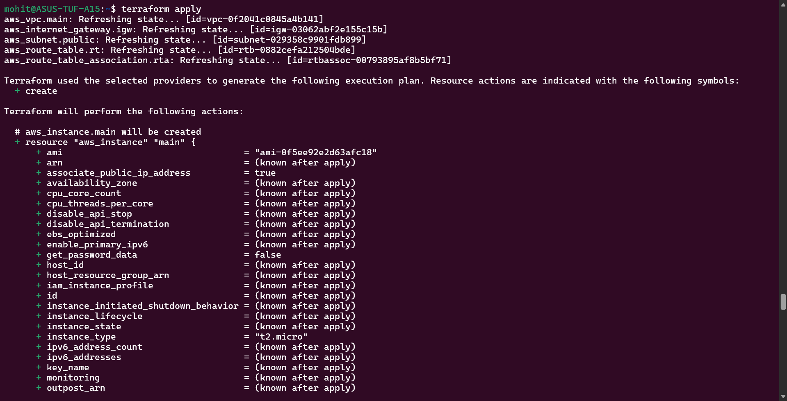

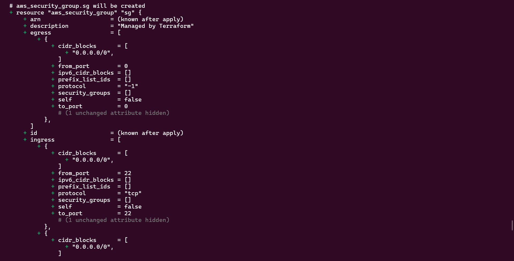

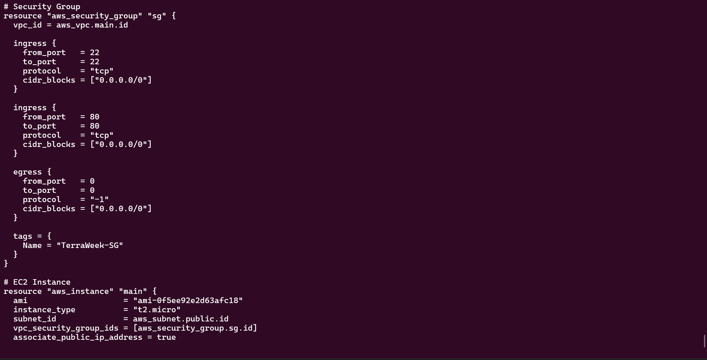

Task 5:-

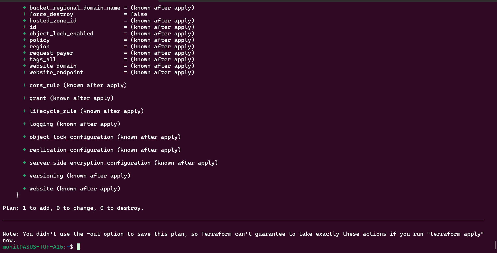

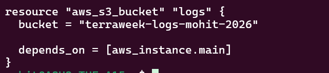

We use depends_on when terraform can't detect dependency on its own.

Task 6:-

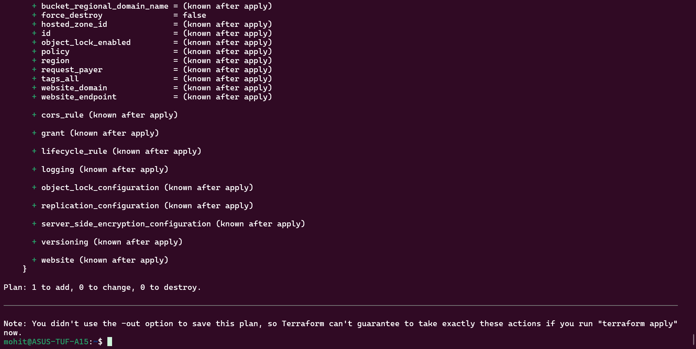

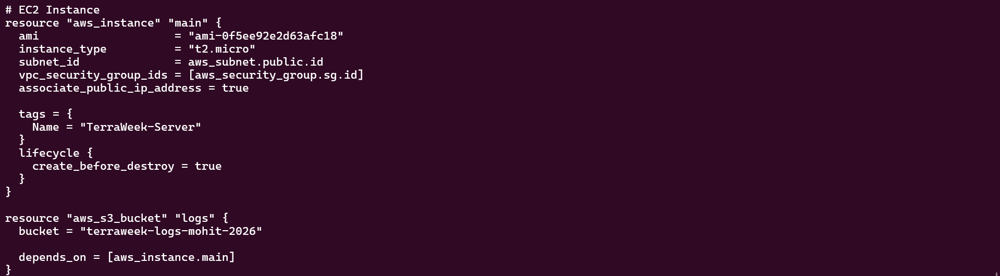

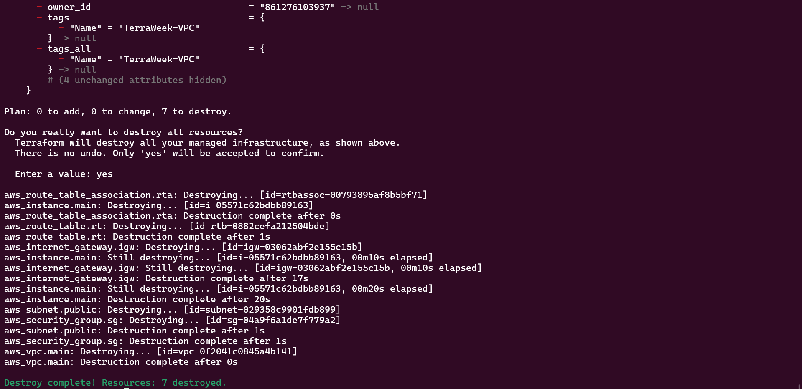