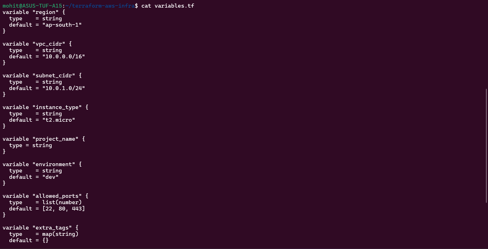
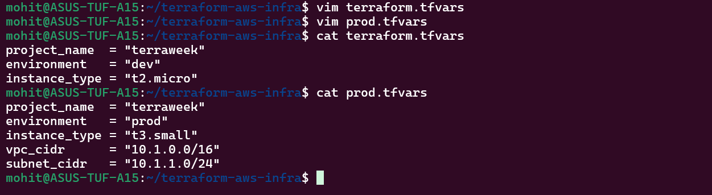
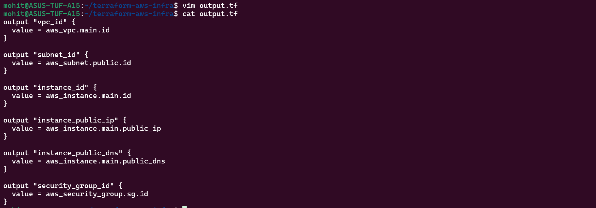
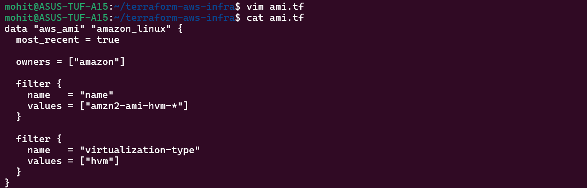
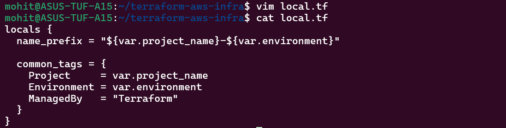

Task 1:-

Terraform variable type:-
String, number, bool, list and map

Task 2:-

Tadk 3:-

Task 4:-

Resource vs Data Source
Resource	Data Source
Creates infra	Reads existing data
Mutable	Read-only

Task 5:-

Task 6:- 

1. upper("abc") → converts to uppercase
2. join("-", ["a","b"]) → joins list into string
3. lookup(map, key) → fetch value safely
4. length(list) → returns size
5. cidrsubnet() → creates subnet from CIDR