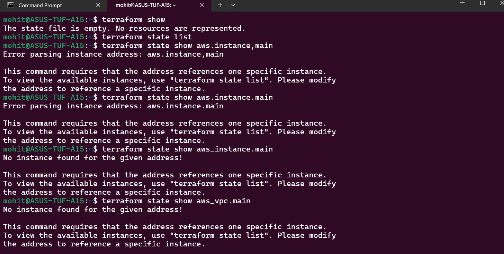
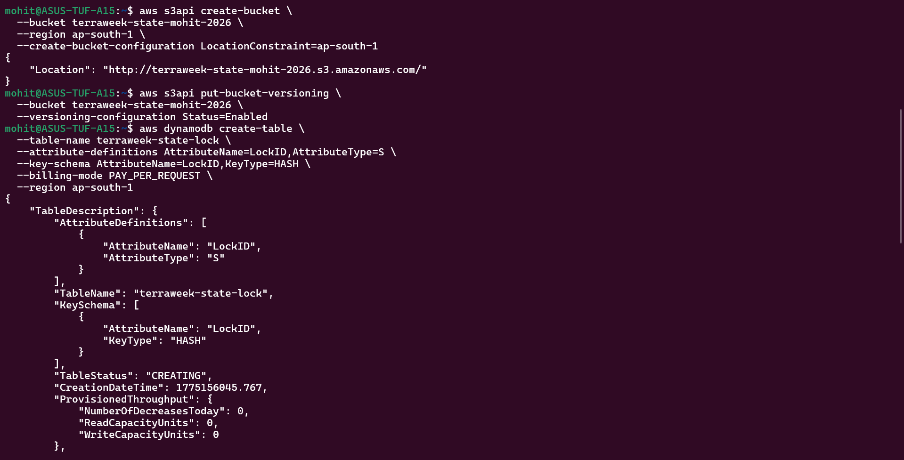
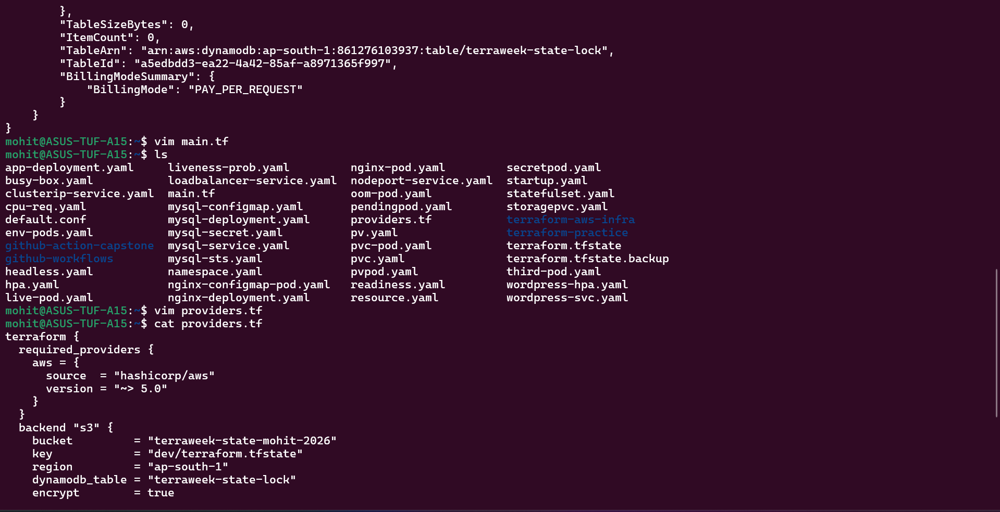
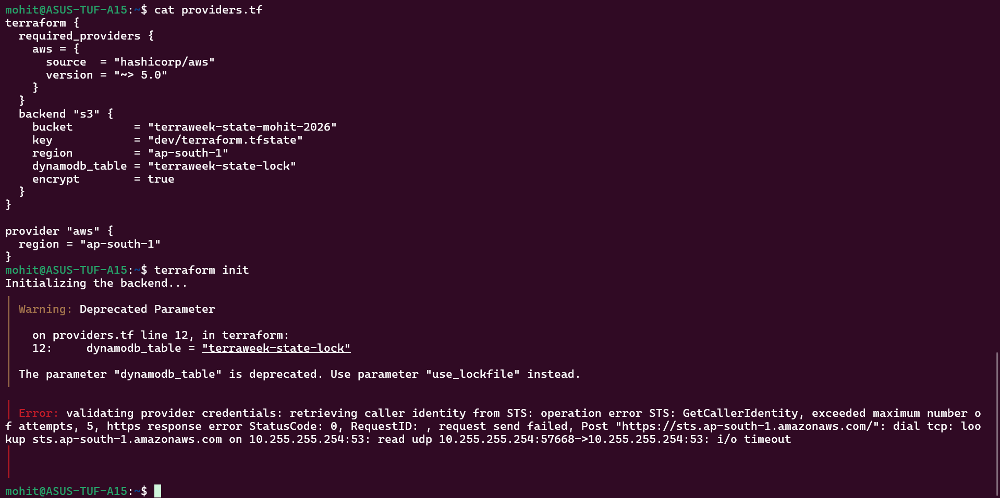
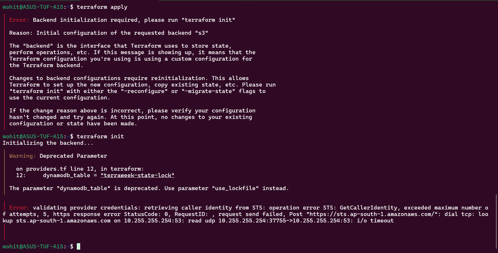
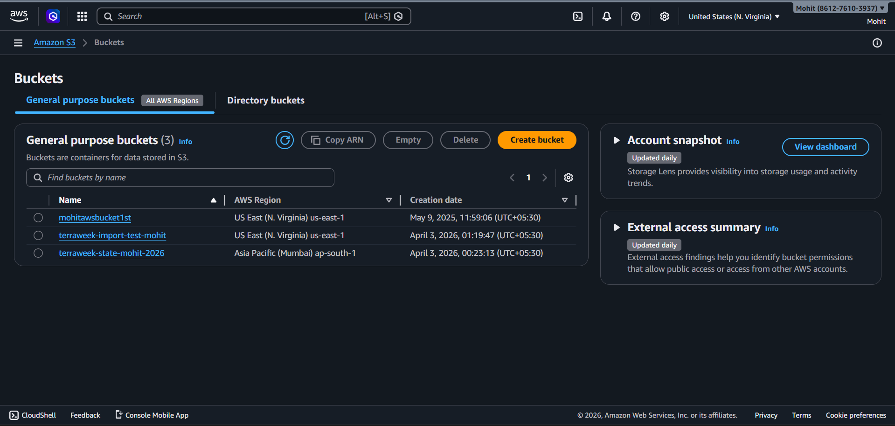
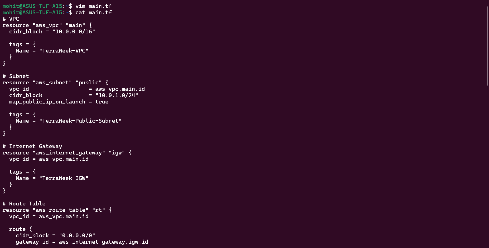
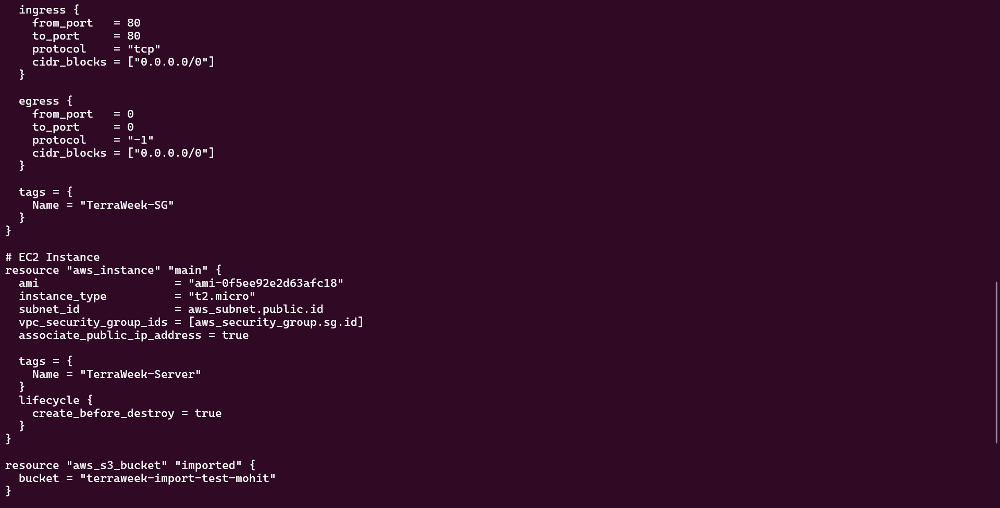
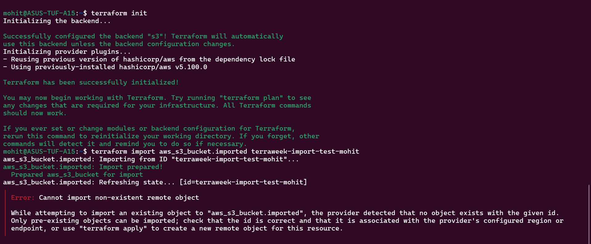

Task 1:-

Task 2:-

Task 3:-

Why locking important?

👉 Prevents:

multiple users modifying infra
state corruption
resource duplication

Task 4:-

Import        vs             Create
Import	                     Create
Existing resource	         New resource
Adds to state	             Creates infra
No infra change	             Infra creation

Task 5:-

