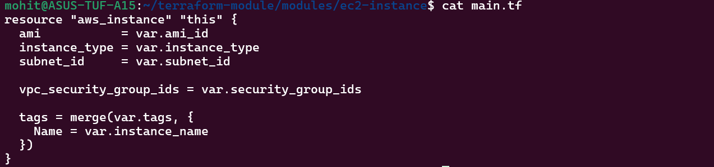
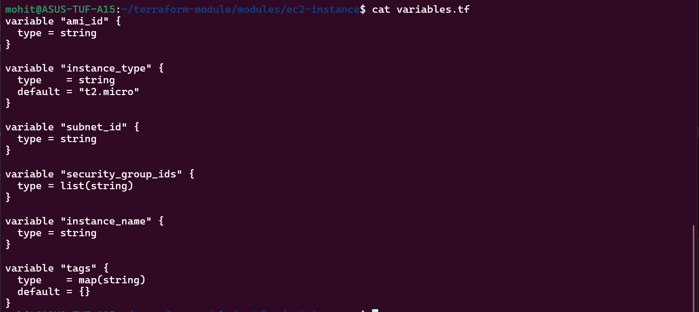
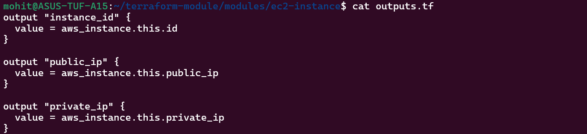
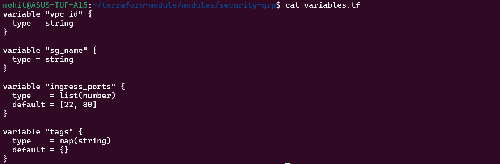
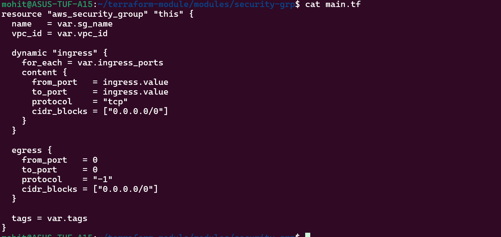
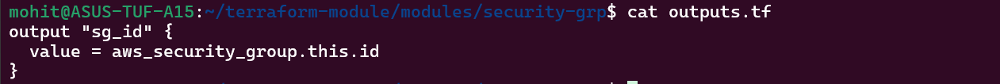
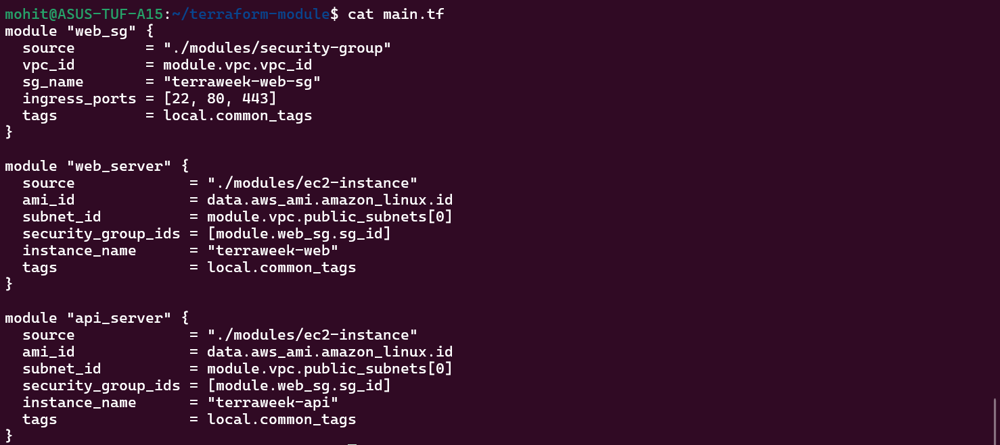
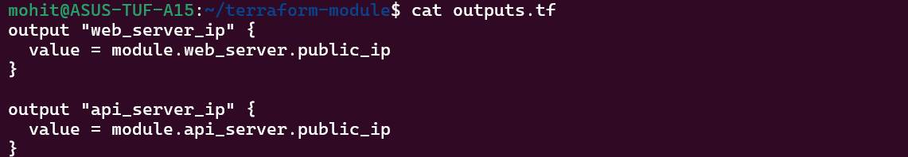

Task 1:-

Root                       vs                Child Module
Root Module	                                 Child Module
Entry point (where you run Terraform)	     Reusable component
Calls modules	                             Gets called
Contains provider/backend	                 Contains resources

Task 2:-

Task 3:-

Task 4:-

Task 5:-

Where modules are downloaded?

.terraform/modules/

Comparison
Manual VPC	Registry Module
3–5 resources	15–25 resources
Limited	Production-ready
Basic	Highly configurable

Task 6:-

Always pin module versions
Keep modules small and focused
Use variables — avoid hardcoding
Always expose outputs
Add README.md for documentationcd 20206
