Task 1:-

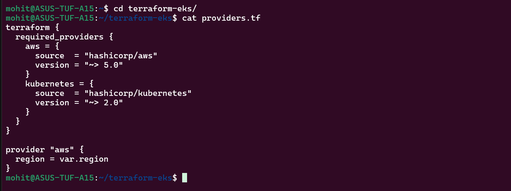

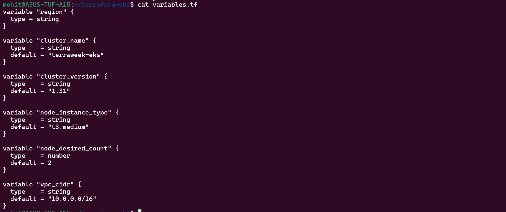

Task 2:-

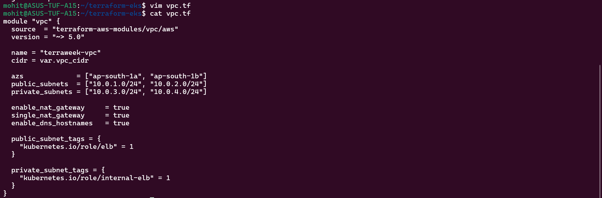

Why both public + private subnets?
Subnet	         Purpose
Public	         Load balancers
Private	         Worker nodes (secure)

Tags tells the cloud provider where to place the LB and how Kubernetes should use subnets.

Task 3:-

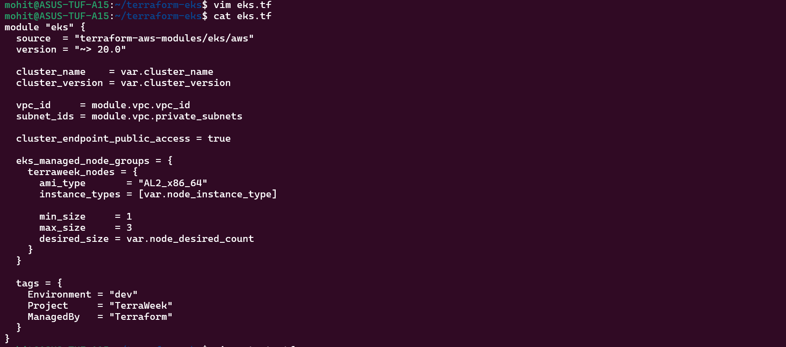

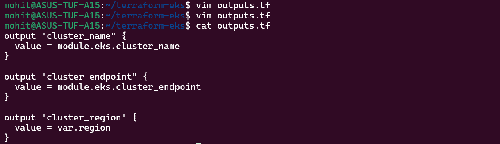

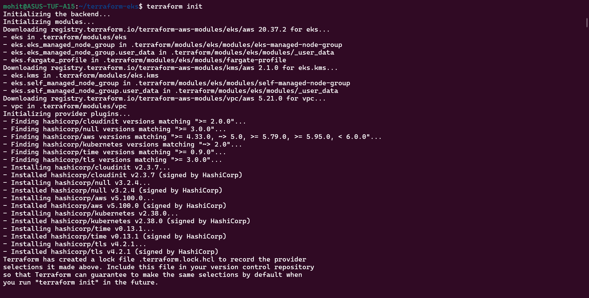

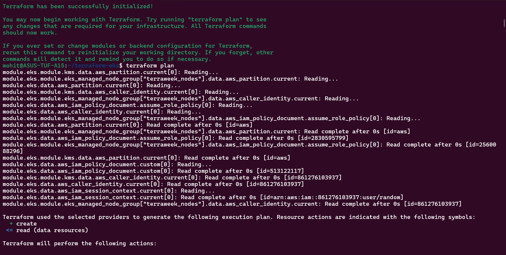

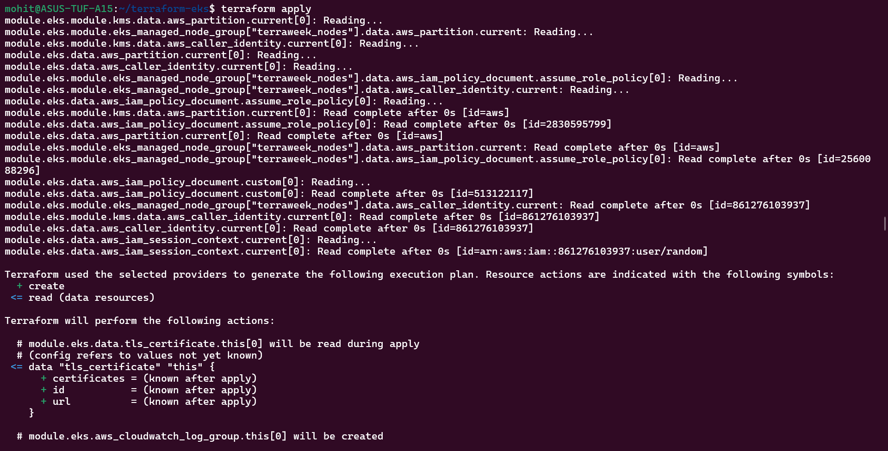

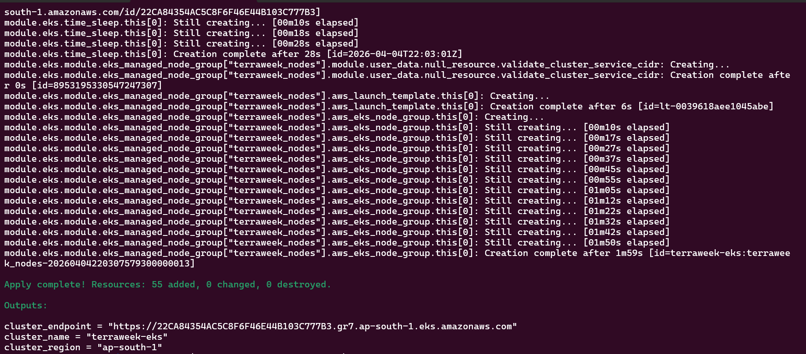

Task 4:-

Task 5:-

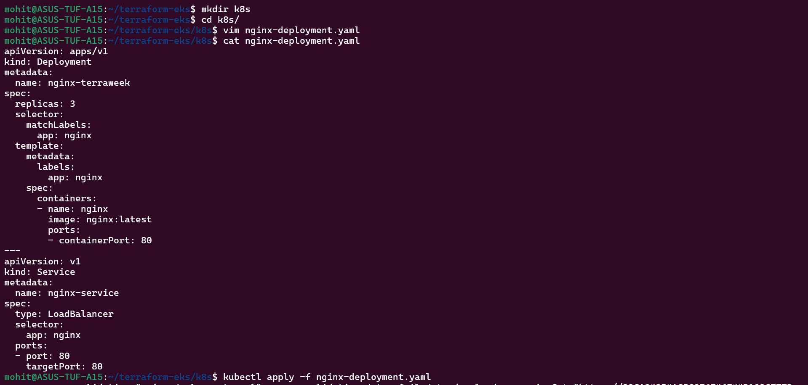

Task 6:-

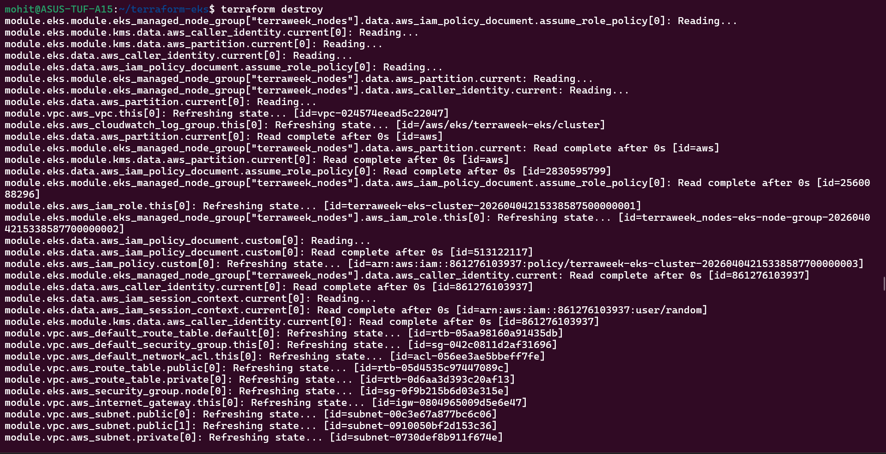

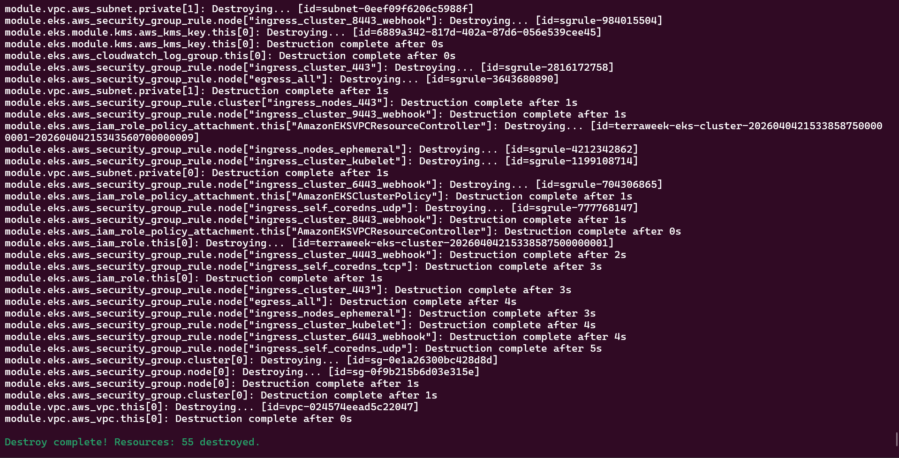