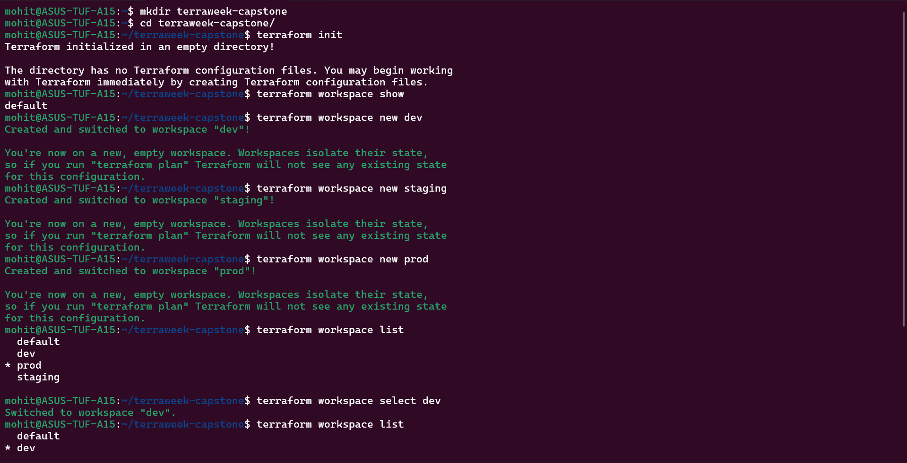
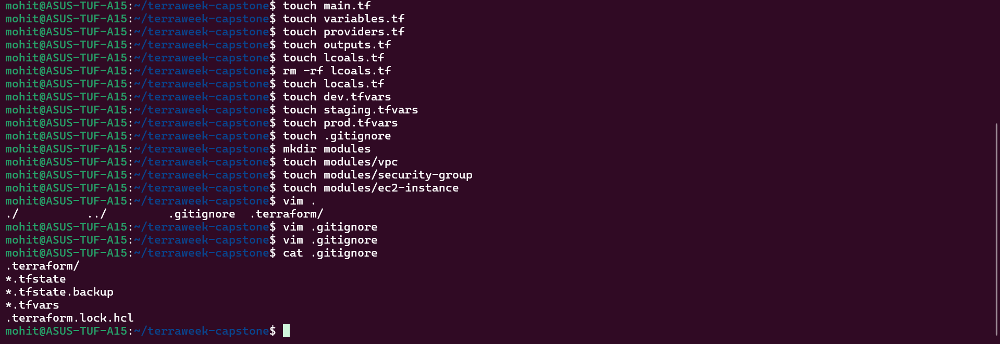
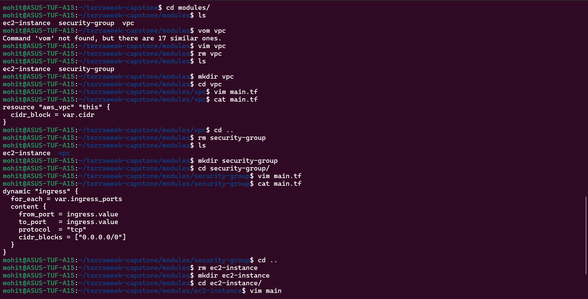
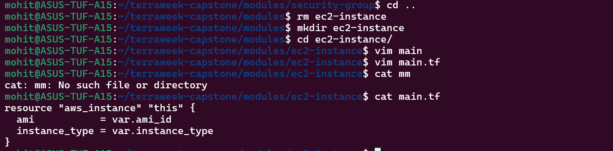
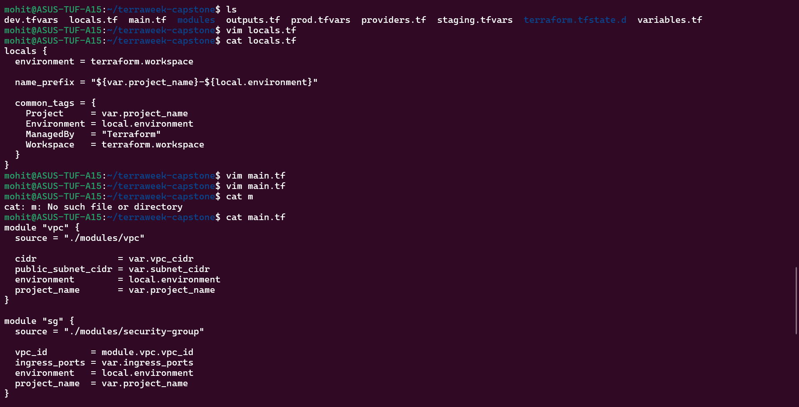
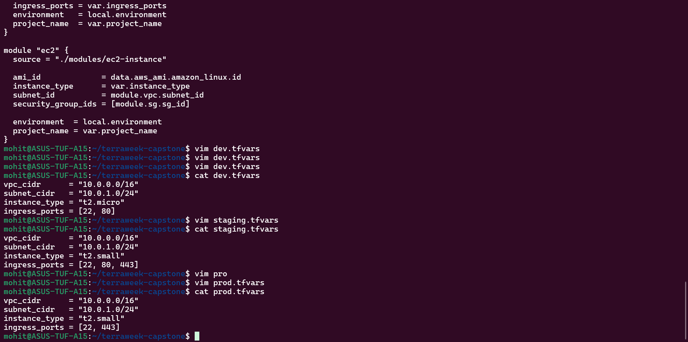

Task 1:-

Answer:-
1. It returns the current workspace name.
2. Each workspace stores its state file inside terraform.tfstate.
3. Workspaces           vs           Separate Directories
   Workspaces	                     Separate folders
   One codebase	                     Multiple codebases
   Shared logic	                     Duplication
   Easy switching	                 Hard to manage
   Less isolation	                 Full isolation

Task 2:-

This file structure is considered best practice because it is clean structure, production ready and it separates each resources to understand them correctly.

Task 3:-

Task 4:-

Task 5:-

Yes, they are fully isolated as they have different state files, different CIDR and separate resources.

Task 6:-

1. Use proper file structure (providers, variables, outputs, locals)
2. Always use remote backend with locking
3. Never hardcode values — use variables
4. Use modules for reusability
5. Use workspaces for environment isolation
6. Protect state file (never commit to Git)
7. Always run terraform plan before apply
8. Tag every resource properly
9. Follow consistent naming conventions
10. Destroy unused resources to save cost