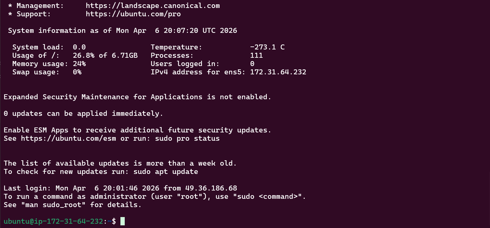
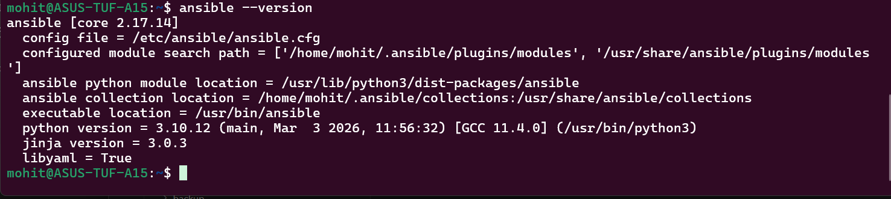

Task 1:-

What is Configuration Management?
It ensures servers stay in a desired state automatically
Example:
Install nginx
Start service
Keep it running

👉 Without it → manual work ❌
👉 With it → automation ✅

✅ Why needed?
Avoid manual SSH + setup
Ensure consistency across servers
Scales easily

Ansible vs Others
Tool	          Agent?	             Language
Ansible	         ❌ No (agentless)	    YAML
Chef	         ✅ Yes	                Ruby
Puppet	         ✅ Yes	                DSL
Salt	          Optional	             Python

👉 Ansible is easiest + no agent = big win

✅ What is Agentless?

👉 Means:

No software installed on target servers
Uses SSH only

Architecture - Control Node(My laptop/your laptop or any server) -> SSH into managed nodes(EC2 servers)

Inventory is list of servers.
Modules are tasks like install, copy.
Playbooks are automation scripts.

Task 2:-

Task 3:-

Installed on: control node only

Why?
Because Ansible pushes commands via SSH
No need on target machines

Task 4:-

Task 6:-

