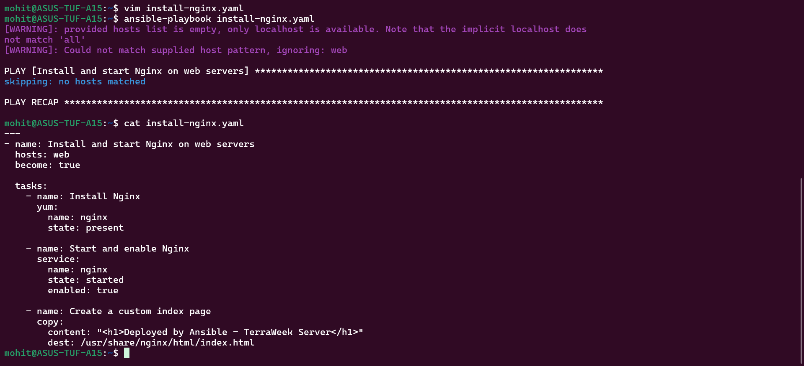
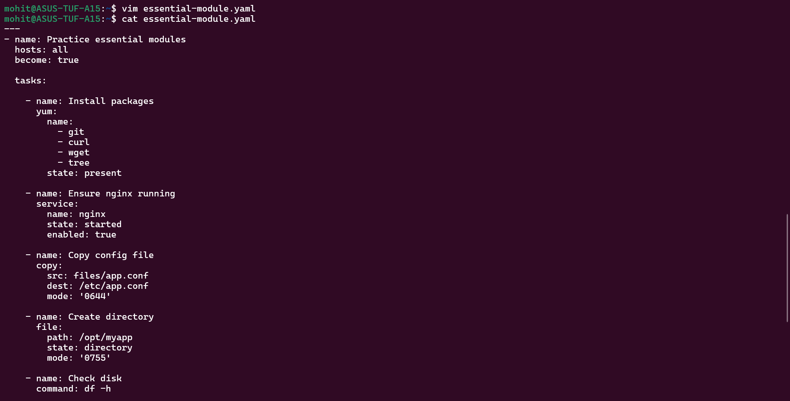
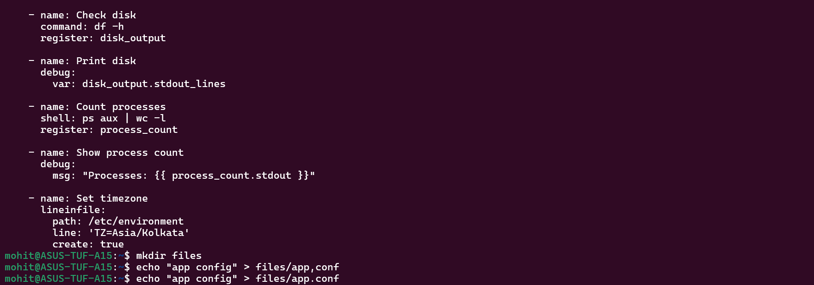
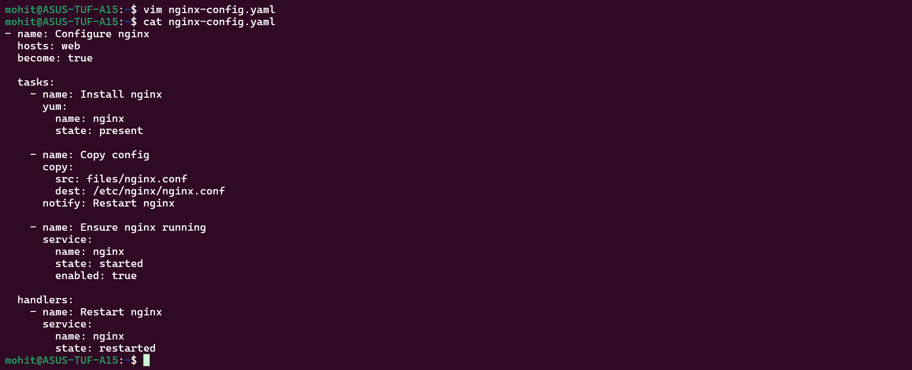

Task 1:-

Task 2:-

- name: Play name        # PLAY
  hosts: web            # TARGET GROUP
  become: true          # SUDO

  tasks:
    - name: Task name   # TASK
      yum:              # MODULE
        name: nginx
        state: present

Play vs Task
Play → targets hosts
Task → action on those hosts

Multiple plays?

YES ✅

become: true

Play level → applies to all tasks
Task level → applies only to that task

If a task fails?

By default:
Play stops 

Task 3:-

command vs shell (IMPORTANT INTERVIEW Q)
Feature	    command	           shell
Pipes	    No	               Yes
Safer		Yes                No
Use case	Simple commands	   Complex commands

Task 4:-

Task 5:-

Why --check --diff important?

Because:
No real changes 
Shows what WILL change 
Safe for production 