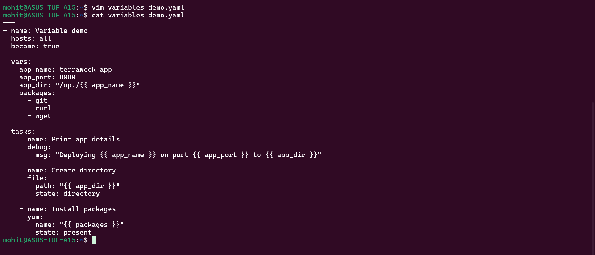
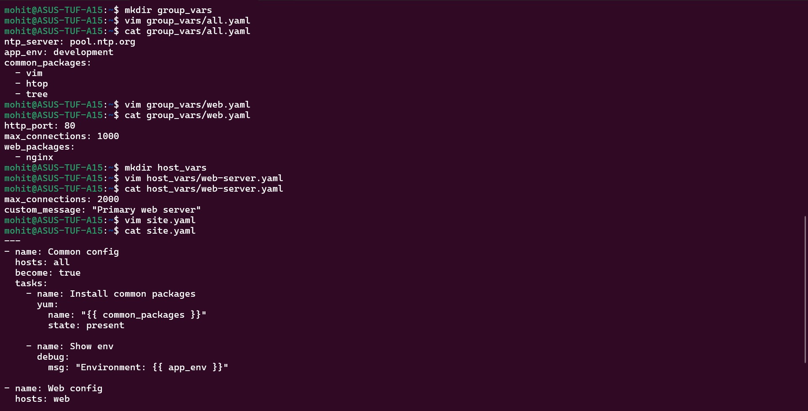
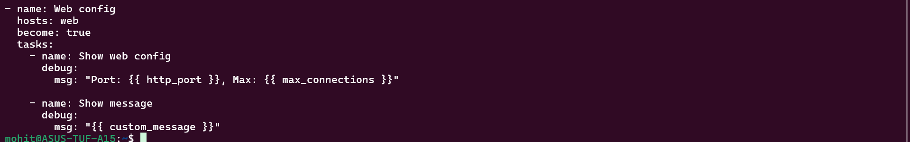
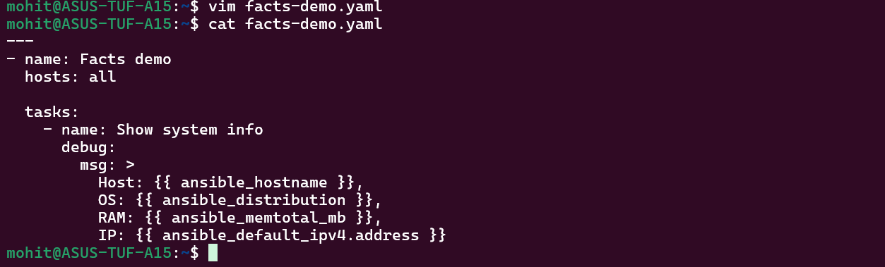
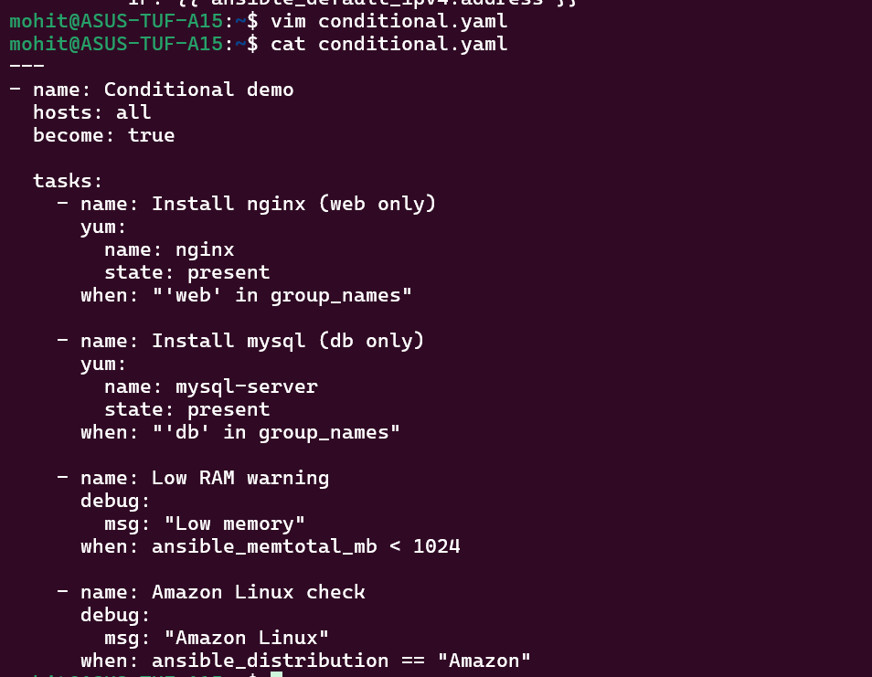
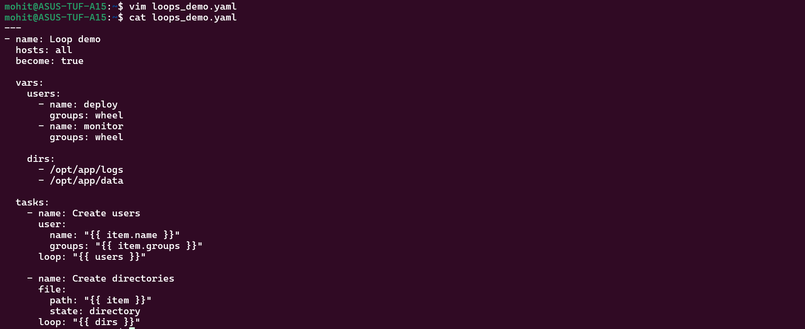
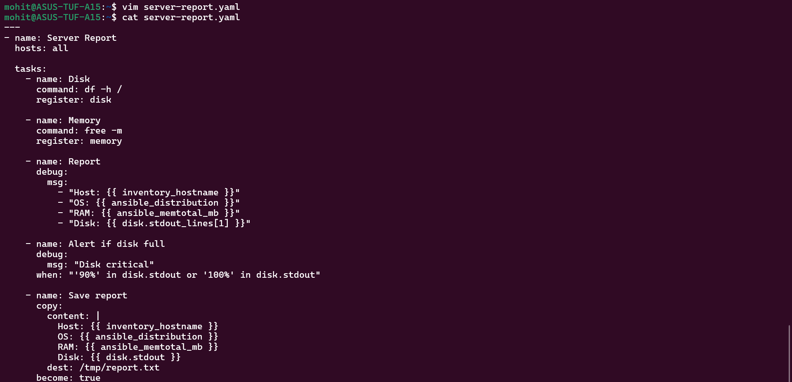

Task 1:-

Yes, CLI overrides playbook variables.

Task 2:-

Lowest → Highest

group_vars/all
group_vars/web
host_vars
playbook vars
task vars
CLI (-e) → HIGHEST 

Task 3:-

Fact	                        Use
ansible_os_family	            OS-specific installs
ansible_distribution	        Ubuntu vs Amazon
ansible_memtotal_mb	            scaling decisions
ansible_default_ipv4.address	networking
ansible_hostname	            logging/reporting

Task 4:-

Task 5:-

Task 6:-

