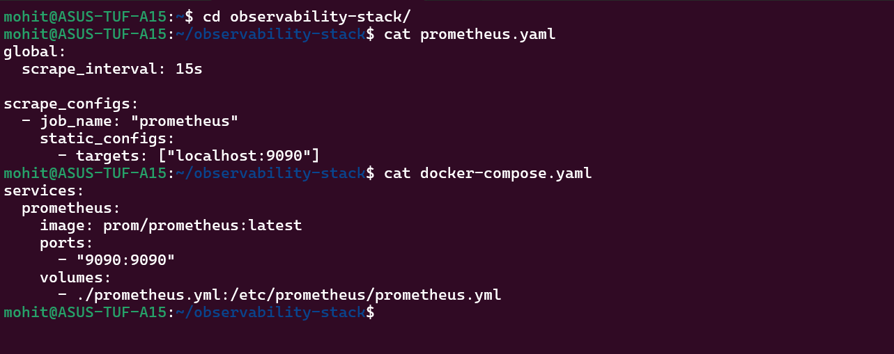
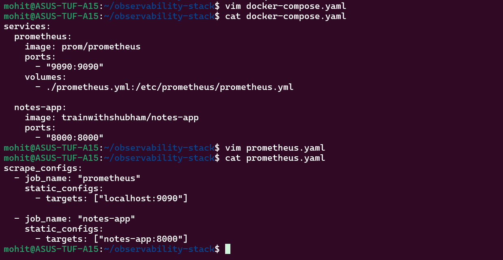
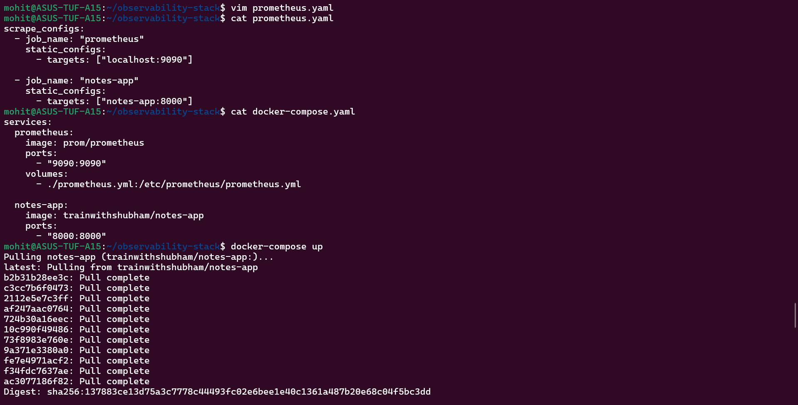

Task 1:-

Observability = ability to understand WHAT + WHY + WHERE system is failing.

Difference:-

Monitoring	                    Observability
Tells WHAT is wrong	            Tells WHY it is wrong
Alerts	                        Deep analysis
Static	                        Exploratory

3 Pillars:-

Metrics
Numbers over time
Example: CPU, requests/sec

Logs
Text events
Example: error stack trace
Traces
Request journey
Example: API → DB → service

Why all 3?
Metrics → What broke
Logs → Why broke
Traces → Where broke

Task 2:-

Task 3:-

Metric Types
Type	     Meaning	       Example
Counter	     Only increases	   total_requests
Gauge	     Up & down	       CPU usage
Histogram	 Distribution	   response time
Summary	     Percentiles	   latency

Counter and Gauge:-
Counter → total API calls (only increases)
Gauge → memory usage (increases/decreases)

Labels
http_requests_total{method="GET", status="200"}

Add dimensions

Task 4:-

Basic Queries
up
1 = healthy, 0 = down

process_resident_memory_bytes
memory usage

rate(prometheus_http_requests_total[5m])
requests/sec

Important Rule
ALWAYS → rate() before sum()

Non-200 requests rate:
rate(prometheus_http_requests_total{code!="200"}[5m])

Task 5:-

Task 6:-

