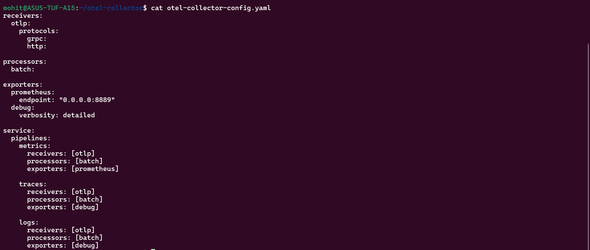
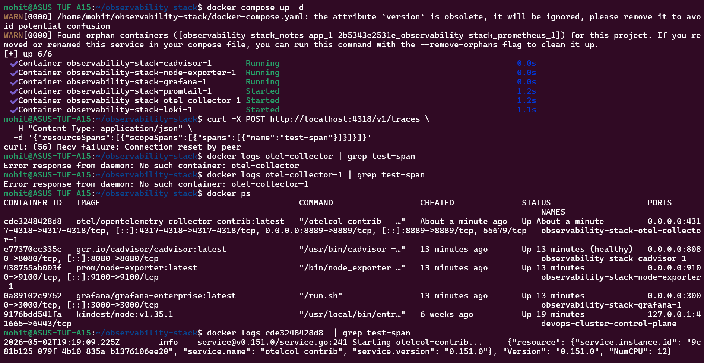
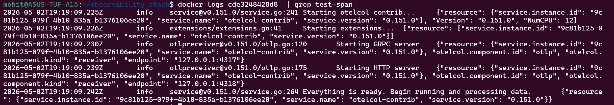

Task 1:-

1. OpenTelemetry (Concept – MUST WRITE)
What is OpenTelemetry?
Vendor-neutral framework to collect metrics, logs, and traces

It does NOT store data
It collects + sends to backends (Prometheus, Loki, etc.)

2. OTEL Collector
Receiver → Processor → Exporter
Component	Role
Receiver	Accept data (OTLP, Prometheus)
Processor	Modify (batch, filter)
Exporter	Send to backend

3. OTLP
Protocol for telemetry
Ports:
4317 → gRPC
4318 → HTTP

4. Traces
Trace = full request journey
Span = one step inside it

Example:

User → API → DB

Task 2:-

Task 3:-

Task 6:-

Prometheus              vs                      Grafana Alerts
Feature	                Prometheus	            Grafana
Location	            Backend	                UI
Flexibility	            High	                Easy
Notifications	        Needs Alertmanager	    Built-in

When to use?
Prometheus → production pipelines
Grafana → quick alerts / learning