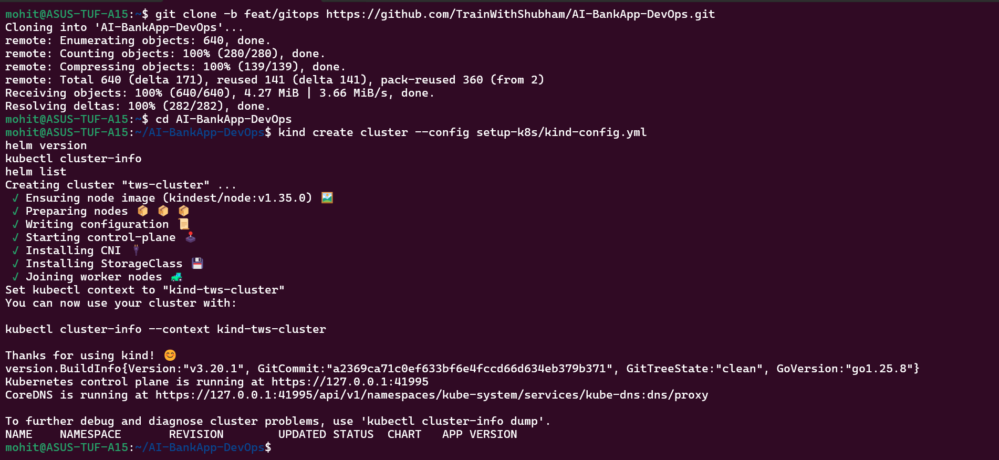
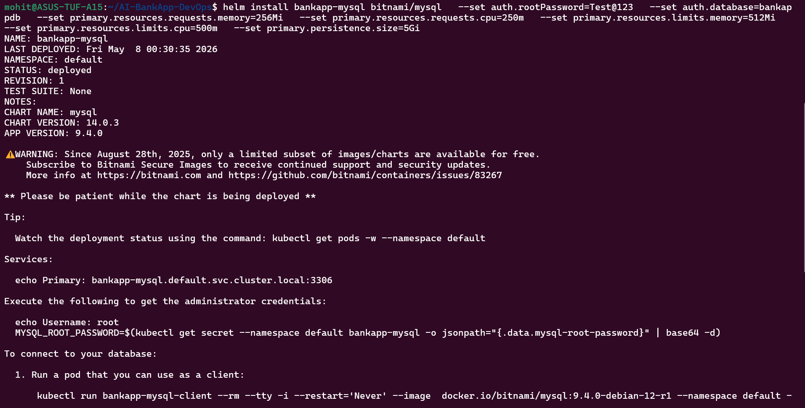
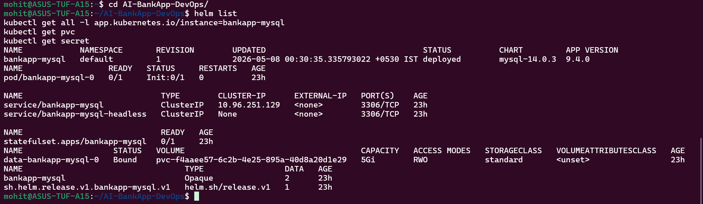
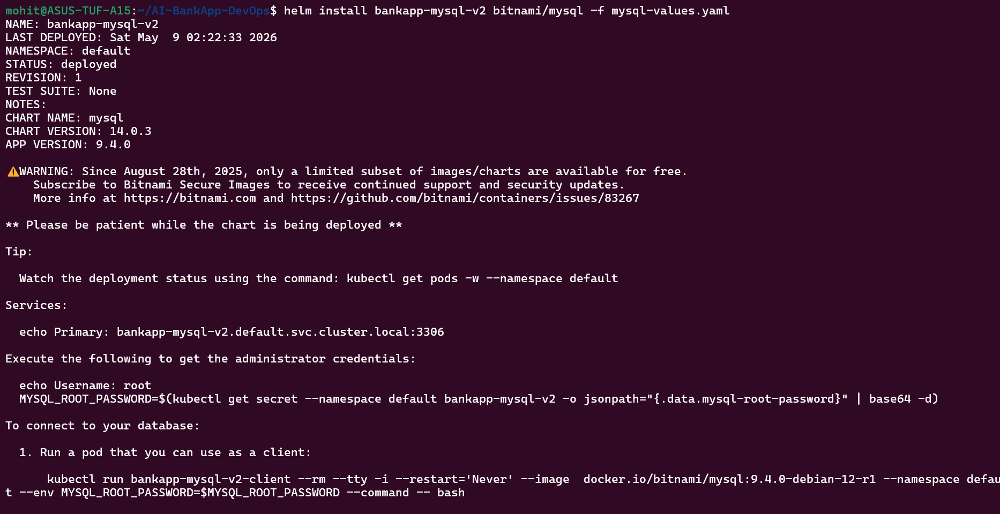

Task 1:-

Helm is a package manager for Kubernetes that helps you deploy and manage applications using reusable templates called charts.

Instead of writing multiple YAML files manually, Helm lets you:
Template configurations
Reuse deployments
Version control applications

Core Concepts:-

1. Chart
A chart is a package of Kubernetes resources.

Example:
Deployment + Service + ConfigMap + Secret = 1 Chart

2. Release
A release is a running instance of a chart.

Same chart → multiple releases possible:
dev
staging
production

3. Repository
A repository is where charts are stored.

Example:
Bitnami repo (like DockerHub but for Helm)

4. Values
Values are configuration inputs for charts.
Example:
replicaCount: 3
image:
  tag: latest

These replace hardcoded values in YAML.

Why Helm over raw manifests?
From AI-BankApp:
12 YAML files 😵

Problems:
Hardcoded values
No easy rollback
Difficult multi-environment setup

Helm solves:
Templating
Versioning
Easy rollback
Reusability

Task 2:-

Task 3:-

Task 4:-

Task 5:-

