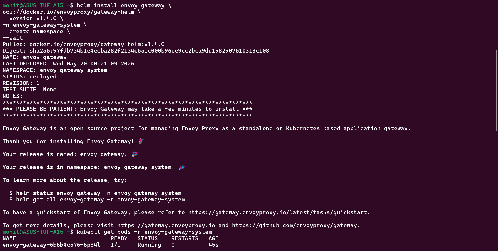
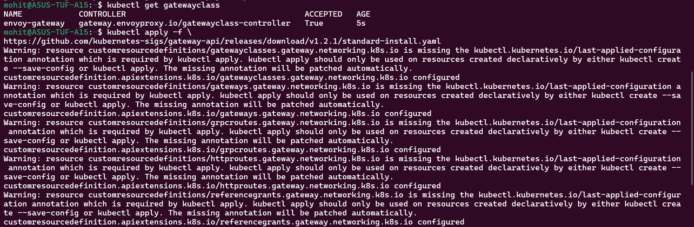
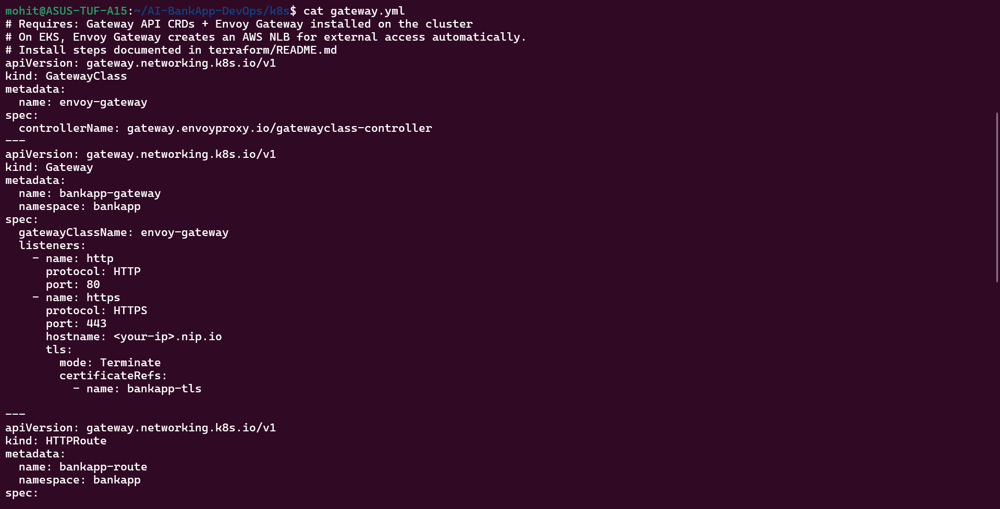
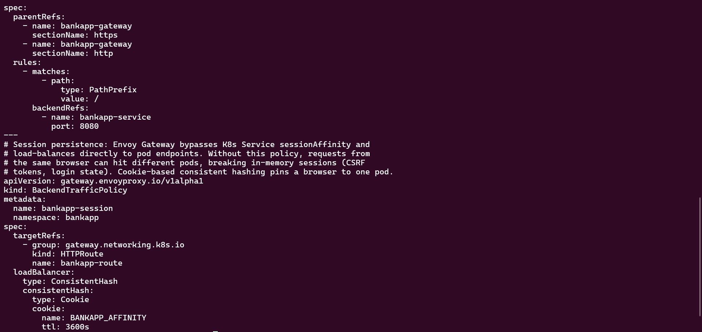
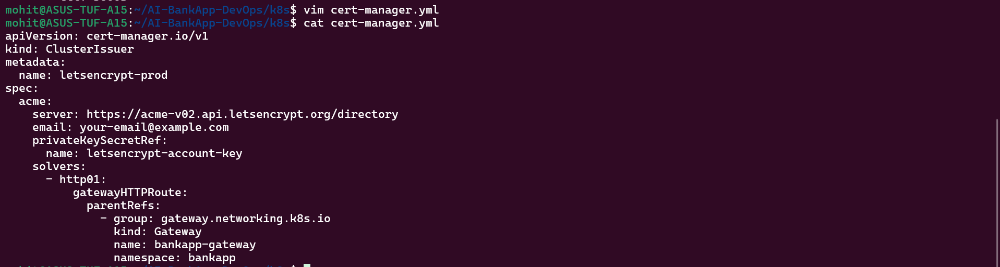
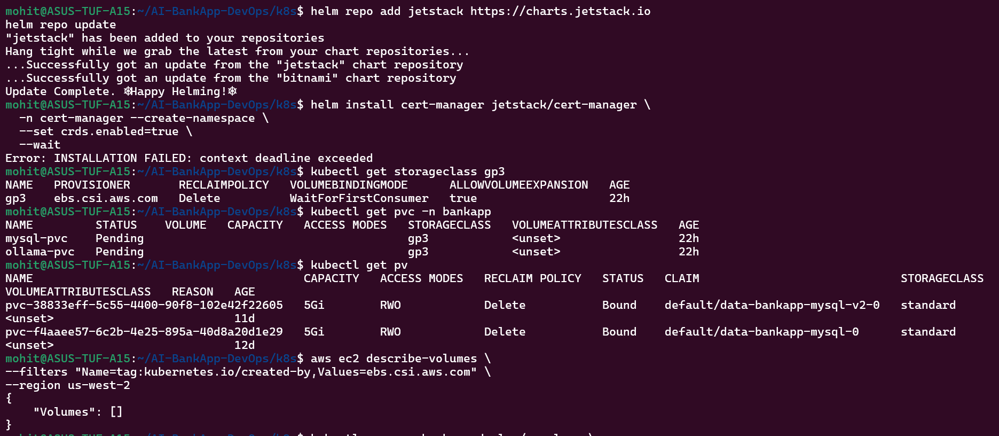
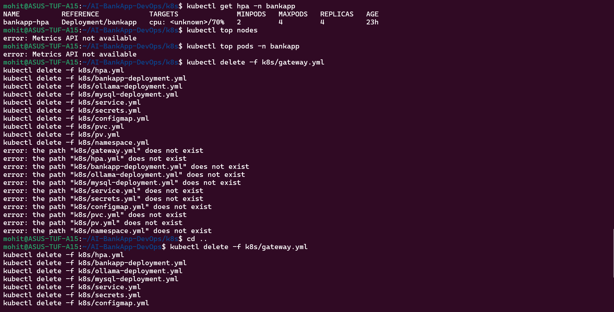
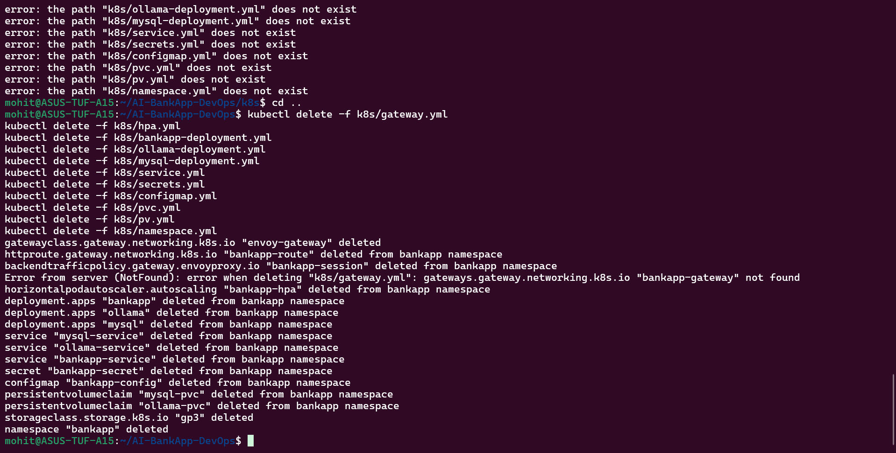

Task 1:-

What is Gateway API?

Gateway API is the next-generation Kubernetes networking API designed to replace the traditional Ingress resource.

It provides:
better traffic routing
role separation
native TLS handling
traffic splitting
extensibility

The AI-BankApp uses:
Envoy Gateway
Gateway API CRDs
HTTPRoute
BackendTrafficPolicy

instead of classic Ingress.

Gateway API vs Ingress

Feature	                  Ingress	                  Gateway API
API maturity	          Stable but limited	      GA since Kubernetes 1.26
Traffic splitting	      Limited	                  Native support
Header matching	          Controller-specific	      Built-in
TLS configuration	      Annotation-based	          Native
Session affinity	      Non-standard	              Supported
Role separation	          Single resource	          GatewayClass → Gateway → Route
Extensibility	          Limited	                  Highly extensible

Task 2:-

Task 3:-

Task 4:-

Task 5:-

Task 6:-

