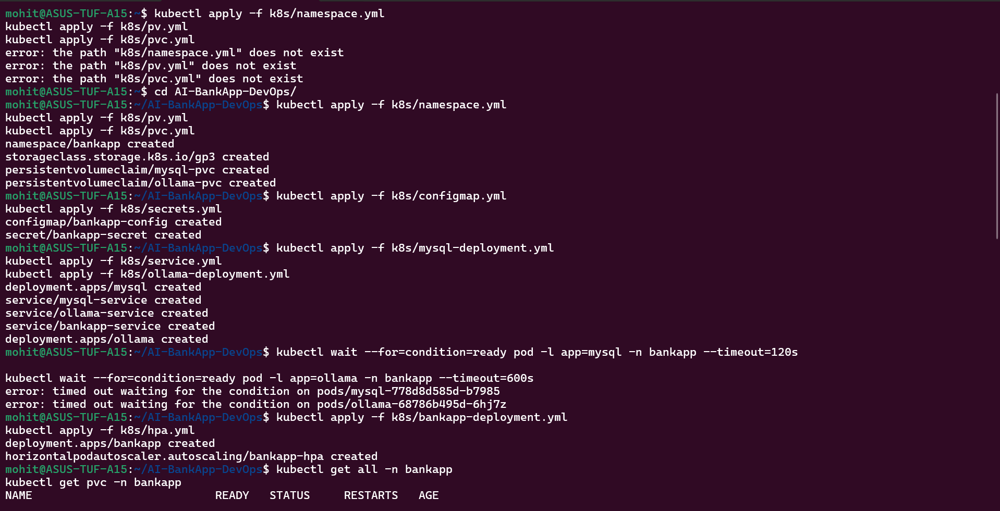
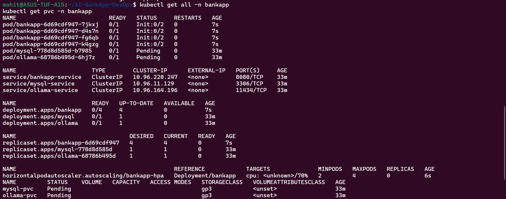
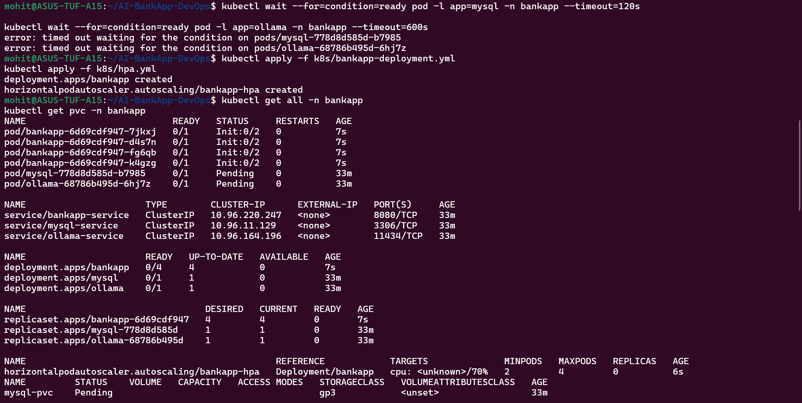
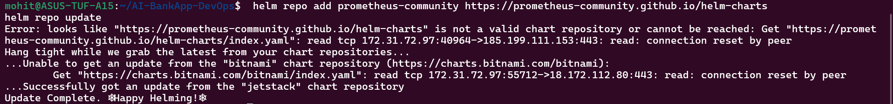
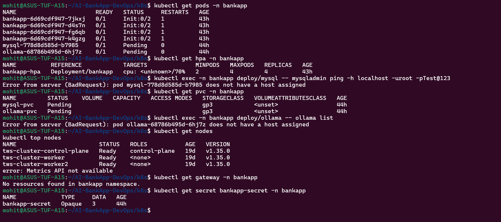
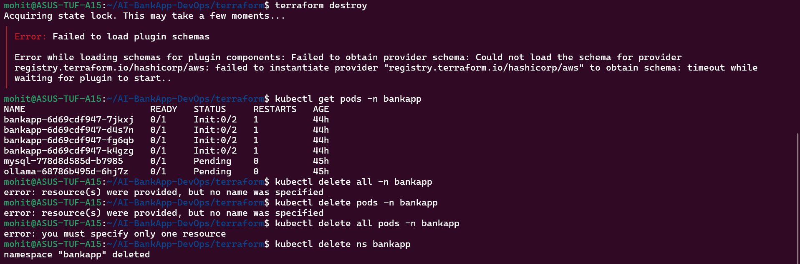

Task 1:-

Task 2:-

Task 3:-

Task 4:-

Task 5:-

Day	What You Learned	Project Connection
81	Terraform + EKS	Cluster provisioning
82	Gateway API + EBS	Networking + storage
83	Monitoring + production deployment	Full AI-BankApp stack

Important Concepts You Learned

1. Terraform Infrastructure
Provisioned:
VPC
Subnets
NAT Gateway
EKS Cluster
Managed Node Groups

2. Persistent Storage
Used:
EBS CSI Driver
PVCs
Stateful workloads

3. Gateway API
Used:
GatewayClass
Gateway
HTTPRoute
Modern replacement for Ingress.

4. Observability
Implemented:
Prometheus
Grafana
ServiceMonitor
Spring Boot Actuator

5. Autoscaling
HPA dynamically scaled BankApp pods.

Task 6:-

